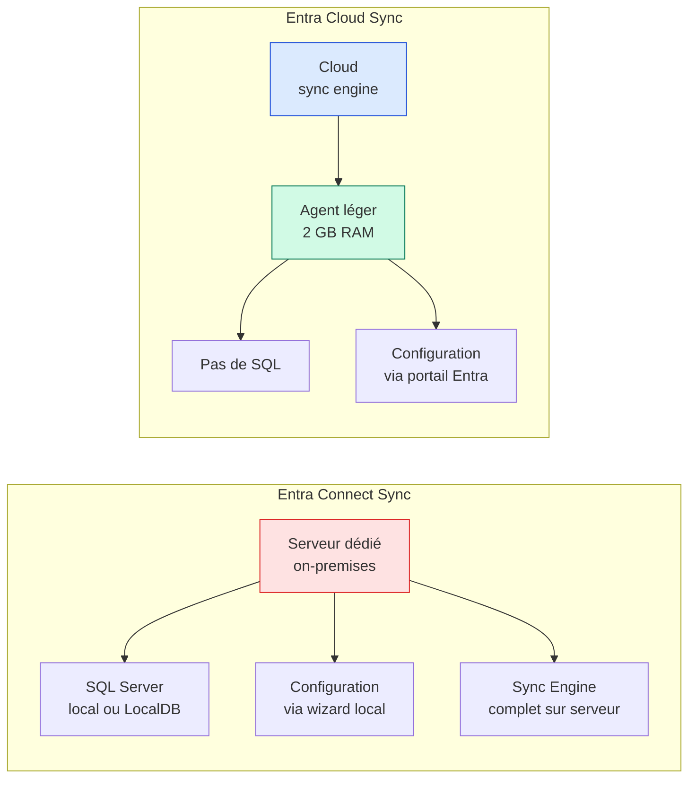
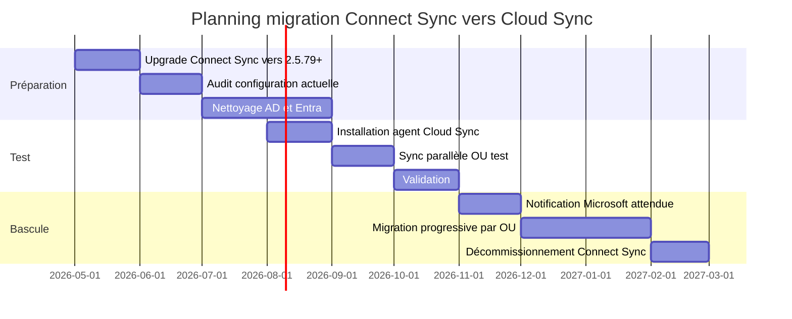

> Microsoft a confirmé en avril 2026 le démarrage officiel de la transition entre **Entra Connect Sync** (l'outil serveur historique, ex-Azure AD Connect) et **Entra Cloud Sync** (le moteur de synchronisation cloud-natif basé sur des agents légers).
> 
> Les notifications individuelles aux tenants commenceront en **juillet 2026** via Message Center, Entra Connect Health et des emails ciblés. Chaque tenant recevra sa propre fenêtre de transition, en fonction de sa complexité de configuration.
> 
> Cet article est un guide d'action pour les administrateurs : ce qu'il faut vérifier, ce qu'il faut préparer, et dans quel ordre.

## Deux échéances à ne pas confondre

C'est le premier point à clarifier, parce que les communications Microsoft mélangent souvent les deux :

| Échéance | Date | Quoi |
|---|---|---|
| **Hardening Connect Sync** | 30 septembre 2026 | Toutes les versions inférieures à 2.5.79.0 cessent de fonctionner |
| **Migration vers Cloud Sync** | À partir de juillet 2026, par vagues | Notification individuelle par tenant avec fenêtre de transition |

La première échéance est un **patch obligatoire de l'outil actuel**. La seconde est la **migration vers un nouvel outil**. Les deux peuvent vous concerner, dans cet ordre.

## Action n°1 : vérifier votre version actuelle

C'est l'action prioritaire, parce qu'elle a une date butoir fixe.

Sur le serveur Entra Connect, ouvrir une PowerShell admin :

```powershell
Get-ADSyncGlobalSettings | Select-Object -ExpandProperty Parameters | Where-Object {$_.Name -eq "Microsoft.Synchronize.ServerConfigurationVersion"}
```

Ou plus simplement, regarder dans le panneau de configuration Windows > Programmes et fonctionnalités, ligne "Microsoft Entra Connect".

**Si vous êtes en dessous de 2.5.79.0** : vous devez upgrader avant le 30 septembre 2026, sinon la synchronisation s'arrête.

**Le .msi d'installation** est désormais disponible uniquement depuis l'admin center Entra (Entra Connect blade), pas sur le centre de téléchargement Microsoft. C'est volontaire.

Les prérequis pour cette version :
- .NET Framework 4.7.2 minimum
- TLS 1.2 activé
- Auto-upgrade configuré pour les futures versions (recommandé)

## Action n°2 : vérifier votre éligibilité à Cloud Sync

Avant même que Microsoft ne vous notifie, vous pouvez tester votre éligibilité à Cloud Sync via le [Sync Tool Checker](https://setup.cloud.microsoft/entra/add-or-sync-users-to-microsoft-entra-id). Bouton "Check sync tool" au milieu de la page.

Cloud Sync n'est pas encore au niveau fonctionnel de Connect Sync. Les fonctionnalités suivantes **forcent à rester sur Connect Sync** (Cloud Sync ne les supporte pas, ou pas encore) :

- Synchronisation des **attributs Exchange Hybrid** complets
- **Device writeback**
- **Group Writeback v1** (pour les groupes Microsoft 365 vers AD)
- **Pass-Through Authentication** (PTA) avec configurations complexes
- Synchronisation depuis **plusieurs forêts AD** avec des règles personnalisées avancées
- Annuaires de **plus de 150 000 objets** par agent (limite par instance)

Si une seule de ces fonctionnalités vous concerne, vous resterez sur Connect Sync pour le moment. Microsoft prévoit d'étendre Cloud Sync progressivement, et les vagues de notification suivront la disponibilité des fonctionnalités.

## Différences techniques entre les deux outils



| Aspect | Connect Sync | Cloud Sync |
|---|---|---|
| **Hébergement** | Serveur Windows dédié | Agent léger sur n'importe quelle machine Windows |
| **Base de données** | SQL Server ou LocalDB | Aucune |
| **Configuration** | Wizard sur le serveur | Portail Entra (admin center) |
| **RAM minimum** | 6 GB (avec SQL local) | 2 GB |
| **Haute disponibilité** | Serveur de staging | Plusieurs agents actifs/actifs |
| **Filtrage** | Par OU ou par attributs (règles complexes) | Par OU ou par groupes |
| **Multi-forêt** | Une instance par forêt | Plusieurs agents par forêt possible |
| **Mises à jour** | Manuelles ou auto-upgrade | Automatiques côté cloud |

Le changement de paradigme est important : avec Cloud Sync, **toute la logique de synchronisation est dans le cloud**, l'agent ne fait que collecter les données AD et les transmettre. C'est ce qui permet d'avoir plusieurs agents actifs en parallèle sans conflit.

## Action n°3 : préparer le déploiement parallèle

Cloud Sync peut tourner **en parallèle** de Connect Sync sans conflit, à condition de bien définir les périmètres (OU différents ou groupes différents). C'est ce que Microsoft appelle le déploiement side-by-side.

Cas d'usage typiques pour démarrer en parallèle :

- **Nouvelle OU dédiée à Cloud Sync** : créer une OU de test, y placer quelques comptes, configurer Cloud Sync pour ne synchroniser que cette OU
- **Group Writeback** : si vous utilisez Group Writeback v2 (déprécié), Cloud Sync peut le faire pendant que Connect Sync gère le reste
- **Filiale avec annuaire indépendant** : un agent Cloud Sync par filiale, sans passer par le serveur Connect Sync central

Les prérequis pour installer un agent Cloud Sync :

- Windows Server 2016 minimum (2019 ou 2022 recommandé)
- 4 GB RAM, 6 GB d'espace disque
- TLS 1.2 activé
- Accès sortant HTTPS vers `*.msappproxy.net`, `*.servicebus.windows.net`, `*.events.data.microsoft.com`, `mscrl.microsoft.com`, `*.entrust.net`, `*.digicert.com`
- Compte de service AD avec droits "Replicate Directory Changes" sur le domaine
- Compte Global Administrator ou Hybrid Identity Administrator pour le setup initial

L'installation se fait via le téléchargement de l'agent depuis le portail Entra :

```
Entra admin center > Identity > Hybrid management > Microsoft Entra Cloud Sync > Download on-premises agent
```

## Action n°4 : auditer votre configuration Connect Sync actuelle

Avant toute migration, il faut savoir ce que Connect Sync fait exactement chez vous. C'est rarement documenté correctement, et les configurations historiques accumulent des règles personnalisées dont plus personne ne se souvient.

Les commandes utiles côté serveur :

```powershell
# Voir les connecteurs configurés
Get-ADSyncConnector | Select-Object Name, Type

# Lister toutes les règles de synchronisation
Get-ADSyncRule | Select-Object Name, Direction, Precedence, Disabled

# Lister les règles personnalisées (non-Microsoft)
Get-ADSyncRule | Where-Object {$_.IsStandardRule -eq $false} | Select-Object Name, Direction

# Voir les attributs personnalisés synchronisés
Get-ADSyncSchema | Select-Object -ExpandProperty Connectors | Select-Object -ExpandProperty Attributes | Where-Object {$_.CustomMapping}
```

Si vous avez des règles personnalisées (`IsStandardRule -eq $false`), il faut les documenter avant de basculer. Cloud Sync gère les transformations d'attributs différemment, et certaines règles complexes devront être réécrites ou abandonnées.

## Action n°5 : nettoyer en amont

La migration est l'occasion de faire le ménage. Quelques actions à mener avant que Microsoft ne vous pousse vers Cloud Sync :

**Côté AD on-premises** :

- Désactiver/supprimer les comptes dormants (plus de 90 jours sans logon)
- Vérifier les comptes avec des attributs `proxyAddresses` dupliqués ou mal formés
- Nettoyer les OUs incluses dans la synchronisation : si vous synchronisez une OU "tout l'AD" historique, c'est le moment de scoper
- S'assurer que les comptes synchronisés ont bien un `userPrincipalName` qui correspond à un domaine vérifié dans le tenant

**Côté Entra ID** :

- Identifier les comptes hybrides qui devraient être cloud-only (Service Accounts qui n'ont plus de raison d'être dans l'AD)
- Vérifier les conflits de soft-match potentiels (utilisateurs cloud créés en parallèle d'utilisateurs AD avec le même UPN ou mail)
- Auditer les comptes qui utilisent encore une synchronisation de mot de passe (Password Hash Sync vs PTA)

## Le calendrier réaliste

Pour un parc de taille moyenne (1000 à 5000 utilisateurs), voici un planning indicatif :



Microsoft promet de la documentation et des outils dédiés au moment de la notification individuelle. Inutile de tout précipiter avant cette annonce, mais les actions n°1 (upgrade) et n°2 (éligibilité) doivent être faites maintenant.

## Ce qu'il ne faut pas faire

- **Désinstaller Connect Sync** avant d'avoir validé Cloud Sync en parallèle. La perte de synchronisation casse les sign-ins des utilisateurs hybrides.
- **Tout migrer d'un coup** sans phase de test. Même sur un petit parc, faire une OU pilote.
- **Ignorer le hardening de septembre 2026**. Si vous restez sur Connect Sync, vous devez quand même être en 2.5.79.0 minimum à cette date.
- **Modifier des règles personnalisées avant la bascule**. Faites le ménage avant ou après, pas pendant.

## Sources

- [What's new in Microsoft Entra (annonce officielle)](https://learn.microsoft.com/en-us/entra/fundamentals/whats-new)
- [Hardening updates for Microsoft Entra Connect Sync](https://learn.microsoft.com/en-us/entra/identity/hybrid/connect/harden-update-ad-fs-pingfederate)
- [Migrate from Connect Sync to Cloud Sync Decision Guide](https://learn.microsoft.com/en-us/entra/identity/hybrid/cloud-sync/connect-to-cloud-sync-decision-guide)
- [Migration FAQ Connect Sync vers Cloud Sync](https://learn.microsoft.com/en-us/entra/identity/hybrid/cloud-sync/cloud-sync-migration-faq)
- [Sync Tool Checker](https://setup.cloud.microsoft/entra/add-or-sync-users-to-microsoft-entra-id)
- [Reference Connect Version History](https://learn.microsoft.com/en-us/entra/identity/hybrid/connect/reference-connect-version-history)
- [Comparison between Connect Sync and Cloud Sync](https://learn.microsoft.com/en-us/entra/identity/hybrid/cloud-sync/what-is-cloud-sync#comparison-between-microsoft-entra-connect-and-cloud-sync)
