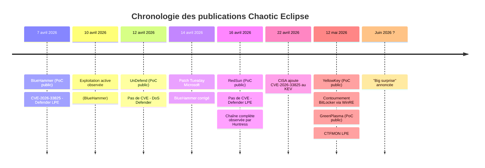
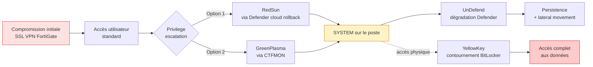

## Pourquoi cet article hors série

> Depuis le début avril 2026, un chercheur en sécurité opérant sous les pseudonymes [Chaotic Eclipse et Nightmare-Eclipse](https://github.com/Nightmare-Eclipse) publie un flot continu de zero-day Windows. Cinq vulnérabilités en six semaines, dont quatre toujours non patchées au moment où j'écris ces lignes. La dernière en date, [YellowKey](https://github.com/Nightmare-Eclipse/YellowKey), permet de contourner BitLocker en configuration TPM-only.
> 
> Pour les équipes sécurité, ces publications répétées posent un vrai problème opérationnel : la majorité de ces failles n'ont pas de correctif disponible. Cet article fait le point sur les cinq exploits, leur statut, et surtout ce qu'il faut faire concrètement.

## Le contexte : une vendetta technique

Le chercheur, qui se présente comme un ancien employé Microsoft frustré par le traitement de ses signalements par le MSRC, a fait du Patch Tuesday son rendez-vous éditorial. Chaque sortie de patches Microsoft est suivie, à quelques jours d'intervalle, par la publication d'un nouvel exploit. Le rythme s'accélère : trois publications en avril, deux supplémentaires en mai, avec [une menace explicite d'une "grosse surprise"](https://www.theregister.com/security/2026/05/13/disgruntled-researcher-releases-two-more-microsoft-zero-days/) pour le Patch Tuesday de juin.

Le pattern est cohérent : toutes les failles ciblent des composants de sécurité Windows (Defender, BitLocker, WinRE, CTFMON). Le chercheur transforme les outils de protection en vecteurs d'attaque et publie systématiquement le code du POC sur GitHub avant tout correctif Microsoft.

[Huntress a confirmé l'exploitation active](https://www.huntress.com/blog/nightmare-eclipse-intrusion) dès mi-avril, avec une campagne attribuée à un acteur géolocalisé en Russie, exploitant un compte SSL VPN FortiGate compromis pour déployer la chaîne BlueHammer + RedSun + UnDefend.

Voici la chronologie des publications :

## L'inventaire des cinq exploits

### BlueHammer - CVE-2026-33825 (patché)

Publié le 7 avril, [BlueHammer](https://nvd.nist.gov/vuln/detail/CVE-2026-33825) est le seul exploit de la série à avoir reçu un correctif. Il s'agit d'une race condition TOCTOU (Time-of-Check to Time-of-Use) dans le moteur de remédiation de Microsoft Defender. L'exploit utilise un opportunistic lock (oplock) pour mettre en pause Defender pendant qu'il traite un fichier détecté comme malveillant, puis redirige l'opération via une junction NTFS vers `C:\Windows\System32`. [L'analyse technique complète de Picus Security](https://www.picussecurity.com/resource/blog/bluehammer-redsun-windows-defender-cve-2026-33825-zero-day-vulnerability-explained) détaille chaque étape de l'exploit.

Résultat : un utilisateur non privilégié obtient SYSTEM sur un Windows 10 ou 11 entièrement patché. CVSS 7.8. Microsoft a publié le correctif lors du Patch Tuesday du 14 avril. [CISA l'a ajouté à son Known Exploited Vulnerabilities Catalog](https://www.cisa.gov/known-exploited-vulnerabilities-catalog) le 22 avril, imposant aux agences fédérales américaines de patcher avant le 6 mai.

### UnDefend (non patché)

Publié le 12 avril, [UnDefend](https://socradar.io/blog/bluehammer-redsun-undefend-windows-defender-0days/) n'est pas une élévation de privilège mais un outil de dégradation : il bloque silencieusement les mises à jour de signatures Defender en exploitant le mécanisme de verrouillage exclusif sur les fichiers de définitions. Defender continue de fonctionner, mais sa capacité de détection se dégrade progressivement à mesure que ses signatures vieillissent.

Aucune CVE attribuée. Aucun correctif disponible. Affecte Windows 10, Windows 11, et Windows Server 2016 à 2025 dès lors que Defender est actif - c'est-à-dire la configuration par défaut sur la quasi-totalité des installations.

### RedSun (non patché)

Publié le 16 avril, [RedSun](https://www.cyderes.com/howler-cell/redsun-zero-day) exploite le mécanisme de rollback cloud de Defender. Quand Defender détecte un fichier tagué cloud (via la Windows Cloud Files API), il tente de le restaurer à son emplacement d'origine sans valider le chemin de destination. L'attaquant en profite pour rediriger l'écriture vers `C:\Windows\System32\TieringEngineService.exe`, puis déclenche l'exécution via COM activation. Résultat : SYSTEM.

Comme BlueHammer, RedSun fonctionne sur des systèmes entièrement patchés. Aucune CVE. Aucun correctif. [Will Dormann a confirmé](https://www.bleepingcomputer.com/news/security/windows-bitlocker-zero-day-gives-access-to-protected-drives-poc-released/) que l'exploit fonctionne sur des systèmes à jour.

### YellowKey (non patché)

Publié le 12 mai, [YellowKey](https://github.com/Nightmare-Eclipse/YellowKey) permet de contourner entièrement BitLocker sur Windows 11 et Windows Server 2022/2025 via le Windows Recovery Environment (WinRE). L'attaque demande un accès physique, mais sa simplicité d'exécution est troublante :

1. Placer des fichiers FsTx spécialement conçus dans `\System Volume Information\FsTx` sur une clé USB (ou directement sur la partition EFI)
2. Brancher la clé USB sur la machine cible
3. Redémarrer en WinRE (Shift + Restart)
4. Maintenir Ctrl pendant le démarrage
5. Une invite de commande s'ouvre avec accès illimité au volume protégé par BitLocker

Le composant vulnérable n'existe que dans l'image WinRE, ce qui amène le chercheur à suggérer qu'il pourrait s'agir d'une [backdoor intentionnelle](https://www.securityweek.com/researcher-drops-yellowkey-greenplasma-windows-zero-days/). Microsoft n'a pas commenté cette accusation.

[Will Dormann a indépendamment reproduit l'exploit](https://thehackernews.com/2026/05/windows-zero-days-expose-bitlocker.html) et a pointé un détail technique inquiétant : les bits NTFS transactionnels présents sur une clé USB peuvent supprimer le fichier `winpeshl.ini` sur un autre disque (X:) au moment du replay, ce qui ouvre une réflexion plus large sur l'isolation des volumes en environnement de récupération.

### GreenPlasma (non patché)

Publié le 12 mai en même temps que YellowKey, [GreenPlasma](https://github.com/Nightmare-Eclipse/GreenPlasma) est une élévation de privilège via le service CTFMON (Collaborative Translation Framework). Le PoC permet à un utilisateur non privilégié de créer des sections mémoire arbitraires dans des répertoires d'objets accessibles en écriture par SYSTEM. Le code publié est volontairement incomplet (le chercheur n'a pas inclus la dernière étape pour obtenir un shell SYSTEM), mais le chemin est clairement tracé.

Aucune CVE. Aucun correctif.

### Récapitulatif des cinq exploits

| Exploit | Publication | CVE | Cible | Impact | Statut |
|---|---|---|---|---|---|
| **BlueHammer** | 7 avril 2026 | CVE-2026-33825 | Defender (TOCTOU) | LPE → SYSTEM | ✅ Patché 14/04 |
| **UnDefend** | 12 avril 2026 | Aucune | Defender (verrous fichiers) | Blocage signatures | ❌ Non patché |
| **RedSun** | 16 avril 2026 | Aucune | Defender (cloud rollback) | LPE → SYSTEM | ❌ Non patché |
| **YellowKey** | 12 mai 2026 | Aucune | BitLocker / WinRE | Contournement chiffrement | ❌ Non patché |
| **GreenPlasma** | 12 mai 2026 | Aucune | CTFMON | LPE → SYSTEM | ❌ Non patché |

Tous les exploits sont [publiés sur le GitHub de Nightmare-Eclipse](https://github.com/Nightmare-Eclipse) avec PoC fonctionnel. BlueHammer et RedSun ont été observés en exploitation active par Huntress.

## Clarification importante : YellowKey et le TPM+PIN

Le sujet fait débat dans la communauté sécurité, il faut donc le détailler.

**Ce qui est vérifiable publiquement :** le PoC publié par Chaotic Eclipse cible exclusivement les configurations BitLocker en TPM-only. Il a été reproduit indépendamment par Will Dormann (Tharros Labs) et confirmé par [Kevin Beaumont](https://www.bleepingcomputer.com/news/security/windows-bitlocker-zero-day-gives-access-to-protected-drives-poc-released/), qui recommande l'usage d'un BitLocker PIN combiné à un mot de passe BIOS comme mitigation.

**Ce que le chercheur affirme sans le démontrer :** dans [une mise à jour de son blog](https://thehackernews.com/2026/05/windows-zero-days-expose-bitlocker.html), Chaotic Eclipse affirme que TPM+PIN n'arrête pas la faille, et qu'il dispose d'une version de l'exploit qui fonctionne aussi dans cette configuration. Il refuse de publier ce PoC, expliquant que "ce qui est déjà en circulation est suffisamment grave". Selon lui, "le MSRC mettra du temps à trouver la vraie cause racine".

**Ce qu'on peut conclure aujourd'hui :** SC Media [confirme dans son analyse](https://www.scworld.com/brief/researcher-publishes-proof-of-concept-exploits-for-unpatched-windows-vulnerabilities) que le PoC public ne touche pas les configurations TPM+PIN. Aucun chercheur indépendant n'a, à ce jour, reproduit l'attaque contre TPM+PIN. La déclaration du chercheur reste donc une affirmation non vérifiée par la communauté.

**Implication pratique :** TPM+PIN reste la meilleure mitigation BitLocker disponible aujourd'hui, et nettement plus robuste que TPM-only. Mais cette protection peut tomber à tout moment si le chercheur publie son PoC TPM+PIN (le rendez-vous explicite est le Patch Tuesday de juin). À combiner avec les autres mesures de durcissement décrites plus bas.

[XDA Developers résume bien la situation](https://www.xda-developers.com/new-windows-11-bitlocker-bypass-needs-usb-stick-researcher-backdoor/) : "le contrôle d'accès physique reste la seule mitigation que l'on peut recommander avec certitude, et les parcs en TPM-only par défaut doivent être traités comme un disque non chiffré jusqu'à ce qu'un correctif arrive".

## La chaîne d'attaque possible

Ces cinq exploits forment une chaîne d'attaque presque complète. Un attaquant qui obtient un point d'entrée via VPN compromis ou phishing peut enchaîner :

- **RedSun** pour passer de utilisateur à SYSTEM sur le poste compromis
- **UnDefend** pour aveugler progressivement Defender et masquer ses traces
- **YellowKey** s'il obtient un accès physique à un autre poste (ou via vol d'équipement)
- **GreenPlasma** comme alternative à RedSun si nécessaire

C'est exactement [la "layered degradation strategy" décrite par Vectra](https://ebuildersecurity.com/cyber-news/microsoft-defender-three-zero-days-bluehammer-redsun-undefend-2026/) : élever ses privilèges, puis dégrader la protection endpoint dans la durée.

Visuellement, la chaîne observée par Huntress donne ceci :

Toutes ces vulnérabilités exploitent des composants de sécurité Windows par défaut : Defender, BitLocker, WinRE. Ce sont les briques sur lesquelles repose la défense d'un parc Windows standard, et elles sont aujourd'hui exploitables sans correctif disponible.

Et le rythme de publication ne montre aucun signe de ralentissement. Le chercheur affirme disposer d'autres exploits prêts à être publiés automatiquement s'il devait disparaître, et annonce déjà du contenu pour le Patch Tuesday de juin.

## Que faire concrètement

Voici les actions priorisées par urgence et par impact, en distinguant ce qui se fait en quelques heures de ce qui demande un projet plus structuré.

### Action immédiate : patcher BlueHammer

Si [BlueHammer (CVE-2026-33825)](https://msrc.microsoft.com/update-guide/vulnerability/CVE-2026-33825) n'est pas encore déployé sur l'ensemble du parc, c'est l'action numéro un. Le correctif est disponible depuis le 14 avril, l'exploitation active est confirmée depuis le 10 avril. Tout retard de déploiement est une fenêtre d'opportunité supplémentaire pour les attaquants.

Pour les organisations qui pilotent leurs déploiements de patches en rings (typique en environnement Intune), il faut envisager une exception out-of-band. La CISA a fixé le 6 mai comme date limite pour les agences fédérales américaines.

### Action court terme : durcir BitLocker

YellowKey vise spécifiquement les configurations BitLocker en TPM-only, qui est la configuration par défaut sur la plupart des déploiements Autopilot et MDM. Comme expliqué plus haut, le PoC public ne touche pas TPM+PIN, mais le chercheur affirme avoir un exploit qui fonctionne dans cette configuration. La bascule vers TPM+PIN reste donc la mesure de durcissement la plus immédiate, sans être une garantie absolue.

Concrètement, pour un parc géré via Intune, [Microsoft documente la configuration BitLocker avec PIN](https://learn.microsoft.com/en-us/mem/intune/protect/encrypt-devices) via les profils de configuration :

- Activer la stratégie "Require startup PIN with TPM" dans le profile BitLocker
- Définir un mot de passe BIOS via Manufacturer-Specific Configuration Profile
- Désactiver le boot USB dans le BIOS quand c'est possible (avec mot de passe BIOS pour empêcher la modification)
- Verrouiller le Boot Order et l'accès à WinRE via les paramètres firmware

Cette dernière mesure - restreindre WinRE - est la plus efficace contre YellowKey. [Microsoft a publié en 2023 une procédure pour désactiver WinRE](https://support.microsoft.com/en-us/topic/kb5025885-how-to-manage-the-windows-boot-manager-revocations-for-secure-boot-changes-associated-with-cve-2023-24932-41a4015c-7877-4778-bb13-f3399466cef0) sur les machines qui n'en ont pas besoin (KB5025885 et procédures associées). Sur les postes utilisateurs standards, désactiver WinRE supprime entièrement la surface d'attaque de YellowKey, au prix d'une perte de capacité de récupération locale.

### Action court terme : détection comportementale

Aucune signature ne protège contre RedSun, UnDefend, et GreenPlasma. La détection doit passer par les comportements. Plusieurs équipes ([Huntress](https://www.huntress.com/blog/nightmare-eclipse-intrusion), [Cyderes](https://www.cyderes.com/howler-cell/redsun-zero-day), [Picus](https://www.picussecurity.com/resource/blog/bluehammer-redsun-windows-defender-cve-2026-33825-zero-day-vulnerability-explained)) ont publié des règles de détection. Les patterns clés à surveiller :

- Appels `NtQueryDirectoryObject` ciblant `HarddiskVolumeShadowCopy*` depuis des processus user-space (indicateur de reconnaissance type RedSun)
- Création d'oplocks par des processus non-système sur des fichiers monitorés par Defender
- Enregistrement de sync roots Cloud Files par des processus non approuvés
- Séquences d'énumération typiques observées dans les intrusions : `whoami /priv`, `cmdkey /list`, `net group`
- Arrêts inattendus du service Defender ou échecs répétés de mise à jour de signatures (indicateur UnDefend)
- Processus SYSTEM dont le parent provient d'une session utilisateur
- Accès à LSASS peu après un événement de connexion

Pour les organisations équipées de [Microsoft Defender for Endpoint](https://learn.microsoft.com/en-us/defender-endpoint/), Microsoft Sentinel, ou CrowdStrike, ces patterns sont déjà intégrés dans les règles de détection des éditeurs au moment où j'écris. Vérifier que les règles correspondantes sont bien activées et alimentent le SOC.

### Action court terme : chasse aux points d'entrée initiaux

L'exploitation observée par Huntress repose sur un accès initial via SSL VPN. Tous les chemins de compromission initiale doivent être audités en priorité :

- Vérifier les comptes de service exposés sur les VPN (FortiGate, mais aussi Cisco AnyConnect, Pulse Secure, etc.)
- Activer la MFA sur toutes les connexions VPN si ce n'est pas déjà le cas
- Auditer les sessions VPN inhabituelles : géolocalisations atypiques, plages horaires non standards, durées de session anormales
- Surveiller les comptes ayant des sessions VPN simultanées depuis des localisations différentes

C'est le point d'entrée réel observé dans les intrusions documentées.

### Action long terme : adapter le cycle de patching

BlueHammer et RedSun ont démontré que la fenêtre entre publication d'un exploit et exploitation en production est désormais de l'ordre de quelques jours, parfois moins. Le [cycle classique de déploiement de patches en vagues sur deux à quatre semaines n'est plus tenable](https://www.securitytoday.de/en/2026/04/21/windows-defender-under-fire-bluehammer-and-redsun-exploited/) pour les vulnérabilités critiques publiquement exploitées.

Il faut documenter formellement, en accord avec le management, une procédure d'out-of-band patching qui permette de court-circuiter le cycle normal en cas de zero-day activement exploité. Les organisations qui n'ont pas cette procédure écrite perdent des jours en chaînes d'approbation, là où l'urgence ne le permet plus.

## Pour aller plus loin

- [The Hacker News - YellowKey et GreenPlasma](https://thehackernews.com/2026/05/windows-zero-days-expose-bitlocker.html)
- [BleepingComputer - YellowKey PoC release](https://www.bleepingcomputer.com/news/security/windows-bitlocker-zero-day-gives-access-to-protected-drives-poc-released/)
- [SecurityWeek - Analyse YellowKey et GreenPlasma](https://www.securityweek.com/researcher-drops-yellowkey-greenplasma-windows-zero-days/)
- [Huntress - Analyse de l'intrusion Nightmare-Eclipse](https://www.huntress.com/blog/nightmare-eclipse-intrusion)
- [SocRadar - Vue d'ensemble des trois exploits Defender](https://socradar.io/blog/bluehammer-redsun-undefend-windows-defender-0days/)
- [CISA KEV Catalog - CVE-2026-33825](https://www.cisa.gov/known-exploited-vulnerabilities-catalog)
- [Picus Security - Analyse technique BlueHammer + RedSun](https://www.picussecurity.com/resource/blog/bluehammer-redsun-windows-defender-cve-2026-33825-zero-day-vulnerability-explained)
- [Cyderes - Détection RedSun](https://www.cyderes.com/howler-cell/redsun-zero-day)
- [GitHub - Nightmare-Eclipse (PoC publics)](https://github.com/Nightmare-Eclipse)