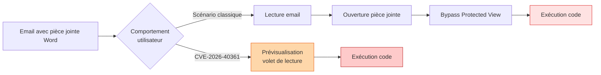

## Le résumé en une phrase

Microsoft a publié le 13 mai 2026 un correctif pour une vulnérabilité Word (CVE-2026-40361) qui s'exécute automatiquement quand Outlook affiche un email dans le volet de lecture. Aucune interaction utilisateur n'est nécessaire.

## Ce qu'il faut savoir techniquement

| Information | Valeur |
|---|---|
| **CVE** | CVE-2026-40361 |
| **CVSS 3.1** | 8.4 (High) |
| **Type** | Use-after-free (CWE-416) |
| **Composant** | wwlib.dll (DLL partagée Word/Outlook) |
| **Vecteur d'attaque** | Local, mais déclenchable via Volet de Lecture Outlook |
| **Interaction utilisateur** | Aucune (zero-click) |
| **Évaluation Microsoft** | Exploitation More Likely |
| **Découvreur** | Haifei Li (Expmon), via ZDI |

La vulnérabilité est dans `wwlib.dll`, une DLL utilisée à la fois par Word et par Outlook pour le rendu des documents et des emails. Quand Outlook affiche un email dans le volet de lecture, il invoque ce même codepath. Un email spécialement conçu déclenche le use-after-free sans aucune interaction utilisateur.

C'est ce que Haifei Li, le chercheur qui avait découvert **BadWinmail (CVE-2015-6172)** il y a dix ans, qualifie de "enterprise killer" : la même classe d'attaque, le même vecteur, le même impact potentiel. N'importe qui peut compromettre un CEO ou un CFO en envoyant un email.

## Pourquoi le volet de lecture est un vecteur particulier



Le scénario classique d'une RCE Office nécessite trois interactions utilisateur : ouvrir l'email, ouvrir la pièce jointe, valider le warning Protected View. CVE-2026-40361 supprime ces trois étapes. L'utilisateur ouvre simplement sa messagerie, le volet de lecture affiche l'email suivant, l'exploit se déclenche.

Pour un attaquant qui envoie un email malveillant à dix personnes d'un même département, le taux de déclenchement approche les 100% chez tous les utilisateurs qui ont le volet de lecture activé (configuration par défaut Outlook).

## Produits concernés

Le correctif est inclus dans les mises à jour cumulatives de mai 2026 pour :

- **Microsoft 365 Apps for Enterprise** (canal Current, Monthly Enterprise, Semi-Annual)
- **Office LTSC 2024**
- **Office 2021** (LTSC et standard)
- **Office 2019**
- **Office 2016** (security-only update, hors support mainstream mais codepath partagé)
- Les SKU Word standalone correspondants

Outlook mobile (iOS/Android) n'est pas concerné, le rendu y est fait par d'autres composants.

## Action immédiate : patcher

Le patch fait partie du Patch Tuesday du 13 mai 2026. Selon votre configuration de déploiement :

**Microsoft 365 Apps (Click-to-Run)** : la mise à jour se fait automatiquement selon le canal de mise à jour configuré. Pour forcer une mise à jour immédiate sur un poste :

```cmd
"C:\Program Files\Common Files\microsoft shared\ClickToRun\OfficeC2RClient.exe" /update user
```

Pour vérifier la version installée :

```cmd
"C:\Program Files\Common Files\microsoft shared\ClickToRun\OfficeC2RClient.exe" /version
```

Les builds qui contiennent le correctif (à vérifier sur la [page des builds Microsoft 365](https://learn.microsoft.com/en-us/officeupdates/update-history-microsoft365-apps-by-date)) selon le canal :

- Current Channel : Version 2604 (Build 18827.20140) ou supérieur
- Monthly Enterprise Channel : Version 2602 (Build 18526.20668) ou supérieur
- Semi-Annual Enterprise Channel : Version 2508 (Build 18129.21010) ou supérieur

**Office MSI (2019, 2021 LTSC, 2024 LTSC)** : déployer le KB approprié via WSUS, SCCM, Intune ou Microsoft Update.

**Côté Intune**, vérifier que la stratégie de gestion des canaux Office (Office Update Channel) pousse bien les utilisateurs vers Current ou Monthly Enterprise, et que le délai d'application n'excède pas 7 jours.

## Mitigations en attendant le déploiement complet

Si vous ne pouvez pas patcher l'ensemble du parc rapidement, plusieurs mesures réduisent significativement la surface d'attaque.

### Forcer l'affichage en texte brut

C'est la mitigation la plus efficace : un email en texte brut ne déclenche pas le codepath vulnérable. Via GPO (`Administrative Templates > Microsoft Outlook > Outlook Options > Preferences > E-mail Options`) :

- **Read all standard mail in plain text** : activé
- **Read all digitally signed mail as plain text** : activé

Via le registre directement :

```cmd
[HKEY_CURRENT_USER\Software\Microsoft\Office\16.0\Outlook\Options\Mail]
"ReadAsPlain"=dword:00000001
```

Cette mitigation a un coût utilisateur réel : les emails HTML s'affichent sans mise en forme. À discuter avec le métier avant déploiement large, ou à appliquer ciblé sur les comptes à haute valeur (direction, finance, RH).

### Désactiver le volet de lecture pour les utilisateurs sensibles

Toujours via GPO ou Intune, désactiver le Reading Pane sur les comptes à risque élevé. C'est une mitigation contraignante au quotidien, mais elle supprime totalement le vecteur zero-click.

### Bloquer les pièces jointes Word à la passerelle

Si vous avez Exchange Online Protection ou un secure email gateway tiers, configurer une règle qui met en quarantaine les pièces jointes `.doc`, `.docx`, `.rtf` provenant d'expéditeurs externes non listés. C'est une mesure agressive qui peut casser des workflows métier légitimes.

### Activer Attack Surface Reduction rules

Pour les parcs avec Defender for Endpoint, deux règles ASR sont particulièrement pertinentes :

- **Block Office applications from creating child processes** (`D4F940AB-401B-4EFC-AADC-AD5F3C50688A`)
- **Block Office applications from injecting code into other processes** (`75668C1F-73B5-4CF0-BB93-3ECF5CB7CC84`)

Ces règles ne bloquent pas la vulnérabilité elle-même, mais limitent les actions post-exploitation. À activer en mode audit d'abord pour identifier les impacts métier, puis en mode block.

## Détection

Pas de signature spécifique disponible publiquement à ce stade. Quelques pistes pour la détection comportementale :

- Processus enfants inhabituels de `OUTLOOK.EXE` ou `WINWORD.EXE` (cmd, powershell, mshta, rundll32, regsvr32)
- Création de fichiers exécutables dans les répertoires utilisateur depuis Outlook ou Word
- Connexions réseau sortantes initiées par Outlook vers des adresses externes inhabituelles
- Chargement de DLLs non signées par le processus Outlook

Pour les organisations avec Defender for Endpoint, les règles d'attaque comportementale couvrant les exploits Office sont déjà actives et détectent ces patterns. Vérifier que la télémétrie remonte bien dans Defender XDR et que les alertes "Suspicious Office process behavior" sont escaladées au SOC.

## Le contexte des RCE Word récurrentes

CVE-2026-40361 n'est pas un cas isolé. Les Patch Tuesday de mars, avril et mai 2026 ont chacun contenu plusieurs RCE Word, plusieurs déclenchables via le volet de lecture :

| Mois | CVE | Évaluation |
|---|---|---|
| Mai 2026 | CVE-2026-40361 | Exploitation More Likely |
| Mai 2026 | CVE-2026-40364 | Exploitation More Likely |
| Mai 2026 | CVE-2026-40366 | Less Likely |
| Mai 2026 | CVE-2026-40367 | Unlikely |
| Avril 2026 | Plusieurs RCE Word | Mix |
| Mars 2026 | Plusieurs RCE Word | Mix |

Le code du parser Word est manifestement la zone qui reçoit le plus d'attention de la part des chercheurs (et des attaquants) en ce moment. Le rythme mensuel de RCE Word ne devrait pas ralentir à court terme.

## Pour les utilisateurs à haute valeur

Pour les comptes VIP (direction, finance, juridique), au-delà du patch immédiat :

- Forcer le texte brut côté GPO sur ces comptes spécifiquement
- Activer le rate limiting Exchange Online pour les emails entrants depuis externe
- Mettre en place du Safe Attachments (Defender for Office 365) avec mode bloquant
- Vérifier que ces comptes ne tournent pas en local admin sur leur poste (sinon une RCE devient une compromission complète immédiate)

## Sources

- [SecurityWeek - Critical Zero-Click Outlook Vulnerability](https://www.securityweek.com/microsoft-patches-critical-zero-click-outlook-vulnerability-threatening-enterprises/)
- [SC Media - Patch Tuesday Mai 2026](https://www.scworld.com/news/patch-tuesday-no-zero-days-among-137-microsoft-cves-4-word-rces)
- [BleepingComputer - Microsoft Office update fixes Word RCE](https://fieldeffect.com/blog/word-rce-via-outlook-emails)
- [Analyse technique GBlock - CVE-2026-40361](https://www.gblock.app/articles/microsoft-word-preview-pane-rce-cve-2026-40361)
- [Zero Day Initiative - Mai 2026 Security Update Review](https://www.zerodayinitiative.com/blog)
- [Haifei Li sur Expmon - BadWinmail v2](https://expmon.com/)
- [Documentation Microsoft Update History M365 Apps](https://learn.microsoft.com/en-us/officeupdates/update-history-microsoft365-apps-by-date)
- [Attack Surface Reduction rules reference](https://learn.microsoft.com/en-us/defender-endpoint/attack-surface-reduction-rules-reference)
