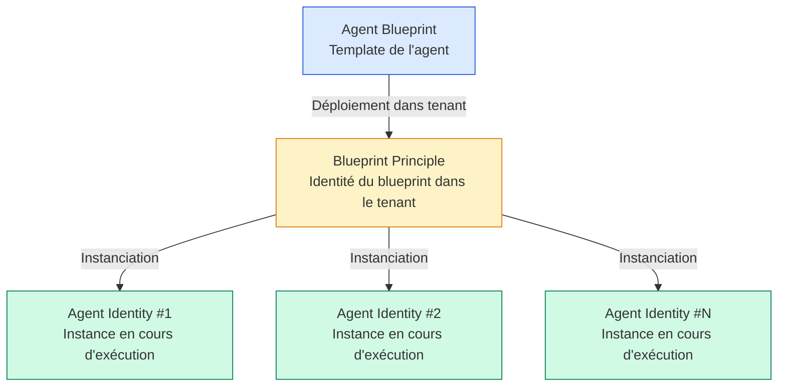

> Microsoft Entra Agent ID est passé en disponibilité générale le **1er mai 2026**. C'est le mécanisme officiel pour gérer l'identité des agents IA (Copilot Studio, agents tiers, agents internes) dans Entra. L'annonce est sur le [blog Microsoft Security](https://www.microsoft.com/en-us/security/blog/2026/05/01/microsoft-agent-365-now-generally-available-expands-capabilities-and-integrations/).

L'arrivée des agents IA en production change la donne pour les admins identité. Un agent n'est ni un utilisateur, ni une application classique. Il a besoin d'authentification, de permissions, de gouvernance, de logs - mais avec une particularité : il peut se cloner, évoluer, et déployer de nouvelles instances dynamiquement.

Microsoft a choisi un modèle à trois niveaux pour gérer cette spécificité. Cet article explique ce modèle, ce qu'il change pour les admins, et comment commencer à l'aborder.

## Le modèle à trois niveaux

L'erreur classique en arrivant sur Agent ID, c'est de raisonner en "app registration unique" comme pour une application classique. Le modèle est différent :



**Agent Blueprint** : le template de l'agent. Il vit dans un tenant (celui du développeur de l'agent) et définit le comportement, les permissions requises, les capacités. Vu comme une app registration "augmentée".

**Blueprint Principle** : l'identité du blueprint dans chaque tenant où il est déployé. C'est l'équivalent du service principal pour une app classique, mais avec une caractéristique clé : les permissions accordées ici cascadent vers toutes les instances d'agent actuelles et futures, à condition que la ressource soit marquée comme inheritable resource sur le blueprint.

**Agent Identity** : l'instance qui s'exécute réellement. C'est ce qui apparaît dans les logs de sign-in, ce qui authentifie, et ce qui peut détenir ses propres permissions en complément de celles héritées.

## Required Resource Access : c'est un signal, pas un grant

C'est le piège qui trompe la plupart des admins à leur premier déploiement. Ajouter une permission au Required Resource Access (RRA) du blueprint **n'accorde rien**. C'est un signal à l'admin qui adopte l'agent : "voici ce dont cet agent va avoir besoin pour fonctionner".

L'accord réel se fait soit :
- À l'adoption, lorsque l'admin du tenant cible consent aux permissions
- Dynamiquement, quand l'agent demande de nouvelles permissions en cours d'exécution

Cette logique de consentement dynamique est un changement profond par rapport aux apps classiques. Les agents évoluent : un agent qui automatise un workflow peut avoir besoin de nouvelles permissions au bout de quelques semaines selon les tâches qu'il prend en charge. Le modèle a été conçu pour gérer cette évolution sans bloquer l'admin dans un cycle de re-consentement permanent.

## Inheritance only works if you set it up

Pour que les permissions accordées au Blueprint Principle cascadent vers les Agent Identities, la ressource doit être marquée comme inheritable resource sur le blueprint. Un oubli classique en début de projet : on accorde la permission sur le Blueprint Principle, puis on s'étonne que les instances n'y aient pas accès.

Vérification rapide :

```powershell
Connect-MgGraph -Scopes "Application.Read.All"

# Lister les agents blueprints du tenant
$agents = Get-MgServicePrincipal -All -Filter "tags/any(t: t eq 'AgentID')"

foreach ($agent in $agents) {
    Write-Output "Blueprint: $($agent.DisplayName)"
    Write-Output "  Inheritable resources:"
    # Récupérer les inheritable resources définies sur le blueprint
    $resources = Get-MgServicePrincipalAppRoleAssignment -ServicePrincipalId $agent.Id
    $resources | Where-Object {$_.AppRoleId -ne $null} | 
        Select-Object ResourceDisplayName, AppRoleId
}
```

Microsoft documente l'attribut `inheritableResources` dans la [référence Microsoft Graph pour Agent ID](https://learn.microsoft.com/en-us/entra/agent-id/what-is-agent-id-platform).

## Ce que ça change concrètement pour un admin Entra

### 1. La gouvernance ne peut plus se faire au niveau "application"

Un agent peut avoir des dizaines d'instances tournant en parallèle, chacune avec ses propres permissions surajoutées. La granularité de gouvernance n'est plus "par app" mais "par instance" pour les permissions ad-hoc, et "par blueprint" pour les permissions héritées.

L'audit des permissions agents nécessite de croiser :
- Les permissions sur le Blueprint Principle (cascadent)
- Les permissions individuelles de chaque Agent Identity
- Les inheritable resources définies sur le Blueprint

### 2. La Conditional Access s'applique aux agents

Microsoft a publié [Conditional Access for agent identities](https://learn.microsoft.com/en-us/entra/identity/conditional-access/agent-id) qui permet d'appliquer des politiques CA aux agent identities. Cas d'usage typiques :

- Restreindre l'accès des agents à certaines ressources sensibles
- Exiger une session limitée pour les agents non vérifiés
- Bloquer l'utilisation d'agents depuis certaines localisations
- Forcer une réauthentification fréquente pour les agents à privilèges élevés

L'admin doit penser ses politiques CA en incluant les agents comme principal possible, pas juste les utilisateurs et apps classiques.

### 3. L'ID Protection couvre maintenant les agents

[ID Protection for agents](https://learn.microsoft.com/en-us/entra/id-protection/concept-risky-agents) est en preview. Le mécanisme détecte les comportements anormaux d'agents :

- Activité depuis une géolocalisation inhabituelle
- Pattern d'utilisation atypique
- Accès à des ressources sensibles non habituelles
- Volume de requêtes anormal

Comme pour les utilisateurs, ID Protection peut déclencher des actions automatisées (bloquer l'agent, exiger une re-validation administrateur, etc.).

### 4. Les agents ont leur propre Secure Web And AI Gateway

[Secure Web And AI Gateway for Microsoft Copilot Studio agents](https://learn.microsoft.com/en-us/entra/global-secure-access/concept-secure-web-ai-gateway-agents) applique les politiques Global Secure Access aux flux générés par les agents : DLP, filtrage de contenu, protection contre les prompt injections.

C'est particulièrement important pour les agents qui exécutent des requêtes web sortantes : sans cette couche, un agent compromis pourrait exfiltrer des données vers un endpoint contrôlé par un attaquant.

## Mise en place dans un tenant

Microsoft a documenté la procédure d'adoption dans [Protect agent identities with Microsoft Entra](https://learn.microsoft.com/en-us/microsoft-agent-365/admin/capabilities-entra). Les étapes principales :

### 1. Activer Agent ID dans le tenant

```powershell
# Vérifier la disponibilité d'Agent ID dans le tenant
Get-MgServicePrincipal -Filter "appId eq 'agent-id-platform-app-id'"

# L'activation se fait via le portail Entra :
# Entra admin center > Agent ID > Settings > Enable Agent ID platform
```

### 2. Configurer les sponsors

Un agent doit avoir un **sponsor** : un utilisateur ou un groupe qui assume la responsabilité de l'agent. C'est une nouveauté Microsoft du 12 mai 2026, documentée dans [Sponsor group type requirements for agent identities](https://devblogs.microsoft.com/microsoft365dev/sponsor-group-type-requirements-for-agent-identities/).

Les sponsors doivent être :
- Des utilisateurs membres du tenant (pas des invités)
- Membres d'un security group activé pour Agent ID sponsorship

Sans sponsor valide, l'agent ne peut pas être déployé ou activé.

### 3. Définir les politiques de gouvernance

[Governing Agent Identities](https://learn.microsoft.com/en-us/entra/id-governance/agent-id-governance-overview) couvre les mécanismes de gouvernance :

- Access reviews périodiques sur les permissions des agents
- Lifecycle management : qui peut créer, modifier, retirer des agents
- Audit trail complet des activités agents

### 4. Visualiser le tenant existant

Erin Greenlee (équipe Entra AuthN chez Microsoft) a publié un outil libre, [Agent ID Helper](https://aka.ms/erins-agent-helper), qui permet de visualiser graphiquement les blueprints, blueprint principles, et agent identities d'un tenant, leurs relations, et les permissions inherited vs individuelles. Outil interactif, no-sign-in tutorial, génération de scripts PowerShell/Graph. Utile pour comprendre la topologie réelle avant de définir une stratégie de gouvernance.

## Recommandations pour démarrer

**Pour les organisations qui n'ont pas encore d'agents en production** : commencer par l'audit. Lister les agents existants (même expérimentaux), leurs sponsors, leurs permissions. Définir une politique d'autorisation avant que les métiers ne déploient des agents sans gouvernance.

**Pour les organisations qui ont déjà des agents déployés** : vérifier que chaque agent a un sponsor valide (avant la date d'application stricte des sponsors), que les inheritable resources sont configurées correctement, et que les access reviews sont activées.

**Dans tous les cas** : prévoir une politique Conditional Access dédiée aux agent identities. Le profil de risque est très différent de celui des utilisateurs humains.

## Sources

- [Microsoft Agent 365, now generally available - blog Microsoft Security](https://www.microsoft.com/en-us/security/blog/2026/05/01/microsoft-agent-365-now-generally-available-expands-capabilities-and-integrations/)
- [What's New in Agent 365: May 2026](https://techcommunity.microsoft.com/blog/agent-365-blog/what%E2%80%99s-new-in-agent-365-may-2026/4516340)
- [What is Microsoft Entra Agent ID?](https://learn.microsoft.com/en-us/entra/agent-id/what-is-microsoft-entra-agent-id)
- [Protect agent identities with Microsoft Entra](https://learn.microsoft.com/en-us/microsoft-agent-365/admin/capabilities-entra)
- [Authorization in Microsoft Entra Agent ID](https://learn.microsoft.com/en-us/entra/agent-id/authorization-agent-id)
- [Conditional Access for agent identities](https://learn.microsoft.com/en-us/entra/identity/conditional-access/agent-id)
- [Governing Agent Identities](https://learn.microsoft.com/en-us/entra/id-governance/agent-id-governance-overview)
- [Secure Web And AI Gateway for Microsoft Copilot Studio agents](https://learn.microsoft.com/en-us/entra/global-secure-access/concept-secure-web-ai-gateway-agents)
- [ID Protection for agents (Preview)](https://learn.microsoft.com/en-us/entra/id-protection/concept-risky-agents)
- [Sponsor group type requirements for agent identities](https://devblogs.microsoft.com/microsoft365dev/sponsor-group-type-requirements-for-agent-identities/)
