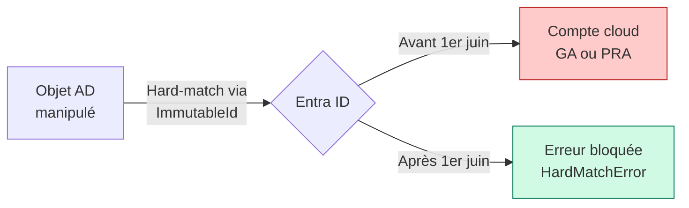

> À partir du **1er juin 2026**, Microsoft Entra ID bloque toute tentative de hard-match d'un objet synchronisé via Entra Connect Sync vers un compte cloud-managed qui détient un rôle Entra ID actif. L'annonce est disponible sur [la page What's New de Microsoft Entra](https://learn.microsoft.com/en-us/entra/fundamentals/whats-new).

Ce hardening vise un vecteur d'attaque documenté : un attaquant qui compromet l'AD on-premises peut manipuler les attributs d'objets AD (immutableId, userPrincipalName, proxyAddresses) pour forcer un hard-match avec un compte cloud privilégié - Global Administrator, Privileged Role Administrator, etc. Sans ce blocage, la compromission de l'AD on-premises pouvait mener directement à une élévation de privilège dans le cloud.

## Ce qu'est un hard-match

Il existe deux mécanismes de correspondance entre un objet AD et un compte Entra ID lors de la synchronisation :

**Soft-match** : Entra Connect compare le `userPrincipalName` ou les `proxyAddresses` de l'objet AD avec les attributs d'un compte cloud existant. Si la correspondance est trouvée, les deux objets sont liés. Le soft-match peut être désactivé ou empêché par l'administrateur Entra.

**Hard-match** : Entra Connect écrit l'`ImmutableId` (dérivé du `ObjectGUID` AD) dans l'attribut `onPremisesImmutableId` du compte cloud. Cette liaison est considérée comme définitive et prend le dessus sur toute autre correspondance. C'est ce mécanisme qui était exploitable.



## Ce qui est bloqué exactement

À partir du 1er juin 2026, Entra ID refuse le hard-match si le compte cloud cible remplit **l'une** de ces conditions :

- Le compte détient un rôle Entra ID actif (directement assigné ou via PIM)
- Le compte est membre d'un groupe de rôles Entra actif
- Le compte est un compte d'accès d'urgence (break-glass)

Le blocage concerne uniquement les **nouvelles** tentatives de hard-match. Les correspondances existantes déjà établies ne sont pas cassées.

Les comptes cloud-managed **sans rôle Entra** ne sont pas concernés par ce blocage.

## Audit préalable : identifier les comptes exposés

Avant le 1er juin, il faut vérifier deux choses : quels comptes cloud privilégiés pourraient être ciblés, et si ta configuration Connect Sync contient des règles qui pourraient déclencher un hard-match vers ces comptes.

### Lister les comptes cloud-managed avec rôles Entra

```powershell
# Connexion
Connect-MgGraph -Scopes "RoleManagement.Read.Directory", "User.Read.All"

# Récupérer tous les role assignments actifs
$assignments = Get-MgRoleManagementDirectoryRoleAssignment -All

foreach ($assignment in $assignments) {
    $user = Get-MgUser -UserId $assignment.PrincipalId -ErrorAction SilentlyContinue
    if ($user -and $user.OnPremisesSyncEnabled -ne $true) {
        # Compte cloud-managed (pas synchronisé depuis l'AD)
        $role = Get-MgRoleManagementDirectoryRoleDefinition -UnifiedRoleDefinitionId $assignment.RoleDefinitionId
        [PSCustomObject]@{
            UPN           = $user.UserPrincipalName
            DisplayName   = $user.DisplayName
            Role          = $role.DisplayName
            IsSynced      = $user.OnPremisesSyncEnabled
            ImmutableId   = $user.OnPremisesImmutableId
        }
    }
} | Export-Csv -Path "cloud_privileged_accounts.csv" -NoTypeInformation -Encoding UTF8
```

**Ce qu'on cherche** : des comptes avec `IsSynced = False` (donc cloud-managed) qui ont un rôle Entra. Ces comptes sont protégés par le nouveau hardening. On vérifie aussi si certains ont déjà un `ImmutableId` défini, ce qui indiquerait une correspondance existante à documenter.

### Vérifier les règles de synchronisation personnalisées

```powershell
# Lister les règles de synchronisation non-standard
Get-ADSyncRule | Where-Object {
    $_.IsStandardRule -eq $false -and
    $_.Direction -eq "Outbound"
} | Select-Object Name, Direction, Precedence, Disabled |
Sort-Object Precedence |
Export-Csv -Path "custom_sync_rules.csv" -NoTypeInformation -Encoding UTF8

# Vérifier spécifiquement les règles qui touchent à l'ImmutableId
Get-ADSyncRule | Where-Object {
    $_.AttributeFlowMappings.Destination -contains "ImmutableId" -and
    $_.IsStandardRule -eq $false
} | Select-Object Name, Direction, @{N='Mappings';E={$_.AttributeFlowMappings | ConvertTo-Json}}
```

Si tu as des règles personnalisées qui manipulent l'ImmutableId, documente-les et vérifie qu'elles ne ciblent pas de comptes cloud privilégiés.

### Vérifier les comptes de batch provisioning

Si tu as des scripts de provisioning en masse qui utilisent `Set-MgUser -OnPremisesImmutableId`, c'est un vecteur de hard-match programmatique. Les identifier :

```powershell
# Chercher dans les audit logs Entra les opérations d'écriture d'ImmutableId des 30 derniers jours
$filter = "activityDisplayName eq 'Update user' and targetResources/any(r: r/modifiedProperties/any(p: p/displayName eq 'onPremisesImmutableId'))"
$logs = Get-MgAuditLogDirectoryAudit -Filter $filter -All

$logs | Select-Object ActivityDateTime,
    @{N='Initiator';E={$_.InitiatedBy.User.UserPrincipalName}},
    @{N='Target';E={$_.TargetResources[0].UserPrincipalName}} |
Export-Csv -Path "immutableid_writes.csv" -NoTypeInformation -Encoding UTF8
```

## Ce qu'il faut corriger avant le 1er juin

### Cas 1 : Comptes avec double identité (hybrid + privilège cloud)

Si un compte est **à la fois** synchronisé depuis l'AD **et** a un rôle Entra ID, la situation est risquée indépendamment du hardening. Un compte hybride avec rôle GA est une mauvaise pratique : la compromission de l'AD donne potentiellement accès au compte GA.

La recommandation Microsoft est de **séparer les comptes** : un compte AD pour les accès on-premises, un compte cloud-only distinct pour les rôles Entra ID.

Pour identifier ces comptes mixtes :

```powershell
$assignments = Get-MgRoleManagementDirectoryRoleAssignment -All
foreach ($a in $assignments) {
    $user = Get-MgUser -UserId $a.PrincipalId -ErrorAction SilentlyContinue
    if ($user -and $user.OnPremisesSyncEnabled -eq $true) {
        Write-Warning "Compte hybride avec rôle Entra : $($user.UserPrincipalName)"
    }
}
```

### Cas 2 : Scripts qui écrivent l'ImmutableId sur des comptes cloud privilégiés

Identifier les scripts concernés (à partir du rapport précédent) et les corriger pour exclure les comptes avec rôles Entra.

### Cas 3 : Règles Connect Sync qui pourraient déclencher un hard-match non intentionnel

Si l'audit des règles personnalisées révèle des transformations d'ImmutableId vers des comptes cloud, valider avec l'équipe qui maintient ces règles que les cibles ne sont pas des comptes privilégiés.

## Après le 1er juin : gérer les erreurs de hard-match

Si une tentative de hard-match est bloquée, Entra Connect Sync génère une erreur de type `HardMatchError` dans les logs de synchronisation. Les comptes concernés apparaissent dans le portail Entra sous **Entra Connect Health > Sync Errors**.

Pour consulter les erreurs programmatiquement :

```powershell
# Erreurs de synchronisation liées au hard-match
Get-MgDirectoryObjectById -Ids (
    Get-MgOrganization | 
    Select-Object -ExpandProperty Id
) | Select-Object -ExpandProperty AdditionalProperties

# Méthode alternative via Graph
Get-MgDirectorySynchronizationJobError -All |
Where-Object {$_.ErrorCode -eq "HardMatchError"}
```

La procédure de mitigation officielle Microsoft est documentée sur [aka.ms/HardMatchError](https://aka.ms/HardMatchError). Le scénario classique de résolution : retirer temporairement le rôle Entra du compte cloud ciblé, laisser le hard-match s'établir, puis ré-assigner le rôle. À faire avec précaution et en dehors des heures de production.

## Pour aller plus loin

- [Annonce officielle - What's New Entra ID](https://learn.microsoft.com/en-us/entra/fundamentals/whats-new)
- [Protect against on-premises attacks - Microsoft Entra](https://learn.microsoft.com/en-us/entra/identity/hybrid/connect/protect-m365-from-on-premises-attacks)
- [Hard-match error mitigation](https://aka.ms/HardMatchError)
- [Best practices Entra Connect Sync](https://learn.microsoft.com/en-us/entra/identity/hybrid/connect/how-to-connect-sync-best-practices-changing-default-configuration)