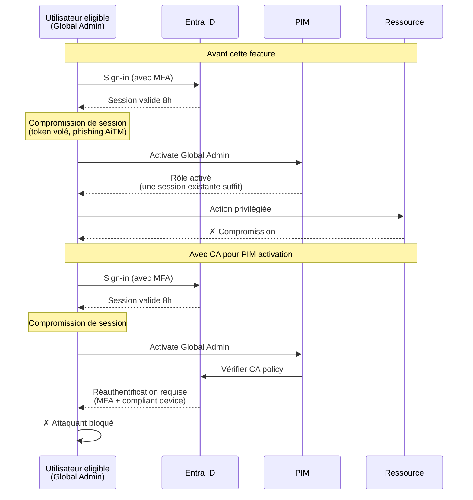
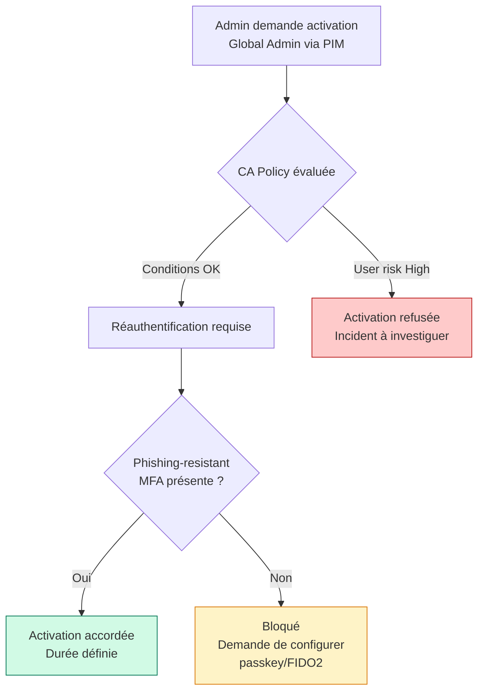

> Microsoft a annoncé en mai 2026 la disponibilité générale de l'enforcement des politiques Conditional Access sur l'**activation des rôles PIM**. Annonce dans le [What's New in Microsoft Entra: May 2026](https://techcommunity.microsoft.com/blog/microsoft-entra-blog/whats-new-in-microsoft-entra-may-2026/4517884).

Avant cette feature, les politiques CA s'appliquaient à la connexion à l'admin center mais pas spécifiquement au moment de l'activation d'un rôle privilégié dans PIM. Un attaquant qui avait obtenu une session valide d'un utilisateur eligible à un rôle Global Admin pouvait activer le rôle sans déclencher une réauthentification spécifique, parce que sa session de base était toujours valide.

Maintenant, on peut exiger qu'au moment précis de l'activation d'un rôle PIM, l'utilisateur passe par une politique CA qui vérifie des conditions spécifiques : authentification forte récente, device managed, localisation, etc.

## Schéma du scénario d'attaque



Le scénario AiTM (Adversary in The Middle) est particulièrement pertinent. Microsoft a publié le 4 mai 2026 [une analyse détaillée d'une campagne AiTM](https://www.microsoft.com/en-us/security/blog/2026/05/04/breaking-the-code-multi-stage-code-of-conduct-phishing-campaign-leads-to-aitm-token-compromise/) qui a touché plusieurs organisations. Le pattern : un phishing par email amène l'utilisateur sur un faux portail qui relaie la connexion vers le vrai Entra. L'attaquant capture la session établie et peut ensuite agir au nom de l'utilisateur jusqu'à l'expiration du token.

Sans CA sur PIM activation, l'attaquant qui capture la session d'un utilisateur eligible à des rôles privilégiés peut activer ces rôles sans déclencher de signal d'alerte. Avec CA sur PIM activation, l'activation déclenche une nouvelle évaluation des conditions, ce qui peut inclure une réauthentification forte qui demande un facteur que l'attaquant n'a pas (passkey FIDO2, compliant device, etc.).

## Configuration de la politique

### Créer la politique Conditional Access

Dans le portail Entra admin center :

```
Entra admin center > Protection > Conditional Access > 
New policy > Create new policy
```

Configuration recommandée pour une politique dédiée à PIM activation :

**Users** : 
- Inclure : tous les utilisateurs éligibles à des rôles privilégiés
- Exclure : les comptes break-glass (à protéger par une politique séparée)

**Target resources** : 
- Sélectionner "User actions" plutôt que "Cloud apps"
- Cocher "Privileged Identity Management role activation"

**Conditions** :
- User risk : exclure les sessions avec user risk High (bloquer plutôt que demander une réauth)
- Sign-in risk : exclure les sessions avec sign-in risk High
- Device platforms : selon votre politique device

**Grant controls** :
- Authentication strength : Phishing-resistant MFA (requiert FIDO2 ou certificat)
- Require device to be marked as compliant
- Require Hybrid Azure AD joined device (selon votre architecture)

**Session controls** :
- Sign-in frequency : "Every time" pour les rôles très sensibles, ou 1 heure pour les rôles modérés

### Via Microsoft Graph PowerShell

```powershell
Connect-MgGraph -Scopes "Policy.ReadWrite.ConditionalAccess"

# Définition de la politique
$policy = @{
    DisplayName = "PIM Activation - Require Phishing-resistant MFA"
    State = "enabledForReportingButNotEnforced"  # Démarrer en report-only
    Conditions = @{
        Applications = @{
            IncludeUserActions = @("urn:user:registerdevice")
            # Le bon scope pour PIM activation
            IncludeAuthenticationContextClassReferences = @("c1")  # Authentication Context dédié
        }
        Users = @{
            IncludeRoles = @(
                "62e90394-69f5-4237-9190-012177145e10"  # Global Administrator
                "194ae4cb-b126-40b2-bd5b-6091b380977d"  # Security Administrator
                # Ajouter les autres role definition IDs eligible PIM
            )
            ExcludeUsers = @("<break-glass-user-id-1>", "<break-glass-user-id-2>")
        }
    }
    GrantControls = @{
        Operator = "AND"
        BuiltInControls = @("compliantDevice")
        AuthenticationStrength = @{
            Id = "00000000-0000-0000-0000-000000000004"  # Phishing-resistant MFA
        }
    }
    SessionControls = @{
        SignInFrequency = @{
            Value = 1
            Type = "hours"
            AuthenticationType = "primaryAndSecondaryAuthentication"
            FrequencyInterval = "timeBased"
            IsEnabled = $true
        }
    }
}

New-MgIdentityConditionalAccessPolicy -BodyParameter $policy
```

### Configurer les Authentication Contexts dans PIM

Le mécanisme repose sur les **Authentication Contexts**, qui permettent d'avoir une granularité fine. Pour utiliser un Authentication Context dans PIM :

1. Créer l'Authentication Context dans Entra admin center > Protection > Conditional Access > Authentication contexts
2. Dans PIM, éditer les paramètres du rôle eligible : ajouter une "On activation" requirement qui pointe vers l'Authentication Context
3. La politique CA cible cet Authentication Context dans ses Target resources

Microsoft documente cette intégration dans [Configure Conditional Access for PIM](https://learn.microsoft.com/en-us/entra/id-governance/privileged-identity-management/pim-how-to-change-default-settings).

## Workflow pour un admin



Du point de vue de l'admin légitime :
- Il clique "Activate" sur son rôle PIM
- Le système détecte qu'une réauthentification est requise
- L'admin se réauthentifie avec sa passkey ou son certificat
- Le rôle est activé pour la durée configurée

Du point de vue d'un attaquant avec une session compromise :
- Il clique "Activate" sur le rôle PIM
- Le système détecte que la réauthentification est requise
- L'attaquant ne dispose pas de la passkey physique de l'utilisateur
- L'activation échoue, l'incident est loggué

## Phasage du déploiement

**Phase 1 - Audit** : identifier tous les utilisateurs eligible à des rôles privilégiés et vérifier qu'ils ont enregistré une méthode phishing-resistant. Microsoft propose le rapport [Authentication methods activity](https://learn.microsoft.com/en-us/entra/identity/authentication/howto-authentication-methods-activity).

```powershell
# Lister les utilisateurs eligible à Global Admin
Get-MgRoleManagementDirectoryRoleEligibilityScheduleInstance -All |
    Where-Object {$_.RoleDefinitionId -eq "62e90394-69f5-4237-9190-012177145e10"} |
    ForEach-Object {
        $user = Get-MgUser -UserId $_.PrincipalId
        $methods = Get-MgUserAuthenticationMethod -UserId $_.PrincipalId
        [PSCustomObject]@{
            UPN = $user.UserPrincipalName
            HasFIDO2 = ($methods | Where-Object {$_.AdditionalProperties.'@odata.type' -eq '#microsoft.graph.fido2AuthenticationMethod'}).Count -gt 0
            HasWHfB = ($methods | Where-Object {$_.AdditionalProperties.'@odata.type' -eq '#microsoft.graph.windowsHelloForBusinessAuthenticationMethod'}).Count -gt 0
            HasCert = ($methods | Where-Object {$_.AdditionalProperties.'@odata.type' -eq '#microsoft.graph.x509CertificateAuthenticationMethod'}).Count -gt 0
        }
    }
```

**Phase 2 - Report-only** : déployer la politique CA en mode "Report-only" pendant 2 à 4 semaines. Analyser les logs pour identifier les utilisateurs qui auraient été bloqués et corriger leur situation.

**Phase 3 - Enforcement progressif** : activer en mode "On" sur un sous-ensemble de rôles d'abord (par exemple Security Administrator), puis étendre à Global Administrator, Privileged Role Administrator, et autres rôles tier 0.

**Phase 4 - Tier 1 et 2** : étendre aux rôles moins critiques avec des conditions adaptées (par exemple, sign-in frequency 4h au lieu de 1h).

## Cas particulier des comptes break-glass

Les comptes break-glass doivent **rester exclus** de cette politique, mais ne doivent pas pour autant être exposés. Recommandation Microsoft :

- Exclure les break-glass de la politique CA pour PIM activation
- Les protéger par une politique séparée qui exige FIDO2 + localisation spécifique
- Logguer toute activation de rôle par un break-glass dans un workflow d'alerte automatique
- Auditer mensuellement l'utilisation des break-glass

## Recommandations complémentaires

**Combiner avec Authentication Context dans Microsoft Defender for Cloud Apps** pour étendre la même logique aux applications SaaS sensibles. Un utilisateur qui active un rôle Global Admin et qui accède ensuite à une SaaS app classifiée comme sensible peut être soumis à une nouvelle évaluation CA.

**Activer la review des Authentication Contexts dans les Access Reviews PIM**. Les access reviews trimestriels doivent valider que les Authentication Contexts attachés aux rôles sont toujours pertinents.

**Documenter le runbook d'incident**. Si un utilisateur est bloqué légitimement (perte de passkey, etc.), il doit y avoir une procédure claire pour rétablir l'accès rapidement sans contourner la sécurité.

## Sources

- [What's New in Microsoft Entra: May 2026](https://techcommunity.microsoft.com/blog/microsoft-entra-blog/whats-new-in-microsoft-entra-may-2026/4517884)
- [Breaking the code: Multi-stage AiTM phishing campaign](https://www.microsoft.com/en-us/security/blog/2026/05/04/breaking-the-code-multi-stage-code-of-conduct-phishing-campaign-leads-to-aitm-token-compromise/)
- [Configure Conditional Access for PIM](https://learn.microsoft.com/en-us/entra/id-governance/privileged-identity-management/pim-how-to-change-default-settings)
- [Authentication contexts for Conditional Access](https://learn.microsoft.com/en-us/entra/identity/conditional-access/concept-conditional-access-cloud-apps#authentication-context)
- [Authentication strengths overview](https://learn.microsoft.com/en-us/entra/identity/authentication/concept-authentication-strengths)
- [PIM eligibility schedule reference](https://learn.microsoft.com/en-us/graph/api/rbacapplication-list-roleeligibilityscheduleinstances)
