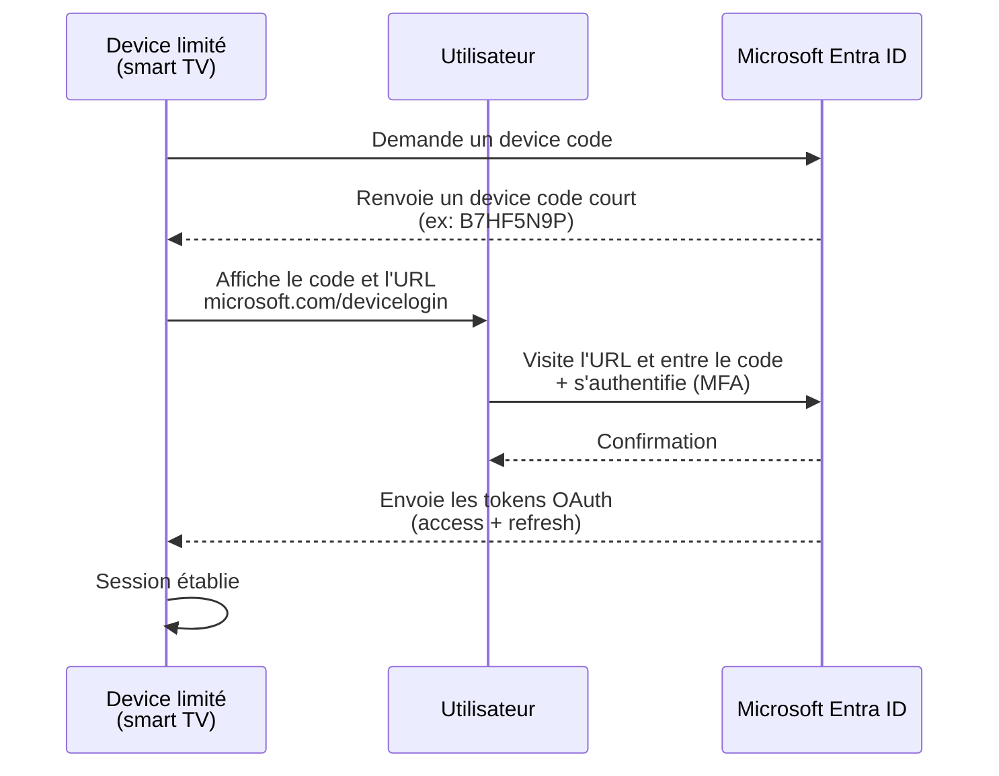
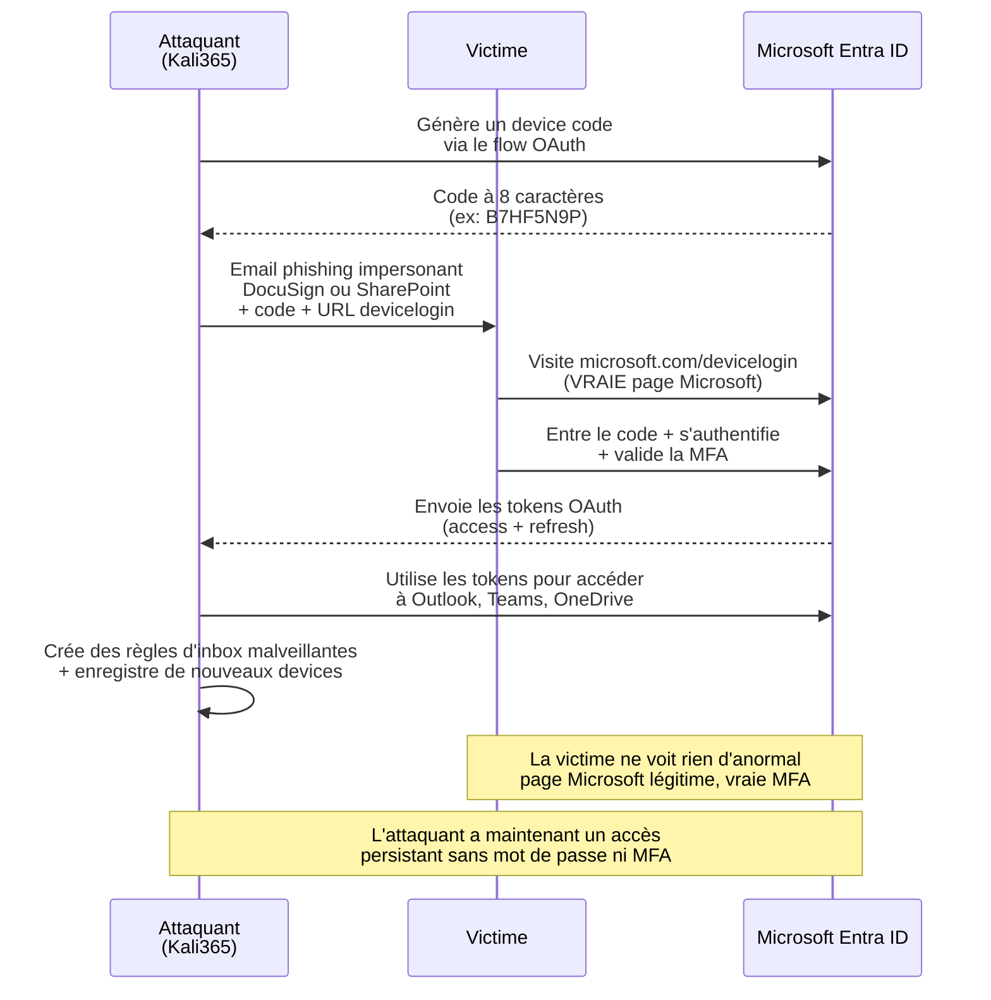

## Le contexte

Le FBI a publié le 21 mai 2026 une [Public Service Announcement (PSA260521)](https://www.ic3.gov/PSA/2026/PSA260521) alertant sur **Kali365**, une plateforme de Phishing-as-a-Service qui exploite le mécanisme OAuth 2.0 device code flow pour voler les tokens Microsoft 365 sans avoir besoin de capturer le mot de passe ni le code MFA. Le kit est distribué via Telegram à partir de 250 dollars par mois, et a été observé pour la première fois en avril 2026 par Arctic Wolf.

L'attaque n'est pas nouvelle dans son principe : Proofpoint avait documenté une augmentation volumétrique du device code phishing en septembre 2025, attribuée d'abord à des acteurs étatiques liés à la Russie, puis adoptée par des criminels financiers en octobre 2025. En février 2026, EvilTokens et Tycoon2FA avaient déjà industrialisé la technique. Huntress avait alors tracé plus de 340 organisations compromises dans cinq pays par une seule campagne associée. Kali365 industrialise davantage en ajoutant des leurres générés par IA, des dashboards de tracking en temps réel, et des templates de campagne automatisés.

Cet article explique le mécanisme technique de l'attaque, ce qui la distingue d'AiTM, et comment la bloquer côté Microsoft Entra.

## Comment fonctionne le device code flow

Le device code flow est un mécanisme OAuth 2.0 légitime, conçu pour permettre l'authentification sur des appareils sans clavier ou avec des capacités d'entrée limitées : smart TV, consoles de salle de réunion, imprimantes, équipements IoT, etc. Le scénario d'usage légitime :



Le mécanisme est sûr dans son usage prévu : le device limité ne reçoit jamais les credentials, et l'utilisateur s'authentifie sur la vraie page Microsoft. Le problème, c'est que le mécanisme ne vérifie pas **quel device a initié la demande** : si l'attaquant initie lui-même la demande de device code et convainc la victime d'entrer ce code sur la vraie page Microsoft, c'est l'attaquant qui reçoit les tokens à la fin.

## Le détournement par Kali365



Le génie de l'attaque est qu'elle utilise **uniquement des composants légitimes** :
- L'email contient un vrai code Microsoft
- L'URL pointe vers `microsoft.com/devicelogin`, qui est la vraie page Microsoft
- La page d'authentification est la vraie page Microsoft
- La MFA est la vraie MFA
- Le token reçu est un vrai token Microsoft

Côté victime, **aucun élément ne paraît anormal**. Aucune URL suspecte, aucun certificat invalide, aucune page contrefaite. C'est ce qui rend la formation utilisateur particulièrement difficile sur ce vecteur.

## Ce qui distingue Kali365 d'une attaque AiTM

Le device code phishing est souvent confondu avec les attaques AiTM (Adversary in the Middle) comme Storm-2949 documenté par Microsoft le 4 mai 2026. Les deux contournent la MFA mais par des mécanismes différents :

| Aspect | AiTM (ex: Storm-2949) | Device code phishing (ex: Kali365) |
|---|---|---|
| Page d'authentification | Faux portail qui relaie | Vraie page Microsoft |
| URL visible par la victime | URL phishing (souvent typosquattée) | URL Microsoft légitime |
| Interception du token | Capture passive du flux | Pas d'interception, l'attaquant reçoit directement le token |
| Protection FIDO2/passkey | Efficace (rebind cryptographique) | Limitée (le token est valide après l'auth) |
| Protection Authentication Strength CA | Efficace | Limitée pour la même raison |
| Détection par l'utilisateur | Possible (URL, certificat) | Très difficile, rien d'anormal visible |

La conséquence pratique : **le déploiement de phishing-resistant MFA (FIDO2, passkeys, CBA) ne suffit pas** pour bloquer Kali365. La MFA s'exécute correctement, le token est légitimement émis, et l'attaquant le récupère via le flow OAuth normal. La défense doit se faire au niveau du flow lui-même, pas au niveau de la méthode d'authentification.

## Comment bloquer Kali365 dans Entra ID

### Étape 1 : Auditer l'usage actuel du device code flow

Avant de bloquer, il faut savoir qui l'utilise légitimement dans votre tenant. Le mécanisme est utilisé par des services réels : Microsoft Authenticator sur certains devices, PowerShell sur des serveurs sans browser, agents legacy, équipements de salle de réunion.

```powershell
Connect-MgGraph -Scopes "AuditLog.Read.All"

# Récupérer les sign-ins via device code flow des 30 derniers jours
$startDate = (Get-Date).AddDays(-30).ToString("yyyy-MM-ddTHH:mm:ssZ")

$filter = "createdDateTime ge $startDate and authenticationProtocol eq 'deviceCode'"

$signIns = Get-MgAuditLogSignIn -Filter $filter -All

$signIns | Select-Object @{N='Date';E={$_.CreatedDateTime}},
    UserPrincipalName,
    AppDisplayName,
    @{N='Location';E={"$($_.Location.City), $($_.Location.CountryOrRegion)"}},
    @{N='IPAddress';E={$_.IpAddress}},
    @{N='Status';E={$_.Status.ErrorCode}} |
Sort-Object Date -Descending |
Export-Csv "device-code-signins-audit.csv" -NoTypeInformation -Encoding UTF8
```

Examiner le résultat : qui utilise le device code flow, depuis quels appareils ou applications, et avec quelle fréquence. Identifier les usages métier légitimes pour les exclure de la politique de blocage.

### Étape 2 : Créer une politique Conditional Access pour bloquer

```powershell
Connect-MgGraph -Scopes "Policy.ReadWrite.ConditionalAccess"

$policy = @{
    DisplayName = "Block Device Code Flow - All Users (Exceptions Excluded)"
    State = "enabledForReportingButNotEnforced"  # Démarrer en report-only
    Conditions = @{
        Users = @{
            IncludeUsers = @("All")
            ExcludeUsers = @("<break-glass-user-id-1>", "<break-glass-user-id-2>")
            ExcludeGroups = @("<device-code-exception-group-id>")
        }
        Applications = @{
            IncludeApplications = @("All")
        }
        AuthenticationFlows = @{
            TransferMethods = "deviceCodeFlow"
        }
    }
    GrantControls = @{
        Operator = "OR"
        BuiltInControls = @("block")
    }
}

New-MgIdentityConditionalAccessPolicy -BodyParameter $policy
```

La politique cible la condition `authenticationFlows.transferMethods` avec la valeur `deviceCodeFlow`. C'est la condition Conditional Access spécifique introduite par Microsoft pour ce cas d'usage.

### Étape 3 : Bloquer aussi les authentication transfer policies

Les **authentication transfer policies** permettent à un utilisateur de transférer une session authentifiée d'un appareil à un autre (par exemple PC vers téléphone). C'est un mécanisme légitime, mais qui peut être détourné pour des scénarios similaires. Le FBI recommande de le bloquer aussi.

```powershell
$policyTransfer = @{
    DisplayName = "Block Authentication Transfer Policies - All Users"
    State = "enabledForReportingButNotEnforced"
    Conditions = @{
        Users = @{
            IncludeUsers = @("All")
            ExcludeUsers = @("<break-glass-user-id-1>", "<break-glass-user-id-2>")
        }
        Applications = @{
            IncludeApplications = @("All")
        }
        AuthenticationFlows = @{
            TransferMethods = "authenticationTransfer"
        }
    }
    GrantControls = @{
        Operator = "OR"
        BuiltInControls = @("block")
    }
}

New-MgIdentityConditionalAccessPolicy -BodyParameter $policyTransfer
```

### Étape 4 : Activer la détection dans Microsoft Defender XDR

Microsoft Defender XDR génère deux alertes spécifiques pour ce vecteur d'attaque :

- **"Suspicious Azure authentication through possible device code phishing"** : déclenchée par des patterns anormaux d'utilisation du device code flow
- **"User account compromise via OAuth device code phishing"** : déclenchée après une compromission confirmée

Pour s'assurer que ces alertes sont actives dans votre tenant :

```
Microsoft Defender portal > Settings > XDR > 
Custom detection rules > Create detection rule
```

Vérifier que les advanced hunting queries sur les sign-in events incluent les filtres `AuthenticationProtocol == "deviceCode"`.

Une query KQL utile pour le threat hunting historique :

```kusto
SignInEvents
| where TimeGenerated > ago(30d)
| where AuthenticationProtocol == "deviceCode"
| where ResultType == 0  // Success
| extend SuspiciousLocation = iff(LocationCountry != "<your-country>", true, false)
| extend SuspiciousIP = iff(IPAddress matches regex @"^(127\.|10\.|172\.16\.|192\.168\.)", false, true)
| where SuspiciousLocation or SuspiciousIP
| project TimeGenerated, UserPrincipalName, AppDisplayName, IPAddress, LocationCountry, ClientAppUsed
| sort by TimeGenerated desc
```

### Étape 5 : Activer Continuous Access Evaluation (CAE) et Token Protection

[CAE](https://learn.microsoft.com/en-us/entra/identity/conditional-access/concept-continuous-access-evaluation) permet à Entra ID de révoquer un token en temps réel quand un risque est détecté. Si Kali365 réussit malgré tout à voler un token, CAE peut le révoquer dès que des signaux anormaux apparaissent (changement de localisation, IP suspecte, etc.) sans attendre l'expiration naturelle du token.

[Token Protection (Token Binding)](https://learn.microsoft.com/en-us/entra/identity/conditional-access/concept-token-protection) en preview lie cryptographiquement un token à un appareil spécifique. Un token volé devient inutilisable depuis un autre device.

## Le cas particulier des comptes break-glass

Les comptes break-glass doivent **rester exclus** de la politique de blocage du device code flow, pour éviter un lockout total en cas de problème. Mais ils doivent être protégés autrement :

- Politique CA dédiée qui exige FIDO2 + IP/localisation spécifique
- Alerting automatique sur toute activation
- Audit mensuel des sign-ins
- Stockage hors-ligne sécurisé du mot de passe et du device FIDO2

## Indicateurs de compromission à surveiller

Arctic Wolf et le FBI ont observé les patterns suivants après compromission par Kali365 :

- **Création de règles d'inbox malveillantes** : règles qui suppriment ou déplacent automatiquement les emails Microsoft, FBI, Microsoft Security, et les notifications d'alerte
- **Enregistrement de nouveaux devices** dans le tenant victime, pour persister l'accès
- **Création de Application registrations** avec des permissions élevées
- **Modifications des paramètres de transfert de mail externe**
- **Activité de découverte** : énumération des groupes, des accès partagés, des règles CA

Pour le threat hunting sur ces indicateurs :

```kusto
// Détection de nouvelles règles d'inbox récentes
OfficeActivity
| where TimeGenerated > ago(7d)
| where Operation in ("New-InboxRule", "Set-InboxRule")
| where Parameters has_any ("DeleteMessage", "MoveToFolder", "SubjectContainsWords", "FromAddressContainsWords")
| project TimeGenerated, UserId, ClientIP, Operation, Parameters
| sort by TimeGenerated desc
```

## Phasage du déploiement

Le blocage du device code flow peut casser des workflows légitimes. Phasage recommandé :

| Phase | Durée | Action |
|---|---|---|
| 1 | Semaine 1-2 | Audit complet de l'usage actuel via les sign-in logs |
| 2 | Semaine 3 | Politique CA en mode "Report-only" pour tous |
| 3 | Semaine 4 | Analyse des cas qui auraient été bloqués, création des exceptions |
| 4 | Semaine 5 | Activation progressive sur les utilisateurs standard |
| 5 | Semaine 6 | Activation sur les comptes à privilèges |
| 6 | En continu | Audit mensuel des exceptions, alerting sur toute nouvelle utilisation |

## Sources

- [FBI IC3 Public Service Announcement PSA260521](https://www.ic3.gov/PSA/2026/PSA260521) - Source primaire officielle
- [Microsoft Learn - OAuth 2.0 device authorization grant flow](https://learn.microsoft.com/en-us/entra/identity-platform/v2-oauth2-device-code)
- [Microsoft Learn - Conditional Access authentication flows](https://learn.microsoft.com/en-us/entra/identity/conditional-access/concept-conditional-access-cloud-apps#device-code-flow)
- [Microsoft Learn - Continuous Access Evaluation](https://learn.microsoft.com/en-us/entra/identity/conditional-access/concept-continuous-access-evaluation)
- [Microsoft Learn - Token Protection (Preview)](https://learn.microsoft.com/en-us/entra/identity/conditional-access/concept-token-protection)
- [Microsoft Security Blog - Storm-2949 AiTM campaign](https://www.microsoft.com/en-us/security/blog/2026/05/04/breaking-the-code-multi-stage-code-of-conduct-phishing-campaign-leads-to-aitm-token-compromise/) (pour comparaison avec AiTM)