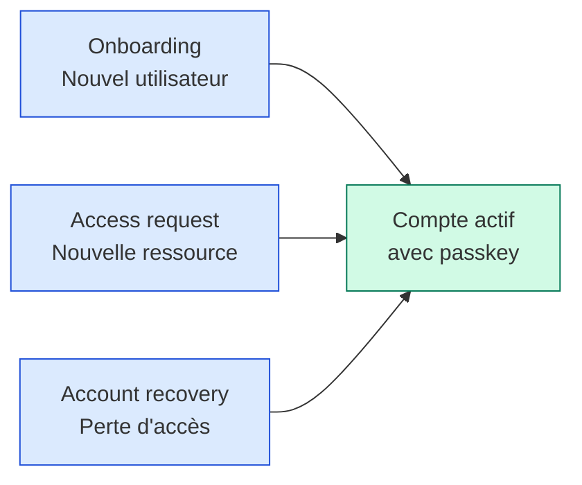

> Microsoft a annoncé le 7 mai 2026, à l'occasion du World Passkey Day, la disponibilité générale de l'**Account Recovery** dans Entra ID. La fonctionnalité couvre trois moments précis dans le cycle de vie d'une identité : l'onboarding initial, les access requests, et la récupération de compte après une perte d'accès.

L'annonce est sur le [blog Microsoft Entra](https://techcommunity.microsoft.com/blog/microsoft-entra-blog/secure-the-moments-attackers-target-onboarding-access-requests-and-account-recov/3627344).

Ces trois moments ont un point commun : ils sont des fenêtres d'opportunité pour les attaquants. Un nouvel employé qui reçoit son premier mot de passe par email, un utilisateur qui demande l'accès à une nouvelle application, un employé qui a perdu son téléphone et appelle le help desk - chacun de ces moments représente une situation où l'identité doit être ré-établie, souvent sans la totalité des facteurs d'authentification habituels. Et c'est exactement ce que les attaquants exploitent dans les attaques de social engineering contre les help desks.

## Les trois moments couverts



**Onboarding** : le nouvel utilisateur doit recevoir ses premières credentials de manière sécurisée. Le Temporary Access Pass (TAP) existait déjà, Account Recovery l'intègre dans un flux end-to-end qui pousse directement vers l'enregistrement d'une passkey.

**Access requests** : quand un utilisateur demande l'accès à une nouvelle ressource (via Entitlement Management ou access packages), Account Recovery permet aux approvers de voir des informations contextuelles sur le demandeur et de valider la demande avec une authentification forte.

**Account recovery** : quand un utilisateur perd l'accès (téléphone perdu, passkey compromise, oubli total des credentials), le processus de récupération est encadré par un flux qui évite les pratiques à risque comme la réinitialisation par téléphone vers le help desk.

## L'angle help desk : la grande nouveauté

C'est le scénario que les attaquants exploitent le plus depuis 2024. Le pattern classique : un attaquant appelle le help desk en se faisant passer pour un employé qui a perdu son téléphone, demande une réinitialisation de la MFA, et obtient l'accès. Plusieurs incidents médiatisés (MGM, Caesars, et plus récemment dans le secteur santé) ont commencé par ce vecteur.

Account Recovery propose une alternative : plutôt que le help desk réinitialise lui-même la MFA, l'utilisateur passe par un flux self-service qui re-vérifie son identité via plusieurs facteurs (à configurer selon le niveau de sensibilité du compte) :

- Vérification via un appareil pré-enregistré (un second device, une passkey de secours)
- Vérification via Face Check (preview, voir [Microsoft Verified ID](https://learn.microsoft.com/en-us/entra/verified-id/))
- Validation par un manager désigné (sponsor)
- Combinaison de plusieurs facteurs selon le risk score Entra ID Protection

Le help desk reste impliqué pour les cas où ces mécanismes échouent, mais l'attaque par téléphone directement vers le help desk devient nettement plus difficile.

## Configuration côté admin

### Activer Account Recovery

Dans le portail Entra admin center :

```
Entra admin center > Protection > Authentication methods > 
Account Recovery > Configuration
```

Trois profils prédéfinis selon le niveau de protection souhaité :

| Profil | Vérifications requises | Cas d'usage |
|---|---|---|
| **Standard** | 2 facteurs (passkey alternative + identité organisationnelle) | Comptes utilisateurs standard |
| **Renforcé** | 3 facteurs (incluant Face Check ou validation manager) | Comptes à privilèges (managers, finance, RH) |
| **Critique** | Validation manager + Face Check + délai obligatoire 24h | Comptes Global Admin, comptes break-glass |

Les profils peuvent aussi être personnalisés avec des combinaisons custom de facteurs.

### Configurer les sponsors

Pour les profils Renforcé et Critique, il faut désigner les sponsors qui peuvent valider une récupération. Recommandation Microsoft : utiliser un Security Group dédié plutôt que des assignations individuelles.

```powershell
Connect-MgGraph -Scopes "Group.ReadWrite.All", "User.Read.All"

# Créer un groupe de sponsors Account Recovery
New-MgGroup -DisplayName "Account Recovery Sponsors" `
    -MailEnabled:$false `
    -SecurityEnabled:$true `
    -MailNickname "account-recovery-sponsors" `
    -Description "Validateurs Account Recovery pour profils Renforcé et Critique"

# Ajouter les sponsors (managers IT seniors, responsables sécurité, etc.)
$sponsorGroup = Get-MgGroup -Filter "displayName eq 'Account Recovery Sponsors'"
Add-MgGroupMember -GroupId $sponsorGroup.Id -DirectoryObjectId <userId>
```

### Configurer les workflows d'onboarding

L'intégration avec [Entitlement Management](https://learn.microsoft.com/en-us/entra/id-governance/entitlement-management-overview) permet de lier l'onboarding au workflow d'access packages. Le nouvel utilisateur reçoit automatiquement les ressources définies dans son access package, avec un TAP généré pour la première connexion.

Pour les access packages sensibles, on peut maintenant configurer une [vue des approvers détaillée](https://learn.microsoft.com/en-us/entra/id-governance/entitlement-management-process-requests) qui montre :

- L'identité validée du demandeur
- Son risk score Entra ID Protection au moment de la demande
- Son historique d'accès récent
- Les vérifications d'authentification effectuées

### Activer Face Check pour les profils sensibles

[Face Check](https://learn.microsoft.com/en-us/entra/verified-id/facecheck-add-design) est une vérification biométrique faciale qui compare une photo prise en temps réel avec une photo de référence stockée dans Microsoft Verified ID. C'est en preview au moment où j'écris.

Configuration de base :

```
Entra admin center > Verified ID > Setup > 
Face Check > Configure verification flow
```

Les organisations qui n'ont pas déjà déployé Verified ID auront besoin d'un setup préalable. Microsoft propose un guide étape par étape dans la [documentation Verified ID](https://learn.microsoft.com/en-us/entra/verified-id/decentralized-identifier-overview).

## Passkey-preferred authentication

Annoncé en preview à la World Passkey Day, le mécanisme **passkey-preferred authentication** détecte les méthodes d'authentification enregistrées par l'utilisateur et lui propose en priorité la plus forte. Si une passkey est enregistrée, c'est ce que l'utilisateur voit en premier.

C'est un changement comportemental, pas une nouvelle fonctionnalité technique. Mais c'est cohérent avec Account Recovery : le flux pousse l'utilisateur vers les méthodes phishing-resistant à chaque interaction.

Pour activer :

```
Entra admin center > Authentication methods > Policies > 
Microsoft Authenticator > Passkey-preferred (Preview) > Enable
```

## Recommandations pour le déploiement

**Démarrer par les comptes à privilèges**. Les comptes Global Admin, Privileged Role Admin, et les comptes break-glass sont les cibles prioritaires des attaques par help desk. Appliquer le profil Critique sur ces comptes en premier.

**Communiquer en amont avec le help desk**. La procédure change : le help desk ne réinitialise plus la MFA directement, il oriente vers le flux self-service. Sans formation préalable, les agents help desk vont chercher à contourner pour rendre service rapidement, ce qui annule le bénéfice.

**Tester le flux Face Check en preview**. La fonctionnalité est utile mais nécessite que les utilisateurs aient enregistré leur photo dans Verified ID. Sans cette étape préalable, le flux Critique ne peut pas aboutir.

**Auditer les délais de recovery**. Le profil Critique impose un délai obligatoire de 24h. Pour les comptes break-glass, c'est volontairement long pour décourager les abus, mais ça peut poser un problème opérationnel en cas de vraie urgence. Documenter une procédure d'urgence séparée avec validation senior management.

## Ce que ça change pour la posture sécurité

Account Recovery ne supprime pas les vulnérabilités liées aux processus humains, mais il standardise et trace le flux complet. Trois améliorations mesurables :

- **Audit trail complet** : chaque récupération est tracée dans les audit logs Entra avec les facteurs utilisés, le sponsor qui a validé, et le timestamp précis
- **Réduction des contacts help desk** : les utilisateurs autonomes via le self-service réduisent la charge help desk de 30 à 50% selon les retours d'expérience publiés par Microsoft
- **Phishing-resistance par défaut** : tout le flux pousse vers passkey + Face Check, qui sont résistants au phishing classique

## Sources

- [Secure the moments attackers target - blog Microsoft Entra](https://techcommunity.microsoft.com/blog/microsoft-entra-blog/secure-the-moments-attackers-target-onboarding-access-requests-and-account-recov/3627344)
- [Passkeys aren't the finish line - blog Microsoft Entra](https://techcommunity.microsoft.com/blog/microsoft-entra-blog/passkeys-aren%e2%80%99t-the-finish-line-eliminating-fallbacks-and-fixing-recovery/3627345)
- [World Passkey Day - Microsoft Security blog](https://www.microsoft.com/en-us/security/blog/2026/05/07/world-passkey-day-advancing-passwordless-authentication/)
- [Face Check documentation](https://learn.microsoft.com/en-us/entra/verified-id/facecheck-add-design)
- [Microsoft Verified ID overview](https://learn.microsoft.com/en-us/entra/verified-id/decentralized-identifier-overview)
- [Entitlement Management - process requests](https://learn.microsoft.com/en-us/entra/id-governance/entitlement-management-process-requests)
- [Temporary Access Pass overview](https://learn.microsoft.com/en-us/entra/identity/authentication/howto-authentication-temporary-access-pass)
