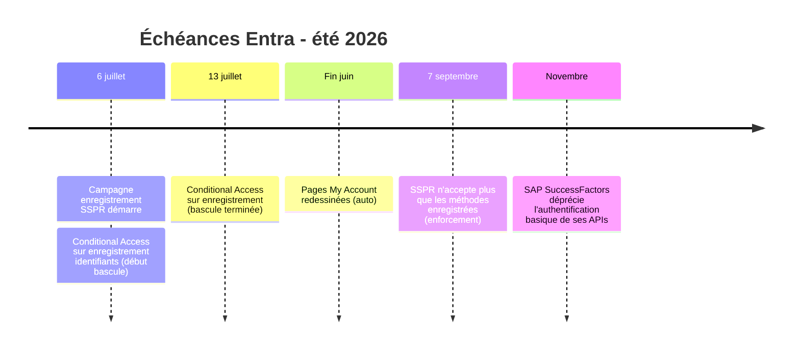

-----

title: “What’s New in Microsoft Entra - juin 2026 : le tri entre ce qui est GA, en préversion, et ce qui arrive cet été”
date: 2026-06-08 12:30:00 +01:00
layout: post
mermaid: true
categories: [news, entra]
tags:

- entra-id
- whats-new
- conditional-access
- passkeys
- identity-governance
- global-secure-access
  readtime: true
  comments: true
  sidebar: true
  level: Synthèse
  platform: Microsoft Entra ID
  scope:
- Microsoft Entra ID
- Microsoft Entra ID Governance
- Global Secure Access
  thumbnail-img: “assets/img/posts/2026/06/whatsnew-juin-2026-thumb.png”
  cover-img: “/assets/img/posts/covers/news-entra-cover.png”

-----

> Microsoft publie chaque mois son [What’s New in Microsoft Entra](https://techcommunity.microsoft.com/blog/microsoft-entra-blog/whats-new-in-microsoft-entra-june-2026/4517885). C’est une lecture utile, mais piégeuse : un même article mélange des fonctionnalités en disponibilité générale, d’autres en préversion publique, et des annonces de changements à venir. Lire trop vite, c’est risquer de déployer en production une fonctionnalité encore en préversion, ou de présenter comme nouveau quelque chose qui existe déjà.

Cet article reprend l’édition de juin 2026 en clarifiant le statut réel de chaque élément, et en signalant ce qui mérite votre attention en priorité. Le classement suit celui de Microsoft : disponibilité générale, préversion publique, annonces avec échéance, puis nouvelle documentation.

## Disponibilité générale (GA)

Ces fonctionnalités sont utilisables en production dès maintenant.

### Phish-resistant MFA pour les bureaux Linux

Microsoft étend l’authentification multifacteur résistante au phishing aux bureaux Linux, via le broker d’identité Microsoft. Linux rejoint ainsi Windows et macOS, ce qui comble un manque de longue date pour les environnements hétérogènes. Le support couvre Ubuntu 24.04 et 26.04, ainsi que RHEL 8, 9 et 10.

Pour les organisations qui ont des postes Linux (développeurs, environnements techniques, postes spécialisés), c’est une vraie avancée : vous pouvez enfin imposer une authentification phishing-resistant cohérente sur les trois familles de systèmes.

### Migration B2C vers External ID en mode High Scale Compatibility (HSC)

Le mode HSC est une nouvelle option de migration au niveau du tenant, qui permet aux clients Azure AD B2C de migrer leurs applications vers Microsoft Entra External ID sans réenregistrer les utilisateurs ni réinitialiser les mots de passe. Il est conçu pour les tenants à grande échelle, en général ceux qui comptent 5 millions d’objets ou plus.

À noter : en dessous de ce seuil, Microsoft recommande de rester sur le parcours de migration standard. Et même les tenants éligibles devraient évaluer soigneusement les deux options avant de choisir. Le B2C Policy Analyzer aide à évaluer la faisabilité.

### Authentification system-preferred pour le premier et le second facteur

Microsoft Entra applique désormais l’authentification system-preferred à la fois au premier et au second facteur, dans l’état Microsoft Managed. Le système évalue les méthodes enregistrées de l’utilisateur et sélectionne la mieux classée pour chaque étape. L’application est automatique dans l’état Microsoft managed, sans action administrateur.

### Pages My Account redessinées

Les pages Appareils, Informations de sécurité et Organisations du portail My Account sont redessinées. Le point le plus utile pour les équipes support : la page Appareils met en avant les clés de récupération BitLocker, ce qui réduit la dépendance au helpdesk. Le déploiement est automatique d’ici fin juin 2026, sans action administrateur.

### Synchronisation de groupes cross-tenant

Cette fonctionnalité permet de synchroniser les groupes de sécurité et leurs appartenances entre tenants, pour une gestion centralisée et un contrôle d’accès cohérent. Un groupe géré dans un tenant source peut être utilisé dans un ou plusieurs tenants cibles, pour des scénarios d’accès applicatif partagé. C’est aussi un levier de gouvernance inter-tenant, qui s’inscrit dans la logique de la Tenant Governance.

### Account discovery pour les applications connectées (ID Governance)

Les administrateurs gagnent en visibilité sur tous les comptes des applications connectées, y compris les comptes orphelins non assignés à l’application d’entreprise. Les rapports de découverte se génèrent directement depuis l’expérience de provisioning. Cette capacité nécessite une licence Microsoft Entra ID Governance ou Microsoft Entra Suite.

### Transitions de parrainage d’identités d’agents automatisées

Microsoft Entra ID Governance garantit qu’une identité d’agent a toujours un parrain humain responsable de son accès et de son cycle de vie. Avec les Lifecycle Workflows, quand un parrain quitte l’organisation, le parrainage est transféré automatiquement à son manager. C’est une brique de gouvernance des agents IA, un sujet qui monte en puissance.

### Campagnes d’enregistrement de passkeys

Les Registration Campaigns de Microsoft Entra prennent maintenant en charge les passkeys (FIDO2) comme méthode d’authentification. Les administrateurs peuvent configurer des campagnes qui incitent les utilisateurs à enregistrer une passkey lors de la connexion. Cette première version est optimisée pour les utilisateurs dans un profil passkey sans restrictions.

### Désactivation d’application (App Deactivation)

Une façon sûre, réversible et en self-service de désactiver les applications inutilisées, dépréciées ou sous investigation, sans les supprimer. Une application désactivée cesse immédiatement de recevoir de nouveaux jetons d’accès, mais les jetons existants restent valides jusqu’à expiration. Toutes les métadonnées, permissions et configurations sont préservées, ce qui rend la réactivation simple. Utile pour les investigations de sécurité ou la suspension temporaire d’une application suspecte.

### Passkeys Entra sur Windows (Windows Hello container)

Les utilisateurs enregistrent des passkeys liées à l’appareil dans le conteneur Windows Hello local et les utilisent avec la biométrie ou le code PIN Windows Hello. Ces passkeys fonctionnent comme des identifiants FIDO2 et ne nécessitent pas que l’appareil soit joint ou enregistré dans Entra. Limite à connaître : la connexion interactive à la console Windows n’est pas prise en charge.

## Préversion publique (Public Preview)

À évaluer en connaissance de cause. Ces fonctionnalités peuvent évoluer avant leur disponibilité générale, donc prudence avant un usage critique.

### Fédération SAML sans domaine sur les tenants workforce

La fédération SAML sans domaine permet à des utilisateurs externes de s’authentifier dans vos applications avec les identifiants gérés par leur IdP, quel que soit leur domaine de messagerie. Elle supprime le besoin de correspondance de domaine entre l’email de l’utilisateur et les domaines IdP préconfigurés.

### Étiquettes de confidentialité pour les groupes de sécurité Entra

Microsoft Entra permet d’appliquer des étiquettes de confidentialité Purview aux groupes de sécurité cloud Entra. Les mêmes étiquettes et politiques que pour les groupes Microsoft 365 peuvent gouverner des comportements comme l’accès des invités. Les étiquettes se gèrent dans Purview et s’appliquent via le centre d’administration Entra, le portail Azure et Microsoft Graph. (Sujet déjà couvert dans un article dédié.)

### Soft delete des appareils

Les administrateurs peuvent déplacer des objets appareil vers un état récupérable au lieu de les supprimer définitivement. La restauration est possible dans une période de rétention définie, en préservant l’identité de l’appareil et ses artefacts de sécurité. Le support couvre les appareils Entra joined, registered et hybrid joined. Une vraie sécurité contre les suppressions accidentelles.

### SAP SuccessFactors en authentification basée sur Workload Identity

Microsoft Entra remplace les couples identifiant/mot de passe à longue durée de vie par des identifiants gérés par Entra et des jetons d’accès à courte durée de vie pour le provisioning SAP SuccessFactors. La mise à niveau se fait en place sur les jobs de provisioning existants. C’est aligné avec le plan de SAP de déprécier l’authentification basique de ses APIs d’ici novembre 2026.

### Gouverner les attributions de rôles Azure via les access packages

Microsoft Entra permet de gouverner les attributions éligibles et actives de rôles Azure aux niveaux Management Group, Subscription et Resource Group via les access packages. Les attributions suivent le même modèle de demande, approbation et cycle de vie que les applications et les groupes. C’est un levier concret pour le moindre privilège et le just-in-time sur Azure, en lien direct avec les leçons de l’attaque Storm-2949.

### Mise à jour automatique d’attributs dans les Lifecycle Workflows

Une nouvelle tâche User Attribute Updates dans les Lifecycle Workflows permet de modifier des attributs (y compris personnalisés) directement dans les workflows, de façon sécurisée et auditable.

### Réponse aux incidents sur les identités privilégiées pour le SOC

Microsoft étend le rôle Entra Security Operator pour que les analystes SOC puissent mener des actions de réponse (désactiver des utilisateurs, révoquer des sessions, marquer un utilisateur compromis, forcer une réinitialisation de mot de passe y compris pour les comptes cloud-only, supprimer des méthodes d’authentification individuelles) directement depuis l’expérience RBAC unifiée de Microsoft Defender, sans rôle d’admin Entra large ni escalade IAM pendant un incident. Les permissions sont limitées aux utilisateurs non-admin. C’est une amélioration importante pour la containment rapide en moindre privilège.

## Annonces avec échéance

Pas encore actives, mais avec une date à anticiper. Ce sont elles qui demandent une préparation.

### SSPR : seules les méthodes enregistrées acceptées au 7 septembre 2026

Le SSPR n’acceptera plus que les méthodes d’authentification explicitement enregistrées pour vérifier une identité. Les coordonnées issues de l’annuaire (numéros de téléphone, emails stockés comme propriétés d’objet) ne seront plus acceptées si elles ne sont pas enregistrées comme méthodes. Cela concerne tous les utilisateurs, y compris les administrateurs, sur Public cloud, GCC, GCC High et DoD. La campagne d’enregistrement démarre le 6 juillet 2026. (Détaillé dans un article dédié.)

### Conditional Access pendant l’enregistrement d’identifiants au 6 juillet 2026

À partir du 6 juillet 2026, les politiques CA ciblant l’action “Register security information” seront évaluées pendant l’enregistrement des identifiants pour Windows Hello entreprise et macOS Platform SSO. Les utilisateurs devront satisfaire les contrôles de la politique (MFA, restrictions réseau, conformité de l’appareil) avant de finaliser l’enregistrement. La MFA reste requise par défaut pour tous les enregistrements d’identifiants sans mot de passe. La bascule se termine le 13 juillet 2026.

### Taille de politique passkey et profils étendus

Microsoft porte la limite de taille de la politique passkey (FIDO2) à une allocation dédiée de 20 Ko dans la politique des méthodes d’authentification. Avant, toutes les méthodes partageaient une seule limite de 20 Ko. Le nombre maximal de profils passkey par tenant passe aussi de 3 à 10, ce qui donne plus de flexibilité pour les scénarios de ciblage avancé.

## Le calendrier de l’été à retenir

## Nouvelle documentation

### Global Secure Access Operations Guide

Microsoft publie un guide d’exploitation pour GSA, pensé comme un compagnon post-déploiement : alertes, contrôles de santé, gestion du changement, métriques, et playbooks de récupération, avec des requêtes KQL et des modèles prêts à l’emploi. Des guides spécifiques couvrent Private Access, Internet Access, Remote Networks et Microsoft Traffic. Utile si vous exploitez GSA à l’échelle.

## Ce que je retiens

Trois fonctionnalités GA méritent qu’on s’y arrête tout de suite : le **phish-resistant MFA sur Linux** (parité enfin atteinte sur les trois OS), les **passkeys Windows dans le conteneur Windows Hello** (authentification phishing-resistant sans exiger un appareil joint), et la **désactivation d’application** (un outil de réponse à incident propre et réversible qui manquait).

Côté préversion, la **gouvernance des rôles Azure via access packages** et la **réponse SOC sur les identités privilégiées** sont les deux à tester en priorité dans un environnement de validation, parce qu’elles répondent directement aux scénarios d’attaque sur les identités qu’on a vus récemment.

Et surtout, deux échéances à mettre dans vos agendas dès maintenant : le **6 juillet** pour la double bascule (campagne SSPR + Conditional Access sur l’enregistrement) et le **7 septembre** pour le durcissement SSPR. Ce sont les seules de cette édition qui peuvent bloquer des utilisateurs si vous ne préparez pas le terrain.

## Sources

- [What’s New in Microsoft Entra: June 2026 - blog Microsoft Entra](https://techcommunity.microsoft.com/blog/microsoft-entra-blog/whats-new-in-microsoft-entra-june-2026/4517885)
- [Device soft delete in Microsoft Entra ID (preview) - Microsoft Learn](https://learn.microsoft.com/en-us/entra/identity/devices/concept-soft-delete-devices)
- [Global Secure Access Operations Guide - blog Microsoft Entra](https://techcommunity.microsoft.com/blog/microsoft-entra-blog/run-global-secure-access-with-confidence-introducing-the-gsa-operations-guide/4524891)
- [Microsoft Build 2026: Securing code, agents, and models - Microsoft Security Blog](https://www.microsoft.com/en-us/security/blog/2026/06/02/microsoft-build-2026-securing-code-agents-and-models-across-the-development-lifecycle/)