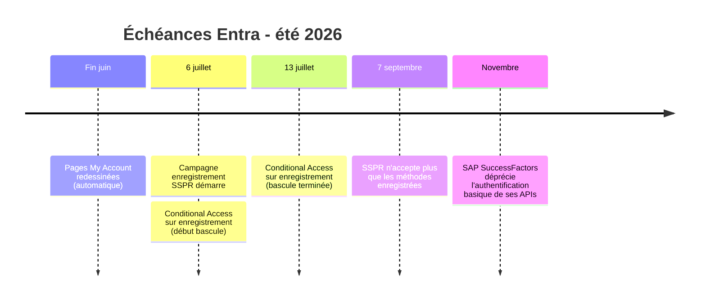

## Le fil de juin

Le What's New de juin raconte deux histoires en parallèle. D'un côté, Microsoft continue de pousser le passwordless : passkeys sur Windows, passkeys dans les campagnes d'enregistrement, plus de place pour les profils passkey, phish-resistant MFA qui débarque enfin sur Linux. De l'autre, un travail de fond sur les identités à privilèges et la gouvernance : réponse SOC sans escalade de droits, gouvernance des rôles Azure, parrainage des identités d'agents.

Le reste, ce sont des améliorations de confort ou des briques de préversion à surveiller sans urgence. Et deux annonces avec une date qui, elles, demandent une vraie préparation avant l'été.

Voici mon tri, fonctionnalité par fonctionnalité, avec à chaque fois ce que j'en ferais concrètement. Le classement reprend celui de Microsoft (GA, préversion, annonces), parce que le statut change tout : on ne déploie pas une préversion comme une fonctionnalité GA.

## Disponibilité générale

### Phish-resistant MFA sur Linux

Microsoft étend l'authentification résistante au phishing aux bureaux Linux via son broker d'identité. Support sur Ubuntu 24.04 et 26.04, RHEL 8, 9 et 10.

C'est la nouveauté GA la plus intéressante du lot pour qui a un parc hétérogène. Jusqu'ici, le poste Linux était le maillon qui cassait votre stratégie phishing-resistant : vous pouviez imposer FIDO2 partout sauf là. Le trou est comblé, Linux rejoint Windows et macOS. Si vous avez des développeurs ou des postes techniques sous Linux, c'est à intégrer à votre socle d'authentification, pas à laisser de côté parce que "c'est juste quelques machines". Ce sont souvent ces machines-là qui ont les accès les plus sensibles.

### Migration B2C vers External ID en mode High Scale Compatibility

Le mode HSC permet aux clients Azure AD B2C de migrer vers Entra External ID sans réenregistrer les utilisateurs ni réinitialiser les mots de passe. Réservé aux très gros tenants, en général 5 millions d'objets ou plus.

Sujet de niche, mais critique pour ceux que ça concerne. Si vous êtes sous le seuil des 5 millions, ce mode n'est pas pour vous, restez sur la migration standard. Si vous êtes au-dessus, ne choisissez pas seul : Microsoft recommande d'évaluer les deux options et d'engager l'équipe de migration EEID. La date de fin de support d'Azure AD B2C approche, donc si vous avez un gros tenant B2C qui n'a pas encore planifié sa sortie, c'est le moment de lancer le B2C Policy Analyzer.

### Authentification system-preferred sur le premier et le second facteur

Entra applique maintenant l'authentification system-preferred aux deux facteurs dans l'état Microsoft Managed, en sélectionnant automatiquement la méthode la mieux classée enregistrée par l'utilisateur.

Rien à faire de votre côté, et c'est le but. C'est une amélioration automatique côté Microsoft, sans action de votre part. Le seul intérêt est de le savoir, pour ne pas être surpris si un utilisateur remonte que sa méthode de connexion par défaut a changé. Vous pouvez le mentionner en interne, mais ça ne demande aucun chantier.

### Pages My Account redessinées

Les pages Appareils, Informations de sécurité et Organisations du portail My Account changent de visage. La page Appareils met notamment en avant les clés de récupération BitLocker.

Le point à retenir est la mise en avant des clés BitLocker. Concrètement, ça veut dire qu'un utilisateur peut récupérer sa propre clé sans passer par le helpdesk. C'est autant de tickets en moins pour vos équipes support. Le déploiement est automatique d'ici fin juin, donc prévenez votre support en amont, pour qu'ils sachent rediriger les utilisateurs vers cette page au lieu de chercher la clé eux-mêmes.

### Synchronisation de groupes cross-tenant

On peut désormais synchroniser des groupes de sécurité et leurs membres entre tenants, pour qu'un groupe géré dans un tenant source soit utilisable dans des tenants cibles.

Utile surtout si vous gérez plusieurs tenants (multinationales, structures issues de fusions, MSP). Ça évite de recréer et maintenir les mêmes groupes à la main dans chaque tenant. À rapprocher de la Tenant Governance dont j'ai parlé récemment : c'est la même logique de gouverner de façon cohérente à travers les frontières de tenants. Si vous n'avez qu'un seul tenant, passez votre chemin.

### Account discovery pour les applications connectées (ID Governance)

Visibilité sur tous les comptes des applications connectées, y compris les comptes orphelins non assignés à l'application d'entreprise. Nécessite une licence Entra ID Governance ou Entra Suite.

Les comptes orphelins sont un classique des audits de sécurité, et personne n'aime les chercher à la main. Pouvoir générer un rapport de découverte directement depuis l'expérience de provisioning fait gagner du temps réel lors de l'onboarding d'une application ou d'une revue d'accès. La vraie question est la licence : si vous avez déjà ID Governance ou la Suite, activez-le et servez-vous-en lors de votre prochaine revue. Sinon, ça ne justifie pas à soi seul l'achat.

### Parrainage automatique des identités d'agents

Avec les Lifecycle Workflows, quand le parrain humain d'une identité d'agent quitte l'organisation, le parrainage passe automatiquement à son manager.

C'est un signal plus qu'une fonctionnalité urgente. Microsoft construit méthodiquement la gouvernance des agents IA, et le principe "une identité d'agent doit toujours avoir un humain responsable" est sain. Si vous commencez à déployer des agents, c'est le genre de garde-fou à mettre en place tôt, avant que la liste des agents orphelins ne devienne ingérable. Si vous n'avez pas encore d'agents en production, gardez-le en tête pour quand ça viendra, parce que ça viendra.

### Passkeys dans les campagnes d'enregistrement

Les Registration Campaigns peuvent maintenant inciter les utilisateurs à enregistrer une passkey FIDO2 lors de la connexion.

C'est l'outil qui manquait pour passer du discours passwordless aux actes. Tout le monde veut déployer les passkeys, mais le frein a toujours été l'adoption : comment amener les utilisateurs à en enregistrer une sans projet lourd. Une campagne qui les sollicite au bon moment, juste après la connexion, c'est exactement le bon levier. Si le passwordless est dans votre feuille de route 2026, c'est une des fonctionnalités à activer en premier.

### Désactivation d'application (App Deactivation)

Une façon réversible de couper une application sans la supprimer : elle cesse de recevoir de nouveaux jetons, mais sa configuration est préservée pour une réactivation simple.

C'est le chaînon manquant de la réponse à incident côté applications. Jusqu'ici, face à une application suspecte, vous aviez le choix entre la laisser tourner (risqué) ou la supprimer (destructeur, et vous perdez la config pour l'analyse). La désactivation réversible règle ça : vous coupez l'accès immédiatement, vous gardez tout pour l'investigation, vous réactivez si c'était une fausse alerte. À documenter dès maintenant dans vos procédures de réponse à incident. Attention au détail qui compte : les jetons déjà émis restent valides jusqu'à expiration, donc la désactivation n'est pas une révocation instantanée.

### Passkeys Entra sur Windows (conteneur Windows Hello)

Les utilisateurs enregistrent des passkeys liées à l'appareil dans le conteneur Windows Hello local, utilisables avec la biométrie ou le PIN, sans que l'appareil ait besoin d'être joint ou enregistré dans Entra.

C'est l'autre grande nouvelle passwordless du mois, et elle est puissante. Le fait que ça marche sans appareil joint ni enregistré ouvre des scénarios intéressants, notamment pour des postes non gérés ou des contextes BYOD. La limite à connaître avant de promettre quoi que ce soit : la connexion interactive à la console Windows n'est pas prise en charge. Donc à cadrer dans vos communications pour éviter les attentes déçues.

## Préversion publique

Le statut change la posture : on teste dans un environnement de validation, on ne déploie pas en production critique. Ces fonctionnalités peuvent encore bouger.

### Fédération SAML sans domaine

Permet à des utilisateurs externes de s'authentifier avec les identifiants de leur IdP, quel que soit leur domaine de messagerie, sans correspondance de domaine préconfigurée.

Ça lève une contrainte pénible des fédérations classiques, où il fallait faire correspondre le domaine de l'email à un IdP préconfiguré. Pour des scénarios de collaboration avec des partenaires aux domaines multiples ou changeants, c'est un vrai confort. En préversion, donc à tester sur un cas non critique d'abord, mais c'est le genre de fonctionnalité qui simplifie concrètement la vie.

### Étiquettes de confidentialité sur les groupes de sécurité

On peut appliquer des étiquettes Purview aux groupes de sécurité cloud Entra, pour gouverner l'accès des invités et d'autres comportements avec les mêmes étiquettes que les groupes Microsoft 365.

Sujet que j'ai déjà traité en détail dans un article dédié, donc je ne m'étends pas. L'idée forte : le contrôle se pose au niveau de l'objet groupe, pas après coup. À tester sur vos groupes les plus sensibles, en gardant en tête qu'une étiquette appliquée est définitive et que certains rôles à privilèges peuvent la contourner (comportement susceptible d'évoluer avant la GA).

### Soft delete des appareils

Les objets appareil supprimés passent dans un état récupérable pendant une période de rétention, au lieu d'être effacés définitivement. Couvre les appareils Entra joined, registered et hybrid joined.

Tous ceux qui ont déjà lancé un script de nettoyage des appareils obsolètes un peu trop large savent pourquoi cette fonctionnalité est bienvenue. Le soft delete existe depuis longtemps pour les comptes utilisateurs, les appareils rattrapent enfin leur retard. Ça transforme une suppression accidentelle en simple incident récupérable. À tester en préversion, mais c'est typiquement le filet de sécurité qu'on regrette de ne pas avoir eu le jour où on en a besoin.

### SAP SuccessFactors en authentification Workload Identity

Remplace les identifiants à longue durée de vie par des jetons courts gérés par Entra pour le provisioning SAP SuccessFactors. Mise à niveau en place, sans recréer les jobs existants.

Si vous avez une intégration SAP SuccessFactors, ce n'est pas optionnel à terme : SAP déprécie l'authentification basique de ses APIs d'ici novembre 2026. Autant prendre les devants. Le bon point est que la migration se fait en place, sans reconstruire vos jobs de provisioning. Donc planifiez la bascule maintenant pendant que c'est en préversion pour valider, et basculez avant l'échéance SAP de novembre.

### Gouvernance des rôles Azure via les access packages

Permet de gouverner les attributions de rôles Azure (Management Group, Subscription, Resource Group) via les access packages, avec le même modèle de demande, approbation et cycle de vie que pour les applications.

C'est, avec la réponse SOC, la préversion la plus stratégique du mois. Les rôles Azure trop larges et attribués en dur sont exactement ce qui transforme une identité compromise en compromission cloud complète, comme l'a montré l'attaque Storm-2949 récemment. Pouvoir mettre les rôles Azure sous le même régime de gouvernance que le reste (demande, approbation, accès juste-à-temps) est un levier direct pour réduire votre surface d'attaque. À tester en priorité si vous gérez des souscriptions Azure de production.

### Mise à jour automatique d'attributs dans les Lifecycle Workflows

Une nouvelle tâche permet de modifier des attributs utilisateur, y compris personnalisés, directement dans les workflows, de façon auditable.

Amélioration solide pour qui automatise déjà ses parcours d'arrivée et de départ avec les Lifecycle Workflows. Pouvoir poser ou effacer des attributs dans le workflow lui-même évite les scripts externes et garde tout traçable au même endroit. Si vous n'utilisez pas encore les Lifecycle Workflows, ce n'est pas ce détail qui changera la donne, mais c'est une brique de plus qui rend l'outil plus complet.

### Réponse aux incidents sur les identités privilégiées pour le SOC

Le rôle Entra Security Operator s'étend pour permettre aux analystes SOC des actions de réponse (désactiver un utilisateur, révoquer des sessions, marquer un compte compromis, forcer une réinitialisation de mot de passe, supprimer une méthode d'authentification) directement depuis le RBAC unifié de Microsoft Defender, sans rôle d'admin Entra large. Permissions limitées aux utilisateurs non-admin.

C'est la préversion qui répond à un vrai problème de terrain. En incident, l'analyste SOC a besoin d'agir vite, mais lui donner des droits d'admin Entra juste pour ça crée un risque permanent. Cette fonctionnalité casse le compromis : l'analyste contient la menace sans escalade de privilèges, et tout est tracé. Le fait que ce soit limité aux utilisateurs non-admin est une limite saine. À évaluer en priorité si vous avez un SOC, parce que ça améliore directement votre temps de réaction tout en respectant le moindre privilège.

## Annonces avec échéance

Ce sont les seules de cette édition qui peuvent bloquer des utilisateurs si vous ne préparez rien. À traiter en priorité.

### SSPR : seules les méthodes enregistrées acceptées au 7 septembre 2026

À partir du 7 septembre, le SSPR n'acceptera plus que les méthodes d'authentification explicitement enregistrées. Les numéros et emails présents dans l'annuaire mais jamais enregistrés cesseront d'être acceptés. Concerne tout le monde, admins compris. Une campagne d'enregistrement démarre le 6 juillet.

C'est l'échéance la plus à risque du mois, et je lui ai consacré un article dédié. Le piège, ce sont les comptes qui dépendent encore d'attributs annuaire jamais enregistrés : ils découvriront le problème le 7 septembre, au pire moment, quand ils auront besoin de réinitialiser leur mot de passe. Le travail à faire avant l'été : identifier cette population à risque et s'assurer qu'elle enregistre une méthode pendant la campagne de juillet. Une organisation qui anticipe traite ça sans douleur.

### Conditional Access pendant l'enregistrement des identifiants au 6 juillet 2026

À partir du 6 juillet, les politiques CA ciblant "Register security information" seront évaluées pendant l'enregistrement Windows Hello entreprise et macOS Platform SSO. La MFA reste requise par défaut. Bascule terminée le 13 juillet.

Sujet que j'ai aussi détaillé à part. L'essentiel : si vous avez des politiques CA sur l'enregistrement, vérifiez leurs conditions d'octroi et testez en mode rapport seul avant la bascule. Le risque, c'est de bloquer un utilisateur en plein enregistrement parce qu'il ne dispose pas de la méthode qualifiante au moment de configurer son appareil. Si vous n'avez pas de politique CA sur cette action, vous n'êtes pas concerné.

### Taille de politique passkey et nombre de profils étendus

La politique passkey FIDO2 obtient sa propre allocation de 20 Ko (au lieu de partager une limite commune), et le nombre de profils passkey par tenant passe de 3 à 10.

Amélioration technique discrète mais utile si vous faites du ciblage passkey avancé. Les 3 profils maximum étaient une vraie contrainte dès qu'on voulait des configurations différentes par population (cadres, terrain, prestataires...). Passer à 10 profils débloque ces scénarios. Rien d'urgent, mais bon à savoir au moment de concevoir votre déploiement passkey.

## Le calendrier de l'été à retenir

## Nouvelle documentation

### Global Secure Access Operations Guide

Microsoft publie un guide d'exploitation post-déploiement pour GSA : alertes, contrôles de santé, gestion du changement, métriques, playbooks de récupération, avec des requêtes KQL et des modèles prêts à l'emploi. Guides spécifiques pour Private Access, Internet Access, Remote Networks et Microsoft Traffic.

Si vous exploitez GSA, ce guide est exactement ce qui manque entre "j'ai déployé" et "je sais l'exploiter au quotidien". Les requêtes KQL prêtes à l'emploi font gagner un temps réel. À garder en favori comme référence d'exploitation.

## Pour résumer

Si vous ne deviez retenir que l'essentiel de juin : du côté de ce qui est déployable tout de suite, le **phish-resistant MFA sur Linux**, les **passkeys Windows** et la **désactivation d'application** sont les trois à intégrer à vos chantiers. Du côté préversion, la **gouvernance des rôles Azure** et la **réponse SOC** sont les deux à tester en priorité, parce qu'elles s'attaquent directement aux scénarios d'attaque sur les identités à privilèges.

Et les deux dates à bloquer dans vos agendas, parce qu'elles peuvent casser quelque chose : le **6 juillet** (campagne SSPR et Conditional Access sur l'enregistrement) et le **7 septembre** (durcissement SSPR). Le reste se déploiera tout seul ou peut attendre que vous ayez le temps.

## Sources

- [What's New in Microsoft Entra: June 2026 - blog Microsoft Entra](https://techcommunity.microsoft.com/blog/microsoft-entra-blog/whats-new-in-microsoft-entra-june-2026/4517885)
- [Device soft delete in Microsoft Entra ID (preview) - Microsoft Learn](https://learn.microsoft.com/en-us/entra/identity/devices/concept-soft-delete-devices)
- [Global Secure Access Operations Guide - blog Microsoft Entra](https://techcommunity.microsoft.com/blog/microsoft-entra-blog/run-global-secure-access-with-confidence-introducing-the-gsa-operations-guide/4524891)
- [Microsoft Build 2026: Securing code, agents, and models - Microsoft Security Blog](https://www.microsoft.com/en-us/security/blog/2026/06/02/microsoft-build-2026-securing-code-agents-and-models-across-the-development-lifecycle/)