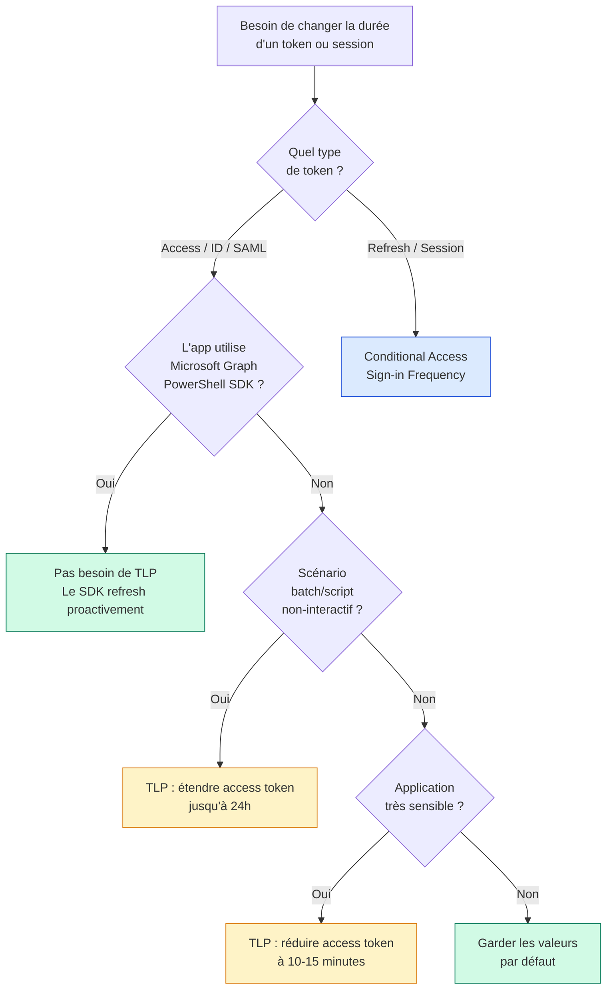

> Microsoft remet les Token Lifetime Policies dans Entra ID. Pour les anciens admins Azure AD, c'est un retour : les Configurable Token Lifetimes (CTL) avaient été partiellement dépréciés en janvier 2021. Depuis cette date, les durées de vie des refresh tokens et session tokens ne sont plus configurables via les TLP, seules les durées de vie des access tokens, ID tokens et tokens SAML le restent.

Microsoft reconnaît avec cette annonce que certains scénarios nécessitent un contrôle plus fin que ce que Conditional Access Sign-in Frequency peut offrir. Cet article fait le point sur la portée actuelle des TLP, les cas d'usage légitimes, et la matrice de décision pour choisir entre TLP et Conditional Access.

## Ce qui est configurable et ce qui ne l'est plus

C'est le premier point à clarifier, parce que la documentation Microsoft mélange les anciennes capacités CTL avec les nouvelles TLP.

| Type de token | Configurable via TLP ? | Durée par défaut | Plage configurable |
|---|---|---|---|
| Access Token | ✅ Oui | 1 heure (variable) | 10 minutes à 24 heures |
| ID Token | ✅ Oui | 1 heure | 10 minutes à 24 heures |
| SAML Token | ✅ Oui | 1 heure | 10 minutes à 24 heures |
| Refresh Token | ❌ Non | Variable (jusqu'à 90 jours) | Géré par Conditional Access uniquement |
| Session Token (SSO) | ❌ Non | 24h (non-persistent) / 90j (persistent) | Géré par Conditional Access uniquement |

Tout ce qui touche à la fréquence de réauthentification de l'utilisateur passe désormais par **Conditional Access Sign-in Frequency**. Les TLP servent à ajuster la durée pendant laquelle un token déjà émis reste valide pour appeler une API.

## Matrice de décision : TLP ou Conditional Access ?



La règle d'or : si la question concerne la fréquence à laquelle l'utilisateur doit se réauthentifier, c'est Conditional Access. Si elle concerne la durée pendant laquelle un token est valide pour appeler une API (sans intervention utilisateur), c'est TLP.

## Cas d'usage légitimes pour les TLP

### Cas 1 : étendre la durée d'un access token pour un script long

Un script PowerShell qui doit tourner pendant 4 heures sans pouvoir prompter l'utilisateur. Le défaut de 1 heure casse l'exécution à mi-parcours. La TLP permet d'aller jusqu'à 24 heures.

Important : si le script utilise Microsoft Graph PowerShell SDK, MSAL.NET, ou les bibliothèques Microsoft Identity Client classiques, ces libraries refreshent les access tokens automatiquement à l'expiration. Pas besoin de TLP dans ce cas. La TLP n'est nécessaire que pour les apps qui n'utilisent pas une library Microsoft moderne et qui ne savent pas refresher leurs tokens.

### Cas 2 : réduire la durée d'un access token pour une app sensible

Une application financière critique où on veut s'assurer qu'un token volé ne reste valide que 10-15 minutes maximum. La réduction force des refresh plus fréquents, ce qui multiplie les opportunités de bloquer le token volé via Conditional Access (révocation continue, signaux de risque).

C'est un trade-off : performance vs sécurité. Plus le token est court, plus l'utilisateur génère de trafic d'authentification.

### Cas 3 : différencier les durées par service principal

Un service principal qui orchestre des workflows batch peut avoir une TLP avec 8 heures d'access token, tandis que les apps interactives gardent le défaut de 1 heure. Permet une granularité par workload.

### Cas 4 : conformité réglementaire

Certains référentiels (PCI-DSS, HDS, secteur financier) imposent des durées maximales de session. Quand Conditional Access Sign-in Frequency ne suffit pas (par exemple parce qu'on veut limiter une durée API mais pas une durée de session UX), TLP devient le levier.

## Les pièges à éviter

### Piège 1 : essayer de configurer les refresh tokens

C'est le réflexe historique CTL, mais ça ne marche plus. Toute valeur définie pour `MaxInactiveTime`, `MaxAgeSingleFactor`, `MaxAgeMultiFactor` ou `MaxAgeSessionSingleFactor` est silencieusement ignorée. Pas d'erreur, juste un comportement par défaut.

Pour identifier les politiques legacy qui contiennent ces propriétés :

```powershell
Connect-MgGraph -Scopes "Policy.Read.All"
Get-MgPolicyTokenLifetimePolicy | ForEach-Object {
    $def = $_.Definition[0] | ConvertFrom-Json
    $policy = $def.TokenLifetimePolicy
    if ($policy.MaxInactiveTime -or $policy.MaxAgeSingleFactor -or 
        $policy.MaxAgeMultiFactor -or $policy.MaxAgeSessionSingleFactor) {
        Write-Warning "Policy $($_.DisplayName) contient des propriétés legacy ignorées"
        $_
    }
}
```

### Piège 2 : pas d'UI dans le portail

Les TLP ne peuvent être gérées que via Microsoft Graph API ou Microsoft Graph PowerShell SDK. Aucune surface dans l'admin center Entra. C'est volontaire : Microsoft considère que la configuration des TLP est un acte technique qui doit être versionné dans du code, pas cliqué dans une UI.

### Piège 3 : SharePoint et OneDrive web sont hors scope

Les TLP s'appliquent aux clients mobiles et desktop accédant à SharePoint Online et OneDrive. Pour les sessions navigateur web, c'est Conditional Access Session Lifetime qui s'applique.

### Piège 4 : managed identities exclues

Les TLP ne sont pas supportées pour les service principals correspondant à des managed identities Azure. Si tu veux ajuster la durée des tokens pour une managed identity, il faut passer par d'autres mécanismes (rotation programmée, validation côté ressource).

### Piège 5 : applications multi-tenant et comptes personnels

Les TLP ne s'appliquent pas aux applications développées pour les comptes Microsoft personnels (`signInAudience` = `AzureADandPersonalMicrosoftAccount` ou `PersonalMicrosoftAccount`).

## Configuration pratique

### Créer une TLP pour étendre l'access token à 8 heures

```powershell
Connect-MgGraph -Scopes "Policy.ReadWrite.ApplicationConfiguration", "Application.ReadWrite.All"

$params = @{
    Definition = @('{"TokenLifetimePolicy":{"Version":1,"AccessTokenLifetime":"08:00:00"}}')
    DisplayName = "Batch-Workload-8h-AccessToken"
    IsOrganizationDefault = $false
}

$policy = New-MgPolicyTokenLifetimePolicy -BodyParameter $params
Write-Output "Policy créée : $($policy.Id)"
```

### Assigner la TLP à un service principal

```powershell
$servicePrincipalId = "00001111-aaaa-2222-bbbb-3333cccc4444"  # ID du SP cible

$assignment = @{
    "@odata.id" = "https://graph.microsoft.com/v1.0/policies/tokenLifetimePolicies/$($policy.Id)"
}

New-MgServicePrincipalTokenLifetimePolicyByRef `
    -ServicePrincipalId $servicePrincipalId `
    -BodyParameter $assignment
```

### Vérifier les TLP appliquées à un service principal

```powershell
Get-MgServicePrincipalTokenLifetimePolicy -ServicePrincipalId $servicePrincipalId
```

### Inspecter un access token pour valider la durée appliquée

```powershell
function Decode-JwtToken {
    param([string]$Token)
    $parts = $Token.Split('.')
    $payload = $parts[1]
    $padding = 4 - ($payload.Length % 4)
    if ($padding -ne 4) { $payload += '=' * $padding }
    $decoded = [System.Text.Encoding]::UTF8.GetString(
        [System.Convert]::FromBase64String($payload)
    )
    return $decoded | ConvertFrom-Json
}

# Après avoir obtenu un token (par exemple via Connect-MgGraph)
$claims = Decode-JwtToken -Token $accessToken
$issuedAt = [DateTimeOffset]::FromUnixTimeSeconds($claims.iat).DateTime
$expiresAt = [DateTimeOffset]::FromUnixTimeSeconds($claims.exp).DateTime
$lifetime = $expiresAt - $issuedAt
Write-Output "Durée du token : $($lifetime.TotalMinutes) minutes"
```

## Bonnes pratiques de gouvernance

**Pas de politique organisation-wide par défaut.** Mettre `IsOrganizationDefault = $false` et assigner explicitement à des apps ou service principals. Une politique organisation-wide casse silencieusement des intégrations qu'on n'avait pas anticipées.

**Documenter chaque politique.** Le nom de la policy doit refléter son usage (`Batch-Workload-8h-AccessToken`, pas `Custom-Policy-1`). Idéalement, maintenir un fichier de configuration versionné qui décrit chaque politique, son scope, et la justification métier.

**Auditer périodiquement.** Lister les politiques existantes tous les trimestres, vérifier qu'elles sont toujours pertinentes, et supprimer les orphelines.

```powershell
# Lister toutes les politiques et leurs apps assignées
Get-MgPolicyTokenLifetimePolicy | ForEach-Object {
    $policyId = $_.Id
    Write-Output "Policy: $($_.DisplayName) ($policyId)"
    
    # Lister les apps qui utilisent cette policy
    $apps = Invoke-MgGraphRequest -Method GET `
        -Uri "https://graph.microsoft.com/v1.0/policies/tokenLifetimePolicies/$policyId/appliesTo"
    
    foreach ($app in $apps.value) {
        Write-Output "  - $($app.displayName) ($($app.'@odata.type'))"
    }
}
```

**Tester en environnement de pré-production.** Une TLP qui réduit l'access token à 10 minutes peut causer des problèmes inattendus sur des apps legacy qui ne savent pas gérer les refresh fréquents.

## Sources

- [Configurable Token Lifetimes - Documentation officielle Microsoft](https://learn.microsoft.com/en-us/entra/identity-platform/configurable-token-lifetimes)
- [Set token lifetimes - Guide pratique Microsoft](https://learn.microsoft.com/en-us/entra/identity-platform/configure-token-lifetimes)
- [tokenLifetimePolicy resource type - Microsoft Graph](https://learn.microsoft.com/en-us/graph/api/resources/tokenlifetimepolicy)
- [Conditional Access Sign-in frequency](https://learn.microsoft.com/en-us/entra/identity/conditional-access/howto-conditional-access-session-lifetime)
- [Microsoft Graph PowerShell SDK - TokenLifetimePolicy cmdlets](https://learn.microsoft.com/en-us/powershell/module/microsoft.graph.identity.signins/get-mgpolicytokenlifetimepolicy)