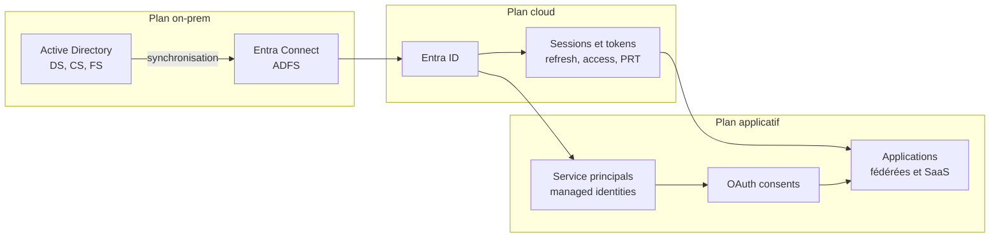

Avant de parler des outils Microsoft qui composent la pile ITDR, il faut savoir contre quoi ils sont censés défendre. Cet article cartographie la **surface d'attaque identité** d'un environnement Microsoft hybride réaliste. Il sort volontairement de la vue produit pour adopter la vue chaîne d'attaque, parce que c'est celle que les équipes adverses utilisent en pratique.

L'objectif n'est pas l'exhaustivité. Il est de donner une grille de lecture claire pour les articles suivants, qui présenteront chacun une brique de détection.

## Trois plans, une seule identité

Dans un environnement Microsoft moderne, une même identité existe simultanément sur plusieurs plans, avec des mécanismes d'authentification, des vecteurs de compromission et des outils de détection distincts.

Ce découpage n'est pas théorique. Il correspond à des sources de signaux et à des outils de détection différents. Le plan on-prem est principalement couvert par Defender for Identity. Le plan cloud par Entra ID Protection et les journaux Entra. Le plan applicatif par Defender for Cloud Apps, les audits Entra et l'analyse des consentements OAuth.

Un attaquant ne se limite pas à un seul plan. Une compromission sérieuse traverse les trois.

## Plan cloud, ce que cible un attaquant aujourd'hui

Les vecteurs les plus actifs sur le plan cloud ne cherchent plus à casser la MFA, ils cherchent à la contourner ou à la rendre inutile.

**Password spray.** Tentative à faible volume sur un grand nombre de comptes pour rester sous les seuils de verrouillage. Visible dans les journaux Sign-in, classé par Entra ID Protection sous la catégorie *password spray*. La détection repose sur la corrélation d'échecs d'authentification sur plusieurs comptes dans une fenêtre temporelle courte, depuis des IP proches ou similaires.

**Adversary-in-the-Middle.** Proxy de phishing qui capte simultanément les identifiants et le cookie de session après MFA réussie. Le token obtenu permet d'opérer sans repasser par l'authentification. Visible partiellement via les signaux d'anomalie de Defender for Cloud Apps et via les détections atypical sign-in côté EIDP, mais le moment exact du vol passe souvent sous le radar. Les tokens volés par AiTM ont des caractéristiques (IP, user agent, horodatage) qui peuvent diverger de la session légitime.

**Vol et réutilisation de tokens.** Extraction d'un refresh token ou d'un PRT depuis un poste compromis, par exemple via un malware ou un accès physique. L'attaquant rejoue le token depuis son propre environnement, ce qui produit une session qui paraît légitime du point de vue d'Entra. La détection repose sur des anomalies de géolocalisation ou de user agent, qui ne sont pas toujours suffisantes.

**OAuth consent illicite.** L'utilisateur accorde un consentement à une application malveillante qui demande des permissions élevées sur Graph : lecture de mails, accès aux fichiers, envoi de messages. La persistance ne dépend plus du mot de passe ni de la MFA, mais des permissions consenties. L'application reste active même après un changement de mot de passe ou une révocation MFA.

**Abus de service principals et managed identities.** Création ou réutilisation d'une identité applicative pour accéder à Graph et à des ressources Azure, avec un niveau de surveillance souvent inférieur à celui des comptes utilisateurs. Les service principals n'ont pas de MFA au sens classique. Leurs permissions peuvent être étendues discrètement.

**Abus du B2B.** Identité externe invitée dans le tenant, mal cadrée par les politiques d'accès, qui sert de point d'entrée à moindre coût. Le tenant invitant ne contrôle pas les politiques d'authentification du tenant d'origine de l'invité.

## Plan on-prem, ce qui reste central

Beaucoup d'environnements modernes restent hybrides. La compromission d'Active Directory ouvre toujours l'accès au cloud par propagation.

**Kerberoasting.** Demande de tickets de service sur des comptes avec SPN, puis cassage hors-ligne. L'attaquant n'a besoin que d'un accès authentifié au domaine pour demander ces tickets, sans élévation préalable. Détecté par Defender for Identity quand le capteur DC est en place et que l'audit Kerberos est correctement configuré.

**AS-REP roasting.** Variante exploitant les comptes pour lesquels la pré-authentification Kerberos est désactivée. Ces comptes répondent à une demande sans authentification préalable, ce qui permet d'obtenir un hash cassable hors-ligne.

**DCSync.** Utilisation des privilèges de réplication pour extraire les hashes des comptes du domaine, dont KRBTGT. Requiert des droits de réplication sur le domaine, obtenus par escalade de privilèges préalable. La rotation du KRBTGT après compromission est rarement opérationnelle de bout en bout dans les environnements réels.

**Pass-the-hash, overpass-the-hash, pass-the-ticket.** Réutilisation d'éléments d'authentification volés pour s'authentifier sans connaître le mot de passe. Ces techniques exploitent les caches d'authentification présents en mémoire sur les postes et serveurs Windows.

**Golden Ticket et Silver Ticket.** Forge de tickets Kerberos à partir du hash KRBTGT ou du hash d'un compte de service, donnant un accès persistant difficile à révoquer. Un Golden Ticket peut rester valide pendant des années si KRBTGT n'est pas régulièrement rotaté.

**Abus des comptes de service.** Comptes avec mots de passe statiques, souvent anciens, avec des privilèges élevés hérités. Leur activité est difficile à distinguer d'un comportement légitime, ce qui les rend difficiles à surveiller sans baseline comportementale.

## Plan hybride, la zone la plus mal couverte

Les vecteurs hybrides exploitent la jointure entre on-prem et cloud, qui est aussi le maillon le moins observé dans la majorité des environnements.

**Compromission Entra Connect.** Le serveur Entra Connect manipule des identités synchronisées et dispose d'un compte de service avec des privilèges élevés côté Active Directory et côté Entra. Sa compromission permet de basculer ou de manipuler des identités côté cloud. Le compte de service utilisé pour la synchronisation est parfois mal restreint et peut être utilisé pour des opérations de type DCSync.

**Compromission ADFS ou de la fédération.** Vol du token signing certificate, attaque Golden SAML. L'attaquant émet ses propres jetons SAML acceptés par Entra, ce qui contourne entièrement les mécanismes d'authentification côté cloud. L'attaque est difficile à détecter parce que les jetons produits sont valides du point de vue d'Entra.

**Propagation T0 vers cloud.** Compte administrateur de domaine compromis qui sert ensuite à pivoter vers une identité cloud à privilèges via un compte hybride synchronisé. Dans un environnement sans séparation claire entre les identités admin on-prem et cloud, la propagation est directe.

**Propagation cloud vers on-prem.** Plus rare, mais possible quand certaines fonctions hybrides sont mal cloisonnées. Cloud Sync avec écriture inverse et certaines configurations de provisioning peuvent ouvrir des chemins de retour vers l'on-prem.

## Mapping rapide MITRE ATT&CK

Pour situer ces vecteurs dans une grille reconnue, voici un mapping synthétique sur les tactiques les plus pertinentes côté identité.

| Tactique | Techniques identité courantes |
|---|---|
| Initial Access | Phishing, AiTM, Valid Accounts |
| Credential Access | Password Spray, Kerberoasting, AS-REP Roasting, Forced Authentication |
| Privilege Escalation | DCSync, Token Impersonation, Abuse of OAuth scopes |
| Persistence | Golden Ticket, Golden SAML, OAuth Consent, Service Principal abuse |
| Defense Evasion | Token theft, Session hijacking |
| Lateral Movement | Pass-the-Hash, Pass-the-Ticket, Remote Services with Valid Accounts |

Ce mapping n'a pas vocation à se substituer à une lecture complète de MITRE ATT&CK. Il sert de repère pour les articles suivants, qui rattacheront chaque détection Microsoft à une ou plusieurs de ces techniques.

## Ce qui change en contexte MSP

La surface d'attaque ne se limite pas à un tenant isolé. En contexte MSP, deux dimensions supplémentaires interviennent.

**Identités du prestataire.** Comptes d'administration utilisés par le MSP, dont la compromission impacte simultanément plusieurs tenants clients. La posture du prestataire doit être au minimum équivalente à celle de son client le plus exigeant.

**Delegated Admin Privileges et Granular Delegated Admin Privileges.** Modèle de délégation Microsoft Partner qui ouvre une voie d'accès depuis le tenant prestataire vers les tenants clients. Surface d'attaque concentrée, qui demande une attention spécifique côté Conditional Access et côté détection. GDAP limite les privilèges délégués à des rôles précis et des durées définies, ce qui réduit la surface par rapport au DAP classique, mais ne la supprime pas.

## Ce que voit déjà la pile Microsoft

Tous les vecteurs ci-dessus ne sont pas équivalents devant les outils de détection.

**Bien couverts.** Password spray, atypical sign-in, AiTM via signaux EIDP et MDCA, Kerberoasting et AS-REP roasting avec capteurs MDI, OAuth consent suspect via Defender XDR.

**Couverture partielle.** Vol et réutilisation de tokens, attaque Golden SAML, abus de service principals, compromission Entra Connect. Ces vecteurs produisent des signaux, mais leur détection dépend fortement de la configuration et du contexte.

**Mal couverts ou non couverts.** Comportements insider légitimes, compromissions B2B côté tenant invitant, IdP tiers fédérés hors Microsoft.

Cette répartition n'est pas une critique de la pile, c'est une lecture honnête de son périmètre, et c'est précisément ce qui justifie la suite de la série.

## Conclusion

La surface d'attaque identité dans un environnement Microsoft moderne n'est pas concentrée sur l'authentification. Elle s'étend sur trois plans qui se chevauchent et se nourrissent mutuellement. Comprendre cette cartographie est un préalable à toute discussion sur les outils de détection et de réponse.

Les articles suivants prendront chaque brique de la pile ITDR Microsoft et la situeront sur cette cartographie, avec un focus sur ce qu'elle voit, ce qu'elle ne voit pas, et comment elle s'intègre dans la chaîne.

## Références

- [MITRE ATT&CK for Enterprise - Identity matrices](https://attack.mitre.org/matrices/enterprise/)
- [Entra ID Protection - Détections de risques](https://learn.microsoft.com/fr-fr/entra/id-protection/concept-identity-protection-risks)
- [Defender for Identity - Vue d'ensemble des alertes](https://learn.microsoft.com/fr-fr/defender-for-identity/alerts-overview)
- [Protéger Microsoft 365 contre les attaques on-premises](https://learn.microsoft.com/fr-fr/entra/architecture/protect-m365-from-on-premises-attacks)
- [Qu'est-ce que Microsoft Entra Connect ?](https://learn.microsoft.com/fr-fr/entra/identity/hybrid/connect/whatis-azure-ad-connect)
- [Granular Delegated Admin Privileges (GDAP)](https://learn.microsoft.com/fr-fr/partner-center/gdap-introduction)
