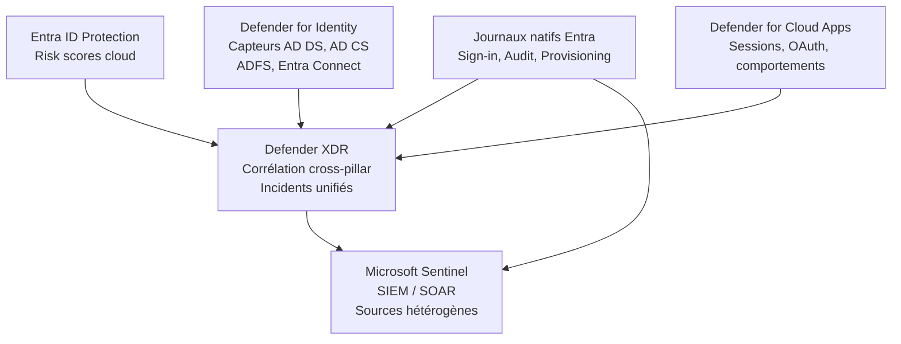

[L'article précédent]() a cartographié la surface d'attaque identité sur trois plans : cloud, on-prem et hybride. Cet article présente les briques Microsoft qui couvrent cette surface, avec leur périmètre réel, ce que chacune voit, ce qu'elle ne voit pas, et comment elles s'articulent entre elles.

La pile ITDR Microsoft n'est pas un produit unique. C'est un ensemble de composants distincts, avec des sources de signaux différentes, des couvertures qui ne se recoupent que partiellement, et des dépendances de licence qui comptent en pratique.

## Microsoft Entra ID Protection

Entra ID Protection produit deux types de scores de risque : un score au niveau de l'utilisateur (*user risk*) et un score au niveau de la connexion (*sign-in risk*). Ces scores alimentent les politiques d'accès conditionnel et peuvent déclencher des actions automatiques, comme forcer une réauthentification ou bloquer l'accès.

**Ce qu'elle voit.** Tentatives de connexion suspectes sur des identités cloud Entra : password spray, atypical travel, anonymous IP, AiTM partiel, leaked credentials. Son périmètre se limite aux identités managées dans Entra ID.

**Ce qu'elle ne voit pas.** Les identités on-prem sans synchronisation, les comportements post-authentification, les actions réalisées sur les ressources après connexion. Une connexion réussie sans anomalie de signalisation ne produit aucun signal.

**Prérequis licence.** Entra ID P2 ou Microsoft 365 E5. Sans licence P2, les détections restent limitées à quelques signaux de base et les politiques de risk-based Conditional Access ne sont pas disponibles.

## Microsoft Defender for Identity

MDI fonctionne via des capteurs déployés sur les contrôleurs de domaine, les serveurs AD CS, les serveurs ADFS et le serveur Entra Connect. Depuis 2023, il intègre également des capteurs côté Entra pour étendre la couverture aux identités cloud dans des environnements hybrides.

**Ce qu'il voit.** Trafic Kerberos et NTLM sur les DC, tentatives de Kerberoasting et AS-REP roasting, DCSync, pass-the-hash, reconnaissance LDAP, Golden Ticket, Golden SAML sur ADFS, activité anormale sur les comptes de service. C'est la brique la mieux positionnée pour détecter les TTPs identitaires côté on-prem et hybride.

**Ce qu'il ne voit pas.** Les environnements full cloud sans Active Directory. Les actions post-authentification dans les applications SaaS. Les comportements OAuth côté applicatif. La détection reste tributaire de la qualité des audits configurés sur les contrôleurs de domaine.

**Prérequis licence.** Microsoft Defender for Identity, inclus dans Microsoft 365 E5 ou disponible en licence autonome.

## Microsoft Defender for Cloud Apps

MDCA couvre principalement le plan applicatif : contrôle de session, détection d'anomalies comportementales, gouvernance des consentements OAuth et découverte d'applications non sanctionnées.

**Ce qu'il voit.** Sessions utilisateurs vers des applications intégrées via le proxy MDCA, comportements anormaux dans SharePoint ou Exchange, applications OAuth avec des permissions élevées, consentements illicites, activité sur des applications cloud connectées. En combinaison avec le Conditional Access, il applique des contrôles de session granulaires sur les applications fédérées.

**Ce qu'il ne voit pas.** Les applications SaaS non intégrées dans le catalogue MDCA. Les sessions qui ne passent pas par le proxy. Les comportements on-prem. Le périmètre dépend directement de la liste des applications connectées et de la politique de session active.

**Point d'articulation CAF.** La [politique de session Conditional Access]() est le point de liaison entre la décision d'accès et le contrôle de session MDCA. Sans politiques de session actives dans la CAF, MDCA ne contrôle pas les sessions en cours, même si l'application est intégrée.

**Prérequis licence.** Microsoft Defender for Cloud Apps, inclus dans Microsoft 365 E5 Security ou EMS E5.

## Microsoft Defender XDR

Defender XDR n'est pas un outil ITDR au sens strict. C'est une plateforme de corrélation cross-pillar qui agrège les alertes produites par Entra ID Protection, MDI, MDCA, Defender for Endpoint et Defender for Office 365, et les consolide en incidents unifiés.

**Ce qu'il apporte.** Un graphe d'actifs qui relie identités, appareils et applications dans un même incident. Une vue d'investigation unifiée. Des capacités de réponse automatisées (AIR) qui peuvent agir sur plusieurs piliers simultanément.

**Ce qu'il n'est pas.** Une source de signaux ITDR indépendante. Il ne dispose pas de capteurs propres sur les identités. Sa pertinence en contexte ITDR dépend entièrement des briques qui l'alimentent. Un Defender XDR seul, sans EIDP ni MDI configurés, ne produit pas de détection identité.

**Prérequis licence.** Microsoft 365 E5 ou Microsoft 365 E5 Security.

## Microsoft Sentinel

Sentinel est le SIEM et SOAR de Microsoft. Il étend Defender XDR quand le périmètre de détection dépasse la pile Microsoft : sources tierces, IdP externes, équipements réseau, journaux applicatifs personnalisés.

**Ce qu'il apporte.** Ingestion de sources hétérogènes via des connecteurs de données, règles analytiques KQL personnalisées, playbooks d'automatisation Logic Apps, corrélation sur des fenêtres temporelles longues.

**Quand il est utile.** Environnements hybrides avec des sources de signaux hors pile Microsoft. Contextes où Defender XDR seul ne couvre pas le périmètre opérationnel ou réglementaire. Besoins de rétention longue ou de corrélation historique.

**Quand il peut faire doublon.** Sur un périmètre purement Microsoft 365 avec Defender XDR bien configuré, certaines règles analytiques Sentinel reproduisent des détections déjà présentes nativement. Le déploiement de Sentinel se justifie par le périmètre réel de l'environnement, pas par défaut.

**Prérequis licence.** Facturation à l'ingestion (Go/jour). L'intégration des données Defender XDR est incluse sans surcoût d'ingestion pour les tables Defender natives.

## Journaux natifs Entra

Les journaux Sign-in, Audit et Provisioning d'Entra ID sont la source brute sur laquelle s'appuient en partie EIDP et Defender XDR. Ils sont directement exploitables via KQL dans Log Analytics, via l'API Microsoft Graph, ou via export vers un SIEM externe.

**Utilité directe.** Hunting ad hoc, corrélation sur des fenêtres que les produits automatisés ne couvrent pas, alimentation d'un SIEM tiers, construction de tableaux de bord opérationnels.

**Contrainte de rétention.** La rétention par défaut des journaux Entra dans le portail est de 30 jours pour les licences P1/P2 et de 7 jours pour les licences de base. Toute détection ou investigation sur des fenêtres plus longues nécessite un export actif vers Log Analytics ou un stockage externe.

## Agrégation des briques vers Defender XDR et Sentinel

## Couverture par type de menace

| Type de menace | EIDP | MDI | MDCA | MXDR | Sentinel |
|---|---|---|---|---|---|
| Password spray | Oui | Partiel (on-prem) | - | Via EIDP | Via EIDP |
| Kerberoasting | - | Oui | - | Via MDI | Via MDI |
| AiTM | Partiel | - | Partiel | Via EIDP/MDCA | Via EIDP/MDCA |
| OAuth consent illicite | - | - | Oui | Via MDCA | Via MDCA |
| Vol de token / session hijacking | Partiel | - | Partiel | Via EIDP/MDCA | KQL custom |
| Anomalie comportementale | Partiel | Partiel | Oui | Agrégé | Agrégé + custom |
| Lateral movement on-prem | - | Oui | - | Via MDI | Via MDI |

Les cases "Partiel" indiquent une détection conditionnelle : elle dépend de la configuration, du contexte ou d'un seuil atteint. Une case vide signifie que la brique n'a pas de visibilité directe sur ce vecteur, pas nécessairement que la menace est invisible de la pile dans son ensemble.

## Zones de recouvrement et complémentarités

**Entra ID Protection et MDI sur les identités hybrides.** Les deux briques se recoupent partiellement sur les comptes synchronisés. EIDP voit les connexions cloud, MDI voit les authentifications on-prem. Pour un compte hybride compromis, les deux peuvent produire des alertes sur des phases différentes de l'attaque. La corrélation se fait dans Defender XDR, qui regroupe ces alertes dans un même incident.

**MDCA et Conditional Access.** Le contrôle de session MDCA n'est actif que si une politique de Conditional Access redirige la session vers le proxy MDCA. Sans cette configuration, MDCA voit l'application dans son catalogue mais ne contrôle pas la session utilisateur en cours. Les deux composants sont complémentaires, pas alternatifs.

**Defender XDR et Sentinel.** Les deux coexistent fréquemment dans les environnements de taille intermédiaire à grande. Defender XDR traite les incidents Microsoft en temps quasi-réel. Sentinel apporte la corrélation sur des sources hors périmètre Microsoft et la rétention longue. Leur complémentarité est intégrée dans l'architecture : les tables Defender sont disponibles nativement dans Sentinel sans duplication d'ingestion.

## Limites du périmètre Microsoft

La pile couvre bien son propre écosystème. Dès qu'on en sort, la visibilité se réduit.

**IdP tiers.** Dans un environnement fédéré avec Okta, Ping ou un ADFS autonome, Entra voit les assertions SAML en entrée, mais pas les authentifications réalisées côté IdP externe. Les signaux de risque produits par l'IdP tiers ne remontent pas automatiquement dans EIDP.

**Applications SaaS hors MDCA.** Une application SaaS non connectée au catalogue MDCA et non protégée par Conditional Access n'est pas visible au niveau comportemental. Les journaux Entra indiquent qu'une connexion a eu lieu, sans détail sur ce qui s'est passé ensuite.

**B2B partiel.** Les identités invitées sont visibles dans Entra du tenant hôte, mais leur comportement dans leur tenant d'origine reste inaccessible. La détection est asymétrique par construction.

**Insider threats.** Les comportements malveillants d'un utilisateur interne qui respecte formellement les politiques d'accès ne produisent pas d'alerte dans la pile ITDR. Ce périmètre relève de Microsoft Purview Insider Risk Management, hors du scope de cette série.

Ces limites seront détaillées dans l'article dédié aux [angles morts de la pile]().

## Conclusion

Les briques de la pile ITDR Microsoft ne sont pas interchangeables. Entra ID Protection et MDI sont des sources de détection avec des périmètres distincts. Defender for Cloud Apps couvre le plan applicatif. Defender XDR est une plateforme de corrélation, pas une source de signaux autonome. Sentinel étend le périmètre quand l'environnement le justifie.

C'est ce que posait le [000 de cette série]() : l'ITDR Microsoft est une chaîne fonctionnelle, pas une catégorie de produit. Lire la pile brique par brique, en partant de la surface d'attaque décrite dans le [010](), permet de savoir ce qu'on couvre réellement et ce qu'on ne couvre pas. Les articles suivants entrent dans le détail de chaque source de signaux.

## Références

- [Microsoft Entra ID Protection - Vue d'ensemble](https://learn.microsoft.com/fr-fr/entra/id-protection/overview-identity-protection)
- [Microsoft Defender for Identity - Présentation](https://learn.microsoft.com/fr-fr/defender-for-identity/what-is)
- [Microsoft Defender for Cloud Apps - Présentation](https://learn.microsoft.com/fr-fr/defender-cloud-apps/what-is-defender-for-cloud-apps)
- [Microsoft Defender XDR - Vue d'ensemble](https://learn.microsoft.com/fr-fr/microsoft-365/security/defender/microsoft-365-defender)
- [Microsoft Sentinel - Vue d'ensemble](https://learn.microsoft.com/fr-fr/azure/sentinel/overview)
- [Journaux de connexion dans Microsoft Entra ID](https://learn.microsoft.com/fr-fr/entra/identity/monitoring-health/concept-sign-ins)
- [Licences Microsoft Entra ID](https://learn.microsoft.com/fr-fr/entra/fundamentals/licensing)
