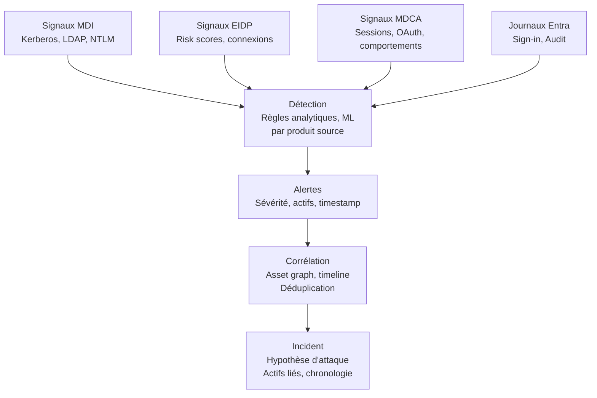

Les briques présentées dans le [020]() produisent toutes des signaux. Mais un signal brut n'est pas exploitable directement par un analyste SOC. Entre un événement de connexion et un incident qualifié, Microsoft passe par plusieurs étapes de traitement, de corrélation et de classification. Cet article décrit ce pipeline, avec les termes exacts et leur sens pratique.

Les mots "signal", "alerte", "détection" et "incident" sont souvent utilisés de façon interchangeable dans la communication Microsoft. En pratique, ils désignent des choses différentes dans le fonctionnement réel de Defender XDR.

## Quatre termes, quatre réalités

**Signal.** Un événement brut produit par une source de données : une connexion dans les Sign-in logs, un ticket Kerberos capté par un capteur MDI, un accès à une application dans MDCA. Un signal n'implique aucun jugement sur sa dangerosité. C'est une observation.

**Détection.** L'application d'une règle ou d'un modèle analytique à un ou plusieurs signaux. Une détection produit un résultat : ce comportement correspond à un pattern connu. Chez Microsoft, les détections sont embarquées dans les produits (EIDP, MDI, MDCA) ou définies par des règles KQL dans Sentinel.

**Alerte.** Une détection qui a franchi un seuil et a été surfacée comme un événement à traiter. Une alerte a une sévérité, une source, un timestamp, et elle est rattachée à un ou plusieurs actifs (utilisateur, appareil, application). Une alerte peut rester isolée ou être absorbée dans un incident.

**Incident.** Un regroupement d'alertes corrélées par Defender XDR autour d'une même hypothèse d'attaque. L'incident est l'unité de travail pour un analyste. Il contient le fil des alertes, les actifs impliqués, la chronologie, et les actions de réponse disponibles.

## Le pipeline Defender XDR

Chaque produit source (MDI, EIDP, MDCA) fait sa propre détection avant de remonter des alertes à Defender XDR. Defender XDR ne refait pas la détection : il corrèle les alertes déjà produites. C'est une distinction importante : améliorer la détection passe par la configuration des briques sources, pas par Defender XDR lui-même.

## Sources de signaux identité dans le pipeline

Les alertes identité qui remontent dans Defender XDR proviennent de quatre sources principales.

**MDI** produit des alertes sur les comportements on-prem : Kerberoasting, DCSync, reconnaissance LDAP, Golden Ticket. Ces alertes ont généralement une sévérité élevée et une fidélité assez haute, parce qu'elles reposent sur des patterns comportementaux précis observés sur le trafic réseau des DC.

**EIDP** produit des alertes sur les risques de connexion et de compte : atypical travel, leaked credentials, password spray, AiTM partiel. Ces alertes sont directement liées aux risk scores. Leur sévérité dépend du score calculé, qui peut varier selon la vitesse de mise à jour du modèle.

**MDCA** produit des alertes comportementales sur les sessions et les applications : volume de téléchargement anormal, connexion depuis un emplacement inhabituel vers une application, activité OAuth suspecte. La qualité de ces alertes dépend du volume de baseline disponible pour l'environnement.

**Les journaux Entra natifs** n'alimentent pas directement des alertes dans Defender XDR. Ils sont exploitables via des règles analytiques Sentinel, ou via le hunting KQL dans le portail Defender. Ils constituent la source la plus brute et la plus complète, mais ils demandent un traitement actif pour devenir exploitables.

## Corrélation : l'asset graph et le graph d'incident

Defender XDR construit un graph d'actifs à partir des alertes reçues. Ce graph lie des entités : un utilisateur, un appareil, une adresse IP, une application, un fichier. Quand deux alertes partagent une entité commune et une fenêtre temporelle cohérente, Defender XDR les regroupe dans un même incident.

Ce mécanisme permet de relier des alertes qui, prises isolément, passeraient sous le seuil de priorité d'un analyste. Un password spray suivi deux heures plus tard d'une connexion depuis une IP inhabituelle sur le même compte produit deux alertes séparées. Regroupées dans un incident, elles forment une hypothèse de compromission bien plus lisible.

La déduplication évite qu'une même activité génère plusieurs alertes redondantes issues de sources différentes, par exemple une connexion suspecte vue à la fois par EIDP et par MDCA. Defender XDR fusionne ces alertes dans la même entrée de l'incident.

## Sévérité, classification, statuts

Defender XDR attribue une sévérité à chaque alerte (Informatif, Faible, Moyen, Élevé) et une sévérité globale à l'incident, calculée à partir des alertes qu'il contient. En pratique, la sévérité est un point de départ, pas une vérité.

Les statuts d'incident suivent un cycle simple : Actif, En cours d'investigation, Résolu. La classification à la fermeture (Vrai positif, Faux positif, Activité attendue) alimente les mécanismes de feedback, mais ce retour n'est pas automatiquement pris en compte dans les seuils de détection des briques sources. Le tuning se fait à un autre niveau.

En pratique, un SOC qui reçoit des alertes Defender XDR sans baseline de tuning va observer un volume significatif d'incidents de sévérité Faible ou Informatif générés par des comportements légitimes : voyages fréquents, usage de VPN, connexions depuis des plages IP d'entreprise non déclarées. La gestion de ce bruit est un travail continu.

## Faux positifs : volumétrie et tuning

La volumétrie de faux positifs dans un environnement non tuné peut être élevée, en particulier sur les alertes EIDP (atypical travel, anonymous IP) et MDCA (activité anormale sur des applications). Ce n'est pas un défaut de conception, c'est une conséquence de modèles calibrés pour une sensibilité maximale par défaut.

Les leviers disponibles sont limités mais existent. Côté EIDP, les named locations permettent de déclarer des plages IP et des pays de confiance, ce qui réduit mécaniquement les alertes atypical travel et anonymous IP sur ces plages. Côté MDCA, les politiques d'activité peuvent être affinées par application, par utilisateur ou par groupe. Côté MDI, certaines exclusions peuvent être configurées sur des comptes de service dont le comportement est connu.

Le tuning n'est pas un projet ponctuel. C'est une activité récurrente, à mesurer par le ratio faux positifs / alertes totales sur les principales catégories de détection. Sans ce suivi, la fatigue d'alerte s'installe et les incidents réels se noient dans le bruit.

## Conclusion

Le pipeline Defender XDR est structuré et cohérent. Il convertit des signaux bruts en incidents exploitables via un enchaînement détection, alerte, corrélation. Mais un incident n'est pas une vérité : c'est une hypothèse construite par le système à partir des alertes disponibles. Sa qualité dépend de la qualité de la détection en amont, du tuning des briques sources, et du travail continu des équipes qui traitent les retours.

Les articles suivants entrent dans le détail de chaque brique source, en commençant par Entra ID Protection et ses risk policies.
