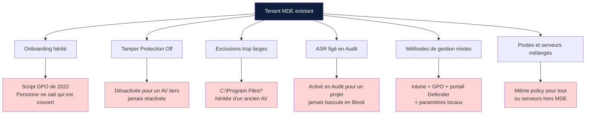
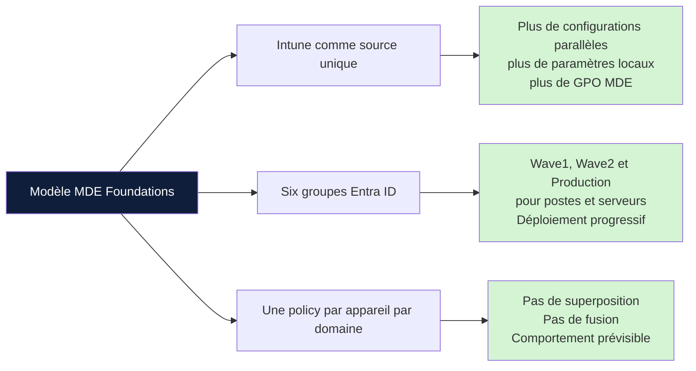
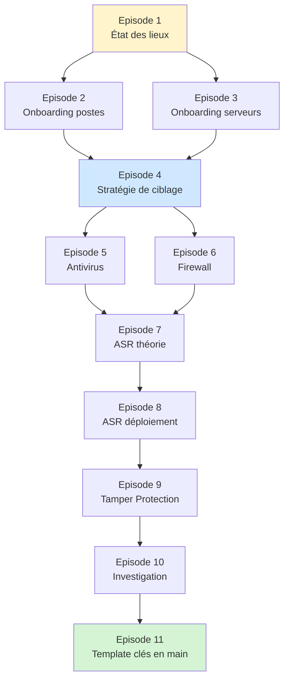

Microsoft Defender for Endpoint est largement déployé, et souvent mal configuré. Microsoft n'a pas publié de configuration de référence officielle. La documentation existe par feature, par scénario, par produit cousin, mais pas de feuille de route qui décrit un déploiement complet, du premier groupe Entra ID jusqu'à la dernière règle ASR en Block.

Cette série propose une feuille de route. Onze épisodes, un modèle de déploiement complet, et un template Intune importable à la fin.

## Ce qu'on trouve sur le terrain

**Onboarding orphelin** : un script GPO tourne depuis trois ans, MDE remonte des machines dans le portail, mais l'inventaire MDE et l'inventaire réel ne correspondent plus. Quand un nouveau poste est créé, est-il onboardé automatiquement ? Réponse impossible sans aller vérifier.

**Tamper Protection à Off** : le paramètre qui empêche un attaquant ou un script local de désactiver l'antivirus est désactivé. Souvent parce qu'un AV tiers entrait en conflit il y a deux ans. L'AV tiers a été désinstallé entre-temps. Tamper Protection est restée à Off.

**Exclusions massives** : des exclusions sur `C:\Program Files\*` ou `C:\Windows\Temp\*`, héritées d'un ancien antivirus. Elles restent en place parce que "ça marche". Ce sont aussi les premières portes d'entrée d'un attaquant qui a déjà un pied sur le poste.

**ASR figé en Audit** : les règles Attack Surface Reduction ont été activées en Audit lors d'un projet qui n'a jamais abouti. Elles génèrent des événements que personne ne consulte. Audit est devenu la configuration permanente. La protection effective est nulle.

**Méthodes de gestion mixtes** : Intune pour certaines policies, portail MDE pour d'autres, GPO pour l'onboarding, paramètres locaux modifiés à la main. Pour savoir quelle configuration est appliquée sur un poste, il faut s'y connecter.

**Postes et serveurs mélangés** : les serveurs reçoivent les mêmes policies que les postes utilisateurs, ou ne sont pas gérés via MDE du tout. Les serveurs exposent une surface d'attaque différente et méritent des profils distincts.

## Pourquoi c'est devenu comme ça

MDE est arrivé par couches successives. ATP en 2016, MDE en 2019, intégration progressive avec Intune, Security Management for MDE, Defender for Business. Chaque couche a apporté ses propres mécanismes de gestion. Les configurations vieilles de cinq ans sont rarement nettoyées.

La documentation Microsoft est exhaustive mais éclatée. Tout est documenté, en plusieurs centaines de pages réparties sur trois portails. Aucune source unique ne donne le déploiement complet.

Les déploiements se font dans l'urgence. Un projet sécurité doit livrer en six semaines. On active ce qui est documenté simplement, on remet à plus tard ce qui demande de la réflexion.

## Le modèle proposé

Trois principes structurent le modèle de la série.

**Intune comme source unique de configuration**

MDE peut être piloté depuis plusieurs endroits : portail Defender, GPO, scripts locaux, Intune. La multiplication des sources rend l'audit difficile et les priorités imprévisibles. Cette série utilise Intune pour tout ce qui peut l'être, et signale les paramètres qui restent au portail Defender.

La configuration est versionnée, traçable, applicable à des sous-ensembles précis du parc via les groupes Entra ID. Les modifications laissent une piste d'audit.

Les policies Intune Endpoint Security s'appliquent aussi aux postes et serveurs onboardés dans MDE qui n'ont pas de licence Intune. Ces machines apparaissent comme "managed by MDE" et reçoivent les policies au même titre qu'un poste Intune-enrolled. La fonctionnalité s'appelle Security Management for MDE.

**Six groupes Entra ID avec déploiement progressif**

Le modèle repose sur six groupes Entra ID : deux groupes pilote (Wave1 et Wave2) et un groupe production, pour les postes et pour les serveurs. Toute nouvelle policy passe d'abord par Wave1 (10% du parc), puis par Wave2 (30%), puis par la production.

Cette structure permet de déployer des règles ASR ou des paramètres firewall sans casser la production.

**Une seule policy par appareil par domaine**

Un poste reçoit une seule policy antivirus. Une seule policy firewall. Une seule policy ASR. Pas de superposition, pas de fusion, pas de statut "Conflit" dans le portail Intune.

Cette exclusivité s'obtient par les exclusions d'assignation Intune. La policy production exclut les groupes pilote. La policy catch-all, assignée à tous les appareils Windows, exclut les six groupes spécifiques. À tout moment, on sait quelle policy s'applique à quelle machine, sans raisonner sur une fusion.

## Le parcours en onze épisodes

**Épisodes 2 et 3** : licences et onboarding, postes puis serveurs. Les serveurs ont des spécificités (licences distinctes, agent unifié sur Windows Server 2012 R2 et 2016, cas Azure Arc) qui justifient un épisode dédié.

**Épisode 4** : la stratégie de ciblage. Six groupes, filtre Windows-Only, principe d'exclusivité qui structure toutes les policies suivantes.

**Épisodes 5 et 6** : antivirus et firewall. Configuration cloud, exclusions maîtrisées, posture firewall différenciée entre postes (règles spécifiques) et serveurs (activation seule, pas de règles applicatives).

**Épisodes 7 et 8** : Attack Surface Reduction. Théorie, modes, prérequis Cloud Block Level High, puis déploiement progressif à deux policies (Audit Plus LSASS au démarrage, FullBlock déployée par vagues).

**Épisode 9** : Tamper Protection et verrouillage. Le verrou qui empêche un attaquant ou un script local de défaire la configuration.

**Épisode 10** : investigation et réponse. Exploitation de la télémétrie remontée par tout ce qui a été configuré.

**Épisode 11** : le template clés en main. Export complet des groupes Entra ID et des policies Intune, importable via IntuneManagement.

Les épisodes macOS et Linux seront traités séparément. Cette série couvre Windows 10, Windows 11 et Windows Server.

## Ce que cette série n'est pas

Pas une revue exhaustive de chaque paramètre MDE. La documentation Microsoft fait ça. La série se concentre sur ce qui compose un déploiement défendable.

Pas un guide d'investigation forensique. L'épisode 10 donne les premiers réflexes et les outils. L'investigation approfondie d'un incident est un sujet à part.

Pas une comparaison MDE versus la concurrence.

## Ce que tu auras à la fin de la série

- Un modèle de groupes Entra ID structuré avec déploiement progressif Wave1 / Wave2 / Production
- Un ensemble de policies Intune autosuffisantes, sans superposition implicite
- Une configuration antivirus complète avec exclusions justifiées et tracées
- Un firewall activé sur les trois profils avec règles ciblées sur les postes
- Un déploiement ASR progressif piloté par la télémétrie
- Tamper Protection active sur tout le parc
- Une démarche d'investigation outillée
- Un template Intune importable

## La suite

L'épisode 2 traite des licences et de l'onboarding des postes de travail. Construction des premiers groupes Entra ID, déploiement de la première policy Intune, vérification dans le portail MDE.
