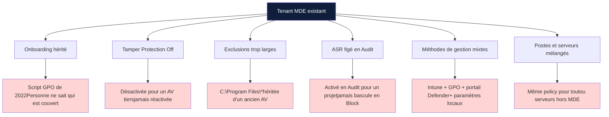
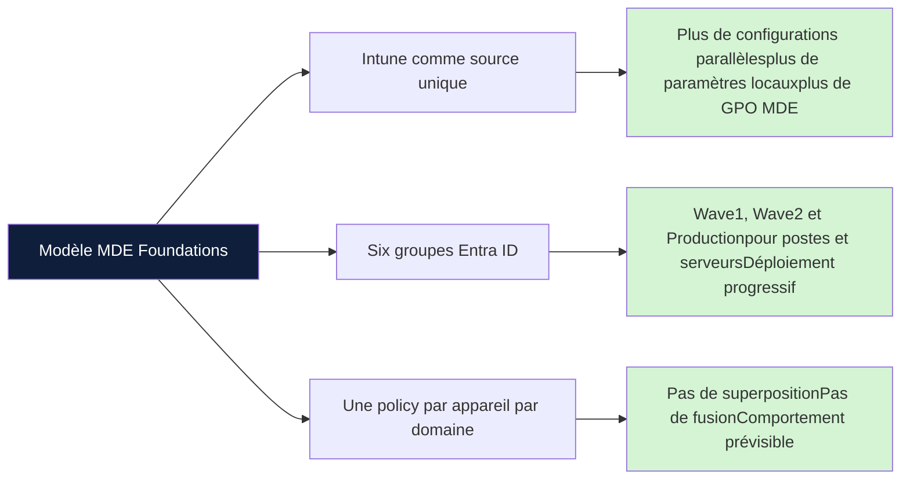
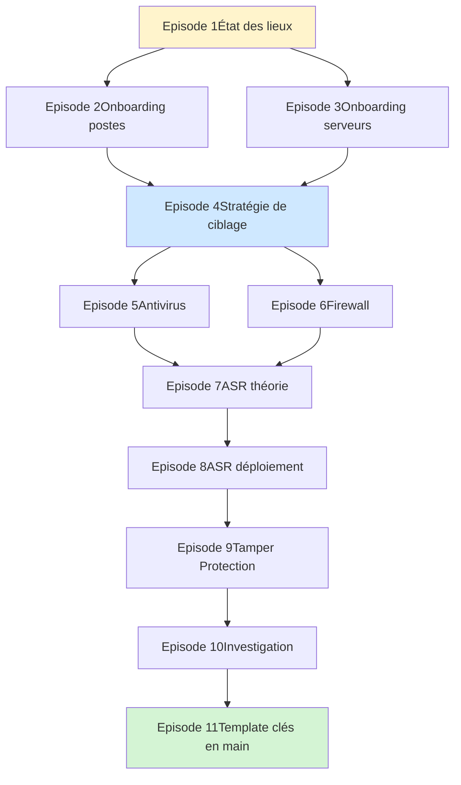

Microsoft Defender for Endpoint est probablement l'EDR le plus déployé au monde. Et c'est aussi celui qu'on configure le plus mal.

Pas parce que les admins manquent de compétences. Parce que MDE n'a jamais eu de configuration de référence officielle. Microsoft publie de la documentation par feature, par scénario, par produit cousin. Mais nulle part une feuille de route qui dit "voilà comment tu déploies MDE proprement sur un tenant, du premier groupe Entra ID jusqu'à la dernière règle ASR en Block".

Cette série comble ce vide. Onze épisodes, un modèle complet, un template Intune importable à la fin. Pas une revue des features. Un vrai déploiement structuré, opérationnel, défendable en audit.

## Ce qu'on trouve sur le terrain

Avant de parler de la cible, posons l'état des lieux. Voici ce qu'on rencontre dans la majorité des tenants audités, quelles que soient leur taille ou leur maturité apparente.

Ce ne sont pas des cas isolés. C'est l'état par défaut.

**Onboarding orphelin** : un script GPO tourne depuis trois ans, MDE remonte des machines dans le portail, mais l'inventaire MDE et l'inventaire réel ne correspondent plus. Quand un nouveau poste est créé, est-il onboardé automatiquement ? Personne ne sait répondre sans aller vérifier.

**Tamper Protection à Off** : le paramètre qui empêche un attaquant ou un script local de désactiver l'antivirus est désactivé. Souvent parce qu'un AV tiers entrait en conflit il y a deux ans. L'AV tiers a été désinstallé entre-temps. Personne n'a réactivé Tamper Protection.

**Exclusions massives** : on trouve des exclusions sur `C:\Program Files\*` ou `C:\Windows\Temp\*`, héritées d'un ancien antivirus. Elles restent en place "parce que ça marche". Ce sont aussi les premières portes d'entrée d'un attaquant qui a déjà un pied sur le poste.

**ASR figé en Audit** : les règles Attack Surface Reduction ont été activées en Audit lors d'un projet qui n'a jamais abouti. Elles génèrent des événements que personne ne consulte. Audit est devenu la configuration permanente. La protection effective est nulle.

**Méthodes de gestion mixtes** : Intune pour certaines policies, portail MDE pour d'autres, GPO pour l'onboarding, paramètres locaux modifiés à la main. Impossible de savoir quelle configuration est réellement appliquée sur un poste sans s'y connecter.

**Postes et serveurs mélangés** : les serveurs reçoivent les mêmes policies que les postes utilisateurs, ou ne sont pas gérés via MDE du tout. Les serveurs exposent pourtant une surface d'attaque différente et méritent des profils distincts.

Si tu reconnais ton tenant dans cette liste, tu n'es pas seul. C'est la norme.

## Pourquoi c'est devenu comme ça

Trois raisons se combinent.

MDE est arrivé par couches successives. D'abord ATP en 2016, puis MDE en 2019, puis l'intégration progressive avec Intune, puis Security Management for MDE, puis Defender for Business. Chaque couche a apporté ses propres mécanismes de gestion. Les configurations vieilles de cinq ans sont rarement nettoyées.

La documentation Microsoft est exhaustive mais éclatée. Tu trouves tout, mais en plusieurs centaines de pages réparties sur trois portails. Aucune source unique ne donne le déploiement complet.

Les déploiements se font dans l'urgence. Un projet sécurité doit livrer en six semaines. On active ce qui est documenté simplement, on remet à plus tard ce qui demande de la réflexion. "Plus tard" n'arrive jamais.

## Le modèle proposé par la série

L'objectif de MDE Foundations est de poser un modèle de déploiement complet, lisible, et maintenable. Trois principes structurent ce modèle.

**Intune comme source unique de configuration**

MDE peut être piloté depuis plusieurs endroits : portail Defender, GPO, scripts locaux, Intune. La multiplication des sources rend l'audit impossible et les priorités imprévisibles. Cette série utilise Intune pour tout ce qui peut l'être, et signale explicitement les paramètres qui restent au portail Defender.

Avantage immédiat : la configuration est versionnée, traçable, et applicable à des sous-ensembles précis du parc via les groupes Entra ID. Les modifications laissent une piste d'audit. Un autre administrateur peut comprendre ce qui a été fait et pourquoi.

Point souvent mal compris : les policies Intune Endpoint Security s'appliquent aussi aux postes et serveurs onboardés dans MDE qui n'ont pas de licence Intune. Ces machines apparaissent comme "managed by MDE" et reçoivent les policies au même titre qu'un poste Intune-enrolled. La fonctionnalité s'appelle Security Management for MDE. Elle change la donne pour les environnements où Intune n'est pas déployé partout.

**Six groupes Entra ID avec déploiement progressif**

Pour limiter le rayon d'impact lors de chaque modification, le modèle repose sur six groupes Entra ID : deux groupes pilote (Wave1 et Wave2) et un groupe production, pour les postes et pour les serveurs. Toute nouvelle policy passe d'abord par Wave1 (10% du parc), puis par Wave2 (30%), puis arrive sur la production.

Cette structure n'est pas un détail organisationnel. C'est ce qui permet de déployer des règles ASR ou des paramètres firewall sans risquer de casser la production. La série revient sur cette logique à chaque épisode de configuration.

**Une seule policy par appareil par domaine**

Le troisième principe est celui qui change le plus la lecture des configurations. Un poste ne reçoit qu'une seule policy antivirus. Une seule policy firewall. Une seule policy ASR. Pas de superposition, pas de fusion à gérer, pas de statut "Conflit" dans le portail Intune.

Cette exclusivité s'obtient par les exclusions d'assignation Intune. Quand la policy production est assignée, elle exclut les groupes pilote. Quand la policy catch-all est assignée à tous les appareils Windows, elle exclut les six groupes spécifiques. Le résultat : à tout moment, on sait exactement quelle policy s'applique à quelle machine, sans avoir à raisonner sur une fusion.

Ce modèle simplifie considérablement la maintenance et le diagnostic. C'est aussi ce qui le rend défendable en audit.

## Le parcours en onze épisodes

La série suit un ordre qui n'est pas négociable. Chaque épisode pose les briques nécessaires aux suivants.

**Épisodes 2 et 3** : licences et onboarding, postes puis serveurs. Sans onboarding fonctionnel, le reste ne sert à rien. Les serveurs ont leurs spécificités (licences distinctes, agent unifié sur Windows Server 2012 R2 et 2016, cas Azure Arc) qui justifient un épisode dédié.

**Épisode 4** : la stratégie de ciblage. C'est le pivot de la série. On y pose les six groupes, le filtre Windows-Only, et surtout le principe d'exclusivité qui structurera toutes les policies suivantes. Si tu ne devais lire qu'un épisode pour comprendre la philosophie de la série, c'est celui-là.

**Épisodes 5 et 6** : antivirus et firewall, les briques de base. Configuration cloud, exclusions maîtrisées, posture firewall différenciée entre postes (règles spécifiques) et serveurs (activation seule, pas de règles applicatives, par prudence).

**Épisodes 7 et 8** : Attack Surface Reduction. L'épisode 7 pose la théorie, les modes, le prérequis Cloud Block Level High. L'épisode 8 entre dans le déploiement progressif avec une approche volontairement simplifiée à deux policies (Audit Plus LSASS au démarrage, FullBlock déployée par vagues).

**Épisode 9** : Tamper Protection et verrouillage. Le verrou final qui empêche un attaquant ou un script local de défaire ce que les épisodes précédents ont posé.

**Épisode 10** : investigation et réponse. Comment exploiter la télémétrie remontée par tout ce qui vient d'être configuré.

**Épisode 11** : le template clés en main. Un export complet des groupes Entra ID et des policies Intune, importable directement dans ton tenant via l'outil IntuneManagement. C'est l'aboutissement de la série : tu peux soit construire policy par policy en suivant les épisodes, soit importer le tout d'un coup et adapter ensuite.

Les épisodes macOS et Linux seront traités séparément. Cette série couvre Windows 10, Windows 11 et Windows Server.

## Ce que cette série n'est pas

Pour cadrer les attentes, autant dire ce que cette série ne traite pas.

Ce n'est pas une revue exhaustive de chaque paramètre MDE. Microsoft fait ça très bien dans sa documentation officielle. On se concentre sur ce qui compose un déploiement défendable, pas sur l'inventaire complet des features.

Ce n'est pas un guide d'investigation forensique. L'épisode 10 donne les premiers réflexes et les bons outils, mais l'investigation approfondie d'un incident est un métier à part entière qui mérite sa propre série.

Ce n'est pas une discussion sur "MDE versus la concurrence". Tu utilises MDE, tu cherches à le configurer correctement. Le reste est hors sujet.

## La promesse concrète

À la fin de la série, tu auras :

- Un modèle de groupes Entra ID structuré avec déploiement progressif Wave1 / Wave2 / Production
- Un ensemble de policies Intune autosuffisantes, sans superposition implicite à gérer
- Une configuration antivirus complète avec exclusions justifiées et tracées
- Un firewall activé sur les trois profils avec règles ciblées sur les postes
- Un déploiement ASR progressif piloté par la télémétrie
- Tamper Protection active sur tout le parc
- Une démarche d'investigation outillée
- Un template importable pour mettre tout cela en place rapidement

Et surtout, tu auras une logique. Pas une collection de paramètres copiés depuis Internet, mais un modèle que tu peux expliquer, défendre, et adapter à ton contexte.

C'est la différence entre "j'ai configuré MDE" et "je sais pourquoi MDE est configuré comme ça chez moi".

## La suite

L'épisode 2 traite des licences et de l'onboarding des postes de travail. C'est le point de départ technique de la série. On y construit les premiers groupes Entra ID, on y déploie la première policy Intune, et on y vérifie que tout remonte correctement dans le portail MDE.

Si tu veux suivre la série dans l'ordre, c'est par là que ça commence vraiment.

