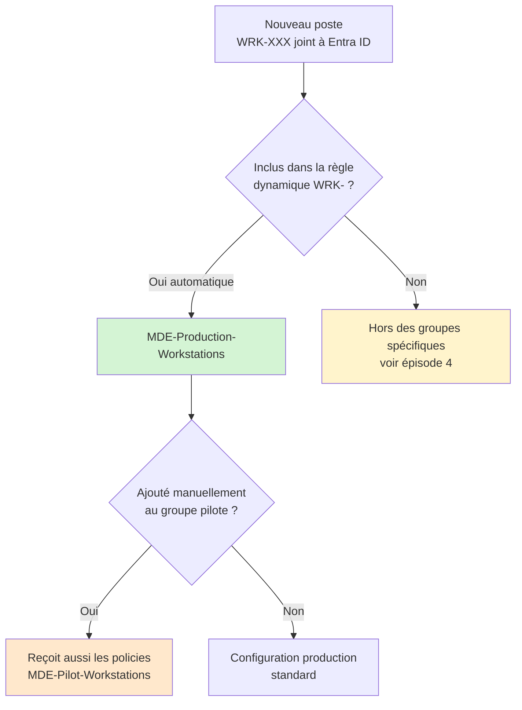

Avant de déployer quoi que ce soit, il faut clarifier deux points : est-ce que tu as les bonnes licences, et comment tu vas onboarder tes postes dans MDE. Ce sont des questions simples en apparence, mais la matrice de licences Microsoft est suffisamment complexe pour générer des erreurs fréquentes.

## La matrice de licences

MDE se décline en deux plans pour les postes de travail.

**MDE Plan 1** couvre les capacités de prévention : antivirus nouvelle génération, règles ASR, protection réseau, accès aux dossiers contrôlé, firewall, filtrage web. Il n'inclut pas les capacités de détection et réponse (EDR).

**MDE Plan 2** ajoute les capacités EDR : détection comportementale, investigation automatisée, threat hunting, Live Response, rétention de 180 jours sur la timeline des devices.

En pratique, voici ce que tu as selon ta licence Microsoft 365 :

| Licence | MDE inclus |
|---|---|
| Microsoft 365 Business Premium | Defender for Business |
| Microsoft 365 E3 | MDE P1 |
| Microsoft 365 E5 | MDE P2 |
| Microsoft 365 E5 Security | MDE P2 |
| Microsoft Defender for Business (standalone) | Defender for Business |

**Defender for Business** est une offre dédiée aux tenants de moins de 300 utilisateurs. Elle reprend l'essentiel de MDE P1 avec quelques simplifications d'interface et d'administration, et inclut des capacités EDR plus limitées que MDE P2.

Si tu es en E3 avec MDE P1 et que tu veux les capacités EDR, tu peux ajouter une licence MDE P2 add-on par utilisateur sans basculer sur E5.

## Les méthodes d'onboarding disponibles

Microsoft propose plusieurs méthodes pour onboarder les postes dans MDE :

- Script local (téléchargé depuis le portail MDE)
- Group Policy Object (GPO)
- Microsoft Intune
- Microsoft Endpoint Configuration Manager (MECM/SCCM)
- Package VDI pour les environnements virtuels non persistants

Dans cette série, on utilise exclusivement **Intune**. C'est la méthode qui offre le meilleur contrôle : périmètre d'application défini par des groupes Entra ID, historique des déploiements, cohérence avec la gestion des autres policies.

Si tu as des postes onboardés via GPO ou script local, tu peux les faire coexister temporairement pendant une migration, mais l'objectif est de tout consolider sous Intune.

## Le cas "managed by MDE" sans licence Intune

C'est un point que beaucoup d'admins ne connaissent pas : il est possible de pousser des policies de sécurité Intune sur des postes qui ne sont pas enrollés dans Intune et qui n'ont pas de licence Intune.

Cette fonctionnalité s'appelle **Security Management for Microsoft Defender for Endpoint** (ou MDE Security Config Management). Elle fonctionne ainsi :

1. Le poste est onboardé dans MDE (via n'importe quelle méthode)
2. Le poste est enregistré dans Entra ID (jointure Entra ID native, jointure hybride, ou simple enregistrement Entra)
3. La fonctionnalité est activée dans les paramètres du portail MDE
4. Le poste contacte Intune pour récupérer ses policies de sécurité Endpoint Security, sans être enrollé en MDM

Ces postes apparaissent dans le portail Intune sous la mention "Managed by MDE". Ils reçoivent uniquement les policies de type Endpoint Security (Antivirus, Firewall, EDR, ASR). Ils ne reçoivent pas les policies de configuration MDM standard, les applications déployées via Intune, ni les scripts.

Pour les environnements où Intune n'est pas déployé sur tous les postes, c'est la méthode à retenir pour garder une gestion centralisée des policies de sécurité sans avoir à acheter des licences Intune supplémentaires.

## Prérequis réseau

Les postes doivent pouvoir atteindre les endpoints Microsoft nécessaires au fonctionnement de MDE. Microsoft maintient la liste complète dans sa documentation : [Configurer les paramètres proxy et de connectivité Internet](https://learn.microsoft.com/fr-fr/defender-endpoint/configure-proxy-internet).

Les points d'attention habituels :

- Si tu as un proxy sortant, les postes doivent pouvoir l'utiliser ou avoir une exception pour les URLs MDE
- L'inspection TLS sur les URLs MDE peut provoquer des problèmes de connectivité et doit être désactivée sur ces destinations
- Certains flux passent en HTTPS sur le port 443, d'autres nécessitent des URLs spécifiques selon la région de ton tenant (EU, US, UK)

Vérifie la connectivité avec l'outil `MDATPClientAnalyzer` disponible dans le portail MDE avant de déployer à grande échelle.

## Déployer la policy d'onboarding via Intune

Dans Intune, l'onboarding MDE se configure depuis **Sécurité des points de terminaison > Détection de point de terminaison et réponse**.

Crée une nouvelle policy, plateforme **Windows 10, Windows 11 et Windows Server**.

Le seul paramètre obligatoire à configurer dans cette policy est le **package d'onboarding**. Tu le télécharges depuis le portail MDE :

`Paramètres > Points de terminaison > Gestion des appareils > Onboarding`

Sélectionne la méthode **Microsoft Intune**, télécharge le fichier `.zip`, et copie le contenu du fichier `WindowsDefenderATP.onboarding` dans le champ correspondant de la policy Intune.

Le paramètre **Type de partage d'exemples** contrôle si MDE peut envoyer automatiquement des fichiers suspects à Microsoft pour analyse. Configure-le sur **Aucun** si tu as des contraintes de conformité sur les données, ou sur **Tous les exemples** si tu veux bénéficier de la protection cloud complète.

Assigne la policy à ton groupe pilote en premier. On reviendra sur la construction des groupes dans la section suivante.

## Vérifier l'onboarding

Après déploiement, plusieurs endroits pour vérifier que l'onboarding a fonctionné.

**Dans le portail MDE** (`security.microsoft.com > Inventaire des appareils`) : le poste doit apparaître dans la liste avec un statut "Actif". Le délai habituel après application de la policy Intune est de 15 à 30 minutes.

**Sur le poste lui-même**, depuis PowerShell en administrateur :

```powershell
Get-MpComputerStatus | Select-Object -Property AMRunningMode, OnboardingState
```

`OnboardingState` doit retourner `1` (onboardé). `AMRunningMode` doit retourner `Normal` et non `Passive` ou `EDR Block`.

**Dans Intune**, dans le détail de la policy, l'état de déploiement sur l'appareil doit passer à `Réussi`.

Si l'appareil n'apparaît pas dans MDE après 1 heure, vérifie :

- La connectivité réseau vers les endpoints MDE
- Le service `Sense` est bien démarré (`sc query sense`)
- Les logs dans `C:\ProgramData\Microsoft\Windows Defender Advanced Threat Protection\Logs\`

## Construire les groupes dynamiques Entra ID

La gestion des politiques par groupes dynamiques évite d'avoir à maintenir des affectations manuelles. Voici la structure de groupes recommandée pour la série.

**Groupe pilote postes de travail**

Commence par un groupe statique avec une sélection manuelle de postes de test. Ce groupe reçoit les policies en premier.

```
Nom : MDE-Pilot-Workstations
Type : Sécurité, membres statiques
```

**Groupe production postes de travail**

Un groupe dynamique pour cibler l'ensemble des postes de travail. La difficulté ici est qu'Entra ID ne dispose pas d'un attribut natif qui distingue un poste de travail d'un serveur. La règle dynamique dépend donc de la convention de nommage de ton parc.

Si tes postes suivent une convention de nommage (par exemple `WRK-` en préfixe) :

```
(device.displayName -startsWith "WRK-")
```

Si tu n'as pas de convention de nommage stricte, l'alternative est d'utiliser un **extensionAttribute** renseigné via un script Graph, ou de gérer ces groupes en statique le temps de mettre en place une convention.

```
Nom : MDE-Production-Workstations
Type : Sécurité, membres dynamiques
```

## Pilote, production et cas particuliers

Une fois ces groupes en place, voici comment un poste se répartit selon sa configuration.



Un poste qui suit la convention de nommage se retrouve automatiquement dans le groupe production. Pour qu'il soit aussi en pilote, il faut l'ajouter manuellement au groupe `MDE-Pilot-Workstations`. Les postes hors convention de nommage (postes de test renommés, machines créées hors procédure) ne tombent dans aucun de ces groupes : on traite ce cas dans l'épisode suivant.

La règle de déploiement est simple : toujours déployer sur le groupe pilote d'abord, observer 48 heures, puis étendre au groupe production. On revient sur cette stratégie à chaque épisode.