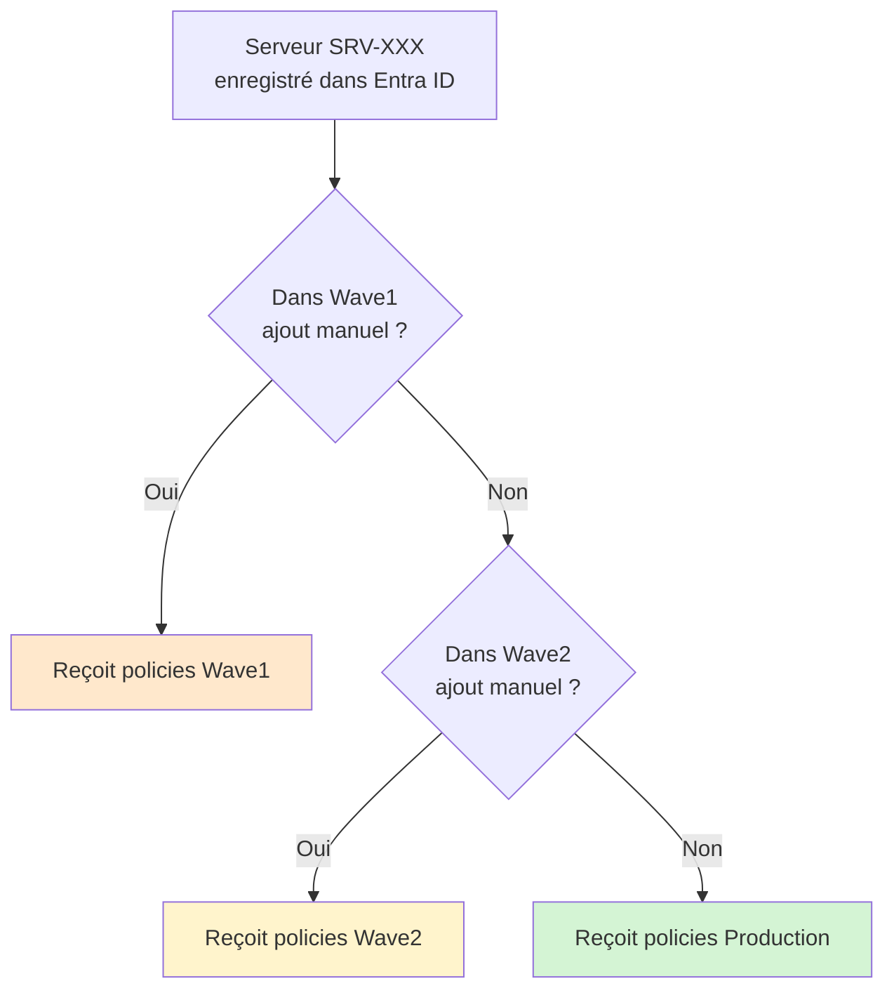

L'onboarding des serveurs dans MDE suit une logique différente de celle des postes de travail. Les licences sont distinctes des licences utilisateur, plusieurs options coexistent selon la taille de ton tenant, et certaines versions de Windows Server nécessitent une étape d'installation préalable. Cet épisode couvre l'ensemble de ces particularités.

## La matrice de licences serveurs

Les licences Microsoft 365 E3, E5 et Business Premium **ne couvrent pas les serveurs**. MDE sur serveur nécessite une licence dédiée, facturée par serveur (par Operating System Environment, c'est-à-dire par instance d'OS, physique ou virtuelle).

Il existe trois options principales pour licencier MDE sur des serveurs.

### Microsoft Defender for Endpoint for Servers (standalone)

Licence dédiée par serveur, achetable directement via le portail Microsoft 365 admin center ou via un CSP. Elle existe en Plan 1 et Plan 2, avec les mêmes capacités que les plans postes de travail correspondants.

C'est la licence à retenir pour des serveurs on-premises classiques, sans dépendance à Azure.

### Microsoft Defender for Business servers (add-on)

Licence add-on disponible uniquement pour les tenants qui ont déjà au moins une licence **Microsoft 365 Business Premium** ou **Defender for Business** (standalone). Elle est facturée à environ 3 dollars par serveur et par mois, par OSE.

Deux contraintes à connaître :

- **Plafond de 60 serveurs maximum** par tenant. Au-delà, il faut basculer sur MDE for Servers ou Defender for Servers.
- Réservée aux **petits et moyens tenants** (l'éligibilité suit celle de Business Premium et Defender for Business, soit 300 utilisateurs maximum).

C'est l'option la plus économique pour les petites infrastructures avec quelques serveurs Windows ou Linux à protéger.

### Microsoft Defender for Servers (via Defender for Cloud)

Plan disponible dans **Microsoft Defender for Cloud**, l'offre cloud-native d'Azure. Existe en Plan 1 et Plan 2.

Cette licence est facturée à l'heure par serveur supervisé. Elle inclut MDE for Endpoint sur serveurs, plus les capacités de Defender for Cloud (recommandations de posture, supervision multicloud, file integrity monitoring sur le Plan 2).

Elle s'applique nativement aux serveurs Azure. Pour des serveurs on-premises, AWS ou GCP, il faut les enregistrer dans Azure via **Azure Arc** pour bénéficier de cette licence.

### Récapitulatif


Les trois options offrent les mêmes capacités EDR de base (P2 dans tous les cas inclut investigation automatisée et threat hunting). Le choix dépend de ton modèle de facturation préféré, de la taille de ton parc, et de ton degré d'intégration avec Azure.

## Support des versions Windows Server

Toutes les versions Windows Server ne se comportent pas de la même façon vis-à-vis de MDE.

**Windows Server 2019 et 2022**

MDE est intégré à Windows Defender, déjà présent sur ces OS. L'onboarding se fait via un script ou une policy Intune, sans étape d'installation préalable. Le processus est identique à celui des postes de travail.

**Windows Server 2016 et 2012 R2**

Ces versions nécessitent l'installation de l'**agent unifié MDE** avant l'onboarding. Microsoft a publié cet agent en avril 2022 pour remplacer l'ancien agent basé sur MMA (Microsoft Monitoring Agent). L'agent MMA pour MDE n'est plus supporté depuis le 31 août 2024.

L'agent unifié apporte la parité fonctionnelle avec les versions récentes : détection comportementale complète, Live Response, investigation automatisée. L'ancien agent MMA n'offrait qu'un sous-ensemble de ces fonctionnalités.

**Windows Server 2008 R2**

Hors périmètre. Microsoft a arrêté le support de MDE sur cette version. Si tu as encore des serveurs 2008 R2 en production, c'est un sujet à traiter en priorité, indépendamment de MDE.

## Installer l'agent unifié sur Windows Server 2012 R2 et 2016

Cette étape est nécessaire uniquement pour ces deux versions. Elle se fait avant l'onboarding.

Télécharge l'installeur depuis le portail MDE :

`Paramètres > Points de terminaison > Gestion des appareils > Onboarding`

Sélectionne **Windows Server 2012 R2 and 2016** comme système d'exploitation. Tu obtiens un package qui contient l'installeur `md4ws.msi` et le script d'onboarding.

Installe d'abord l'agent :

```powershell
msiexec /i md4ws.msi /quiet
```

Puis applique le script d'onboarding :

```powershell
.\MDATPClientOnboardingScript.cmd
```

Un redémarrage n'est pas systématiquement requis, mais recommandé pour s'assurer que tous les composants sont correctement initialisés.

Pour déployer cette séquence sur plusieurs serveurs, tu peux utiliser un script PowerShell distribué via MECM ou une tâche planifiée GPO. L'étape d'installation de l'agent ne peut pas passer par Intune directement pour ces versions, car Intune nécessite que le poste soit déjà enrollé ou géré avant de pousser des packages complexes. Dans la pratique, on installe l'agent via un outil de distribution existant (MECM, script GPO, Ansible), puis Intune prend le relais pour les policies de sécurité.

## Onboarder les serveurs via Intune

La policy d'onboarding dans Intune est identique à celle des postes de travail : **Sécurité des points de terminaison > Détection de point de terminaison et réponse**, plateforme **Windows 10, Windows 11 et Windows Server**.

La condition pour qu'un serveur reçoive cette policy est qu'il soit enregistré dans Entra ID. Trois cas de figure :

**Serveur joint à Entra ID (cloud-only)**

Cas rare pour des serveurs, mais possible sur des environnements récents sans Active Directory on-premises. La gestion Intune est complète.

**Serveur joint à Entra ID en mode hybride (hybrid join)**

C'est le cas le plus courant dans les environnements existants. Le serveur est membre d'un domaine Active Directory et enregistré dans Entra ID via la synchronisation Entra Connect. Il peut recevoir les policies Intune Endpoint Security via Security Management for MDE, sans licence Intune.

**Serveur joint uniquement au domaine Active Directory (pas d'Entra ID)**

Dans ce cas, le serveur ne peut pas recevoir de policies via Intune. L'onboarding MDE peut se faire via GPO ou script local, mais la gestion des policies de sécurité devra passer par une autre méthode (GPO, MECM) tant que le serveur n'est pas enregistré dans Entra ID.

La migration vers le hybrid join est souvent le prérequis à adresser dans ce type d'environnement.

## Le cas Azure Arc

Si tes serveurs on-premises ne sont pas joignables à Entra ID (contraintes techniques, OS non supportés par l'hybrid join), **Azure Arc** est une alternative. Azure Arc enregistre les serveurs dans Azure et les expose dans Entra ID comme des ressources gérées.

Une fois un serveur enregistré via Azure Arc, il peut bénéficier de Defender for Cloud avec MDE intégré. La gestion des policies de sécurité MDE se fait alors depuis le portail Defender for Cloud plutôt que depuis Intune.

Ce cas est à considérer pour des environnements mixtes ou des serveurs Linux, mais il sort du périmètre Intune de cette série. On l'évoque ici pour que tu saches que l'option existe si Intune n'est pas accessible pour certains serveurs.

## Vérifier l'onboarding des serveurs

La vérification est identique à celle des postes de travail. Depuis PowerShell en administrateur sur le serveur :

```powershell
Get-MpComputerStatus | Select-Object -Property AMRunningMode, OnboardingState
```

Sur Windows Server 2012 R2 et 2016, vérifie également que le service `Sense` est bien en cours d'exécution :

```powershell
Get-Service -Name Sense
```

Si le service est en état `Stopped` après l'installation de l'agent unifié, démarre-le manuellement et vérifie les logs dans :

```
C:\ProgramData\Microsoft\Windows Defender Advanced Threat Protection\Logs\
```

## Construire les groupes Entra ID pour les serveurs

Comme pour les postes de travail, Entra ID ne dispose pas d'attribut natif qui identifie un serveur. La stratégie de groupe dépend de ta convention de nommage. La structure suit la même logique que pour les postes, avec deux vagues de déploiement progressif.

**Groupe pilote Wave1 serveurs**

Premier groupe pilote serveurs, statique, avec une sélection manuelle de serveurs non critiques ou de lab. Mélange de profils (serveurs applicatifs simples, serveurs de fichiers, etc.).

```
Nom : MDE-Pilot-Servers-Wave1
Type : Sécurité, membres statiques
```

**Groupe pilote Wave2 serveurs**

Deuxième groupe pilote serveurs, statique. Permet d'élargir progressivement le périmètre de validation.

```
Nom : MDE-Pilot-Servers-Wave2
Type : Sécurité, membres statiques
```

**Groupe production serveurs**

Groupe dynamique basé sur le préfixe de nommage si tu en as un (par exemple `SRV-`) :

```
(device.displayName -startsWith "SRV-")
```

Si tu n'as pas de convention de nommage, une alternative est de renseigner un `extensionAttribute` sur les objets ordinateur dans Active Directory (qui se synchronisent vers Entra ID via Entra Connect) et de construire la règle dynamique sur cet attribut.

Par exemple, tu peux renseigner `extensionAttribute1` avec la valeur `Server` via un script AD, puis utiliser la règle :

```
(device.extensionAttribute1 -eq "Server")
```

```
Nom : MDE-Production-Servers
Type : Sécurité, membres dynamiques
```

## Logique d'exclusivité

Même principe que pour les postes : un serveur reçoit une seule configuration par domaine. Quand une policy de production sera assignée à `MDE-Production-Servers`, elle exclura les groupes pilote Wave1 et Wave2.



Les serveurs hors convention de nommage ne tombent dans aucun de ces groupes. Comme pour les postes, ils sont rattrapés par la policy catch-all traitée dans l'épisode suivant.

## Stratégie de déploiement serveurs

La logique de déploiement progressif s'applique aussi aux serveurs, mais avec plus de prudence vu la criticité. Le périmètre Wave1 reste très réduit (2 à 5 serveurs non critiques), Wave2 s'élargit aux serveurs moins exposés, et la production absorbe le reste une fois validation faite.

Les configurations diffèrent entre postes et serveurs (ASR, exclusions antivirus, règles firewall), c'est pourquoi cette série maintient des groupes séparés dès le départ. Avoir des groupes distincts évite d'avoir à scinder les affectations plus tard.