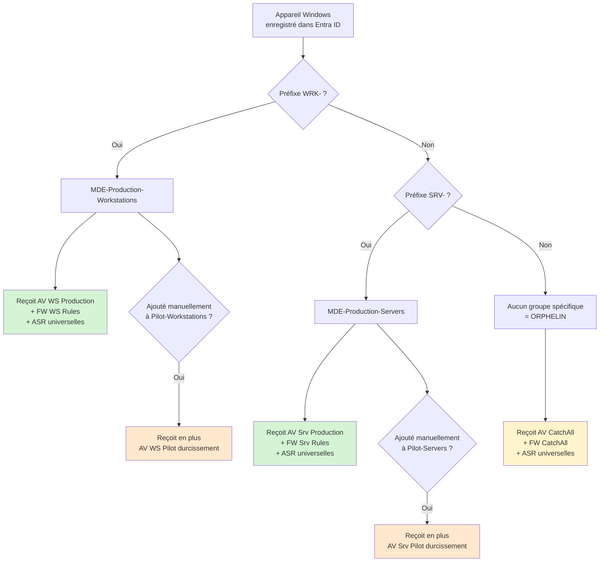
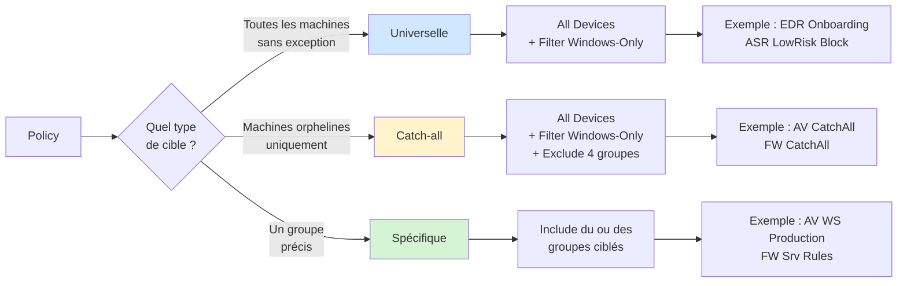

Tu as construit tes groupes pilote et production, postes et serveurs. Avant d'attaquer les policies de configuration fines, il faut clarifier un point : que se passe-t-il pour les machines qui ne tombent dans aucun de ces groupes ?

Cet épisode pose la stratégie de ciblage qui couvre l'ensemble du parc, y compris les machines orphelines, sans créer un groupe supplémentaire à maintenir.

## Le problème des orphelins

Les groupes dynamiques que tu as construits aux épisodes précédents reposent sur des règles de nommage : préfixe `WRK-` pour les postes, préfixe `SRV-` pour les serveurs. Ces règles couvrent bien ce qui respecte la convention, mais pas le reste.

Cas typiques où une machine onboardée dans MDE ne tombe dans aucun groupe spécifique :

- Poste hors convention de nommage (machine de test renommée à la main, vieux poste qui ne suit pas le standard actuel)
- Serveur sans préfixe `SRV-`, hérité d'une autre époque
- Machine fraîchement onboardée dont le nom n'a pas encore propagé dans Entra ID
- Erreur dans la règle dynamique qui exclut involontairement une catégorie de machines

Sans stratégie de couverture, ces machines restent avec leur configuration MDE par défaut. Et la configuration par défaut est minimale : antivirus actif sans tuning, pas de protection cloud renforcée, pas de règles ASR, Tamper Protection souvent à Off selon l'OS et la version.

Il faut donc un mécanisme qui rattrape ces machines avec une configuration minimale autosuffisante.

## La mauvaise approche

L'intuition première est de créer un groupe dynamique `MDE-CatchAll-Windows` qui inclut tous les appareils Windows, et de lui appliquer une policy "socle" en plus des policies spécifiques. C'est une mauvaise idée pour plusieurs raisons.

D'abord, ça force chaque machine à recevoir deux policies au lieu d'une : la policy catch-all et la policy spécifique. Toute la complexité de la fusion des policies devient un problème quotidien.

Ensuite, ça crée une dépendance implicite : la policy production "AV postes" devient incomplète sans le catch-all. Si quelqu'un désaffecte le catch-all par erreur, les postes production perdent une partie de leur configuration sans qu'on s'en aperçoive.

Enfin, ça ne reflète pas l'intention. Le catch-all n'est pas un socle commun à empiler, c'est un filet pour les orphelins. Le bon modèle, c'est l'exclusivité : une machine reçoit soit sa policy spécifique, soit la policy de rattrapage, mais pas les deux.

## La bonne approche : All Devices avec exclusion

Intune propose une cible spéciale `All Devices` lors de l'assignation d'une policy. Cette cible inclut automatiquement tous les appareils gérés du tenant, y compris les appareils en mode Security Management for MDE.

L'astuce, c'est de combiner cette cible avec une exclusion explicite des groupes spécifiques :

```
Include : All Devices
Filter : Windows-Only
Exclude : MDE-Production-Workstations
Exclude : MDE-Pilot-Workstations
Exclude : MDE-Production-Servers
Exclude : MDE-Pilot-Servers
```

Le résultat : la policy s'applique à tout appareil Windows qui n'est dans aucun des quatre groupes spécifiques. C'est exactement la définition d'un orphelin.

Avantages de cette approche :

- Aucun groupe Entra ID supplémentaire à créer ou maintenir
- L'intention est lisible directement dans l'assignation de la policy
- Pas de délai de propagation de règle dynamique sur un groupe supplémentaire
- Aucune dépendance implicite entre policies : chaque policy est autosuffisante

## Le filtre d'assignation Windows-Only

`All Devices` cible tous les types d'appareils gérés du tenant, y compris iOS, Android et macOS. Pour ne cibler que Windows, on utilise un **filtre d'assignation Intune**.

Création du filtre depuis Intune : `Appareils > Filtres > Créer un filtre`

```
Nom : Windows-Only
Plateforme : Windows 10 et plus tard
Règle : (device.deviceTrustType -ne "Workplace") and (device.operatingSystem -eq "Windows")
```

Ce filtre se définit une seule fois et se réutilise sur toutes les policies catch-all. À l'assignation d'une policy avec `All Devices`, sélectionne le filtre en mode `Include` : la policy ne sera appliquée qu'aux appareils Windows.

Sans ce filtre, les policies AV ou ASR ciblées sur `All Devices` apparaîtraient avec un statut `Not Applicable` sur les appareils iOS/Android, ce qui n'est pas un blocage mais génère du bruit dans le suivi.

## Schéma de la stratégie complète

Voici comment se répartit un appareil Windows dans le tenant.



## Les types de policies et leur ciblage

Avec ce modèle, on distingue trois types de policies selon leur cible.



**Policies universelles**

Policies qui doivent s'appliquer à toutes les machines Windows sans exception. Ciblage : `All Devices` avec filtre `Windows-Only`, sans exclusion.

Exemples : la policy d'onboarding EDR (toute machine onboardée), la policy ASR des règles à risque très faible (LSASS et autres comportements jamais légitimes).

**Policies catch-all**

Policies qui doivent rattraper les machines orphelines avec une configuration minimale autosuffisante. Ciblage : `All Devices` avec filtre `Windows-Only`, exclusion des quatre groupes spécifiques.

Exemples : `MDE-AV-CatchAll`, `MDE-FW-CatchAll`.

**Policies spécifiques**

Policies qui ciblent un groupe précis avec une configuration adaptée. Ciblage : `Include` du ou des groupes concernés.

Exemples : `MDE-AV-Workstations-Production` ciblée sur `MDE-Production-Workstations`, `MDE-FW-Rules-Servers` ciblée sur `MDE-Production-Servers` et `MDE-Pilot-Servers`.

## Le cas légitime de superposition

Il reste un cas où la superposition de policies a du sens : les **policies pilote**.

Un poste pilote est par définition aussi un poste production. Il est dans les deux groupes simultanément. Plutôt que de dupliquer toute la configuration production dans la policy pilote, on ne met dans la pilote que les paramètres qui durcissent la production. Cloud Block Level passe de High à High Plus, par exemple.

Dans ce cas, le poste reçoit la fusion des deux policies, et le mécanisme Intune fait son travail : pour les valeurs simples qui diffèrent, la plus stricte gagne.

C'est le seul cas où la fusion de policies est utilisée volontairement dans le socle. Partout ailleurs, on évite les superpositions implicites.

## La logique de fusion en cas de conflit

Quand deux policies Endpoint Security s'appliquent à un même appareil (cas pilote ci-dessus, ou erreur d'assignation), Intune applique les règles suivantes :

**Pour les paramètres de type liste** (exclusions antivirus, règles ASR, applications autorisées) : Intune fusionne les valeurs. L'union des deux listes s'applique.

**Pour les paramètres à valeur simple** (Tamper Protection, Cloud Block Level, mode de protection temps réel) : si les valeurs diffèrent, Intune remonte un statut `Conflit` dans le portail et applique la **valeur la plus sécurisée**.

Cette logique signifie qu'un statut `Conflit` n'est pas nécessairement un problème en production. Dans le cas pilote = production + durcissement, le conflit est attendu et bénin. Dans les autres cas, il faut investiguer.

## Construire les policies catch-all (préparation)

Les policies catch-all elles-mêmes seront construites dans les épisodes suivants (antivirus, firewall, ASR). Pour cet épisode, il suffit de poser le principe :

- Chaque policy catch-all est **autosuffisante** : elle contient tous les paramètres nécessaires à une protection minimale acceptable
- Elle n'est pas "le minimum sur lequel les autres s'ajoutent" : c'est une policy complète qui couvre tout l'essentiel
- Elle est assignée via `All Devices + filtre Windows-Only + exclusion des 4 groupes`
- Elle ne contient pas de paramètres trop stricts qui pourraient casser une machine orpheline non identifiée

## Anti-patterns à éviter

**Créer un groupe dynamique MDE-CatchAll-Windows**

Inutile avec l'approche `All Devices + Exclude`. Maintenir un groupe en plus pour faire ce que Intune fait nativement, c'est du travail pour rien.

**Mettre des paramètres trop stricts dans la policy catch-all**

La policy catch-all couvre des machines que tu ne connais pas en détail. Si tu y mets des règles ASR Office en Block ou des exclusions critiques, tu risques de casser des serveurs métier que personne n'avait recensés. Reste sur du non bloquant et de l'universel.

**Oublier le filtre Windows-Only**

Sans le filtre, les policies catch-all ciblent aussi iOS, Android et macOS et apparaissent en statut `Not Applicable`. Ce n'est pas bloquant mais ça pollue le suivi.

**Empiler le catch-all et les policies spécifiques**

C'est la fausse bonne idée à éviter. Une machine doit recevoir soit la policy catch-all, soit la policy spécifique. Si tu vois une machine production qui reçoit aussi la policy catch-all, c'est qu'un groupe d'exclusion a été oublié dans l'assignation.

## Vérification

Sur un poste cible, vérifier que la bonne policy s'applique :

`intune.microsoft.com > Appareils > [poste cible] > Configuration des appareils`

Liste les policies appliquées. Un poste `WRK-001` doit recevoir les policies production postes (`MDE-AV-Workstations-Production`, `MDE-FW-Rules-Workstations`), pas la policy catch-all.

Un poste hors convention de nommage doit recevoir les policies catch-all (`MDE-AV-CatchAll`, `MDE-FW-CatchAll`), pas les policies production.

Si une machine apparaît avec les deux types de policies, vérifier que les groupes ont bien été ajoutés en exclusion sur les policies catch-all.

## Récapitulatif

Tu as maintenant :

- Une stratégie de ciblage qui couvre tous les appareils Windows du tenant, y compris les orphelins
- Aucun groupe Entra ID supplémentaire à maintenir
- Un filtre d'assignation `Windows-Only` réutilisable sur toutes les policies catch-all
- Une distinction claire entre policies universelles, catch-all et spécifiques
- La compréhension du cas légitime de superposition (pilote = production + durcissement)

Les épisodes suivants construisent les policies concrètes : antivirus, firewall, ASR. Chacune sera déclinée selon ce modèle de ciblage.