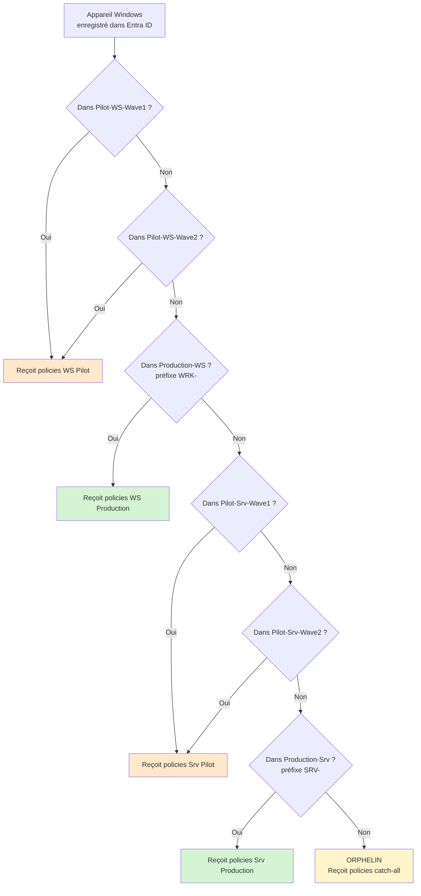
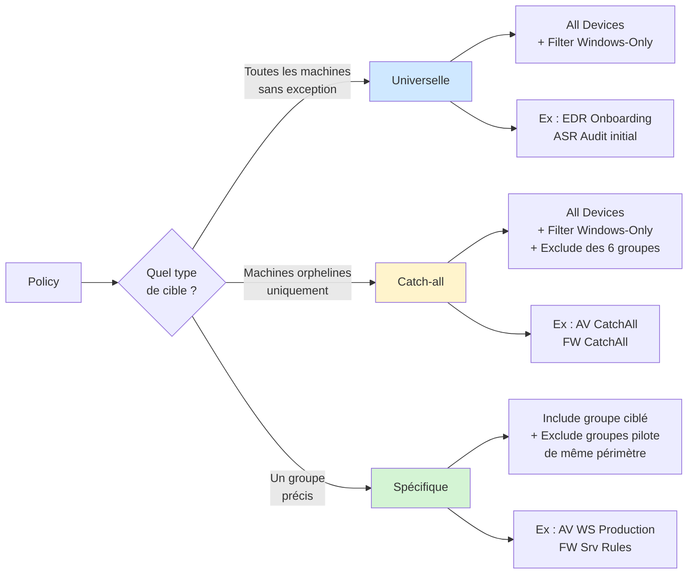

Tu as construit tes six groupes Entra ID : deux vagues pilote et une production, pour les postes et pour les serveurs. Avant d'attaquer les policies de configuration fines, il faut clarifier deux points : que se passe-t-il pour les machines hors convention de nommage, et comment garantir qu'un appareil ne reçoive qu'une seule policy par domaine ?

Cet épisode pose la stratégie de ciblage de toute la série, sans créer de groupe supplémentaire et sans gestion de fusion de policies.

## Le principe : un appareil, une policy

La règle est simple. Pour chaque domaine de configuration (antivirus, firewall, ASR), un appareil reçoit **une seule** policy. Pas de superposition, pas de fusion, pas de "socle commun" à empiler. Cette simplicité a deux conséquences directes.

Chaque policy est **autosuffisante**. Elle contient l'intégralité de la configuration nécessaire à son périmètre. La policy production postes n'est pas un "delta" par rapport à un socle, c'est une policy complète.

Les **exclusions Intune** assurent qu'un appareil tombe dans un seul groupe à la fois. Quand une policy de production est assignée, elle exclut les groupes pilote. Quand une policy catch-all est assignée à `All Devices`, elle exclut les six groupes spécifiques.

## Le problème des orphelins

Les groupes dynamiques que tu as construits aux épisodes précédents reposent sur des règles de nommage : préfixe `WRK-` pour les postes, préfixe `SRV-` pour les serveurs. Ces règles couvrent bien ce qui respecte la convention, mais pas le reste.

Cas typiques où une machine onboardée dans MDE ne tombe dans aucun groupe spécifique :

- Poste hors convention de nommage (machine de test renommée à la main, vieux poste qui ne suit pas le standard actuel)
- Serveur sans préfixe `SRV-`, hérité d'une autre époque
- Machine fraîchement onboardée dont le nom n'a pas encore propagé dans Entra ID
- Erreur dans la règle dynamique qui exclut involontairement une catégorie de machines

Sans stratégie de couverture, ces machines restent avec leur configuration MDE par défaut. La configuration par défaut est minimale : antivirus actif sans tuning, pas de protection cloud renforcée, pas de règles ASR, Tamper Protection souvent à Off selon l'OS et la version.

Il faut donc un mécanisme qui rattrape ces machines avec une configuration minimale autosuffisante.

## La mauvaise approche

L'intuition première est de créer un groupe dynamique `MDE-CatchAll-Windows` qui inclut tous les appareils Windows, et de lui appliquer une policy "socle" en plus des policies spécifiques. C'est une mauvaise idée pour deux raisons.

D'abord, ça force chaque machine à recevoir deux policies au lieu d'une : la policy catch-all et la policy spécifique. La fusion devient un problème quotidien à gérer.

Ensuite, ça crée une dépendance implicite. La policy production "AV postes" devient incomplète sans le catch-all. Si quelqu'un désaffecte le catch-all par erreur, les postes production perdent une partie de leur configuration sans qu'on s'en aperçoive.

Le bon modèle, c'est l'exclusivité : une machine reçoit soit sa policy spécifique, soit la policy de rattrapage, jamais les deux.

## La bonne approche : All Devices avec exclusion

Intune propose une cible spéciale `All Devices` lors de l'assignation d'une policy. Cette cible inclut automatiquement tous les appareils gérés du tenant, y compris ceux en mode Security Management for MDE.

L'astuce, c'est de combiner cette cible avec une exclusion explicite des six groupes spécifiques :

```
Include : All Devices
Filter : Windows-Only
Exclude : MDE-Pilot-Workstations-Wave1
Exclude : MDE-Pilot-Workstations-Wave2
Exclude : MDE-Production-Workstations
Exclude : MDE-Pilot-Servers-Wave1
Exclude : MDE-Pilot-Servers-Wave2
Exclude : MDE-Production-Servers
```

Le résultat : la policy s'applique à tout appareil Windows qui n'est dans aucun des six groupes. C'est exactement la définition d'un orphelin.

Avantages de cette approche :

- Aucun groupe Entra ID supplémentaire à créer ou maintenir
- L'intention est lisible directement dans l'assignation de la policy
- Pas de délai de propagation de règle dynamique sur un groupe supplémentaire
- Aucune dépendance implicite entre policies : chaque policy est autosuffisante

## Le filtre d'assignation Windows-Only

`All Devices` cible tous les types d'appareils gérés du tenant, y compris iOS, Android et macOS. Pour ne cibler que Windows, on utilise un **filtre d'assignation Intune**.

Création du filtre depuis Intune : `Appareils > Filtres > Créer un filtre`

```
Nom : Windows-Only
Plateforme : Windows 10 et plus tard
Règle : (device.deviceTrustType -ne "Workplace") and (device.operatingSystem -eq "Windows")
```

Ce filtre se définit une seule fois et se réutilise sur toutes les policies catch-all. À l'assignation d'une policy avec `All Devices`, sélectionne le filtre en mode `Include` : la policy ne sera appliquée qu'aux appareils Windows.

Sans ce filtre, les policies AV ou ASR ciblées sur `All Devices` apparaîtraient avec un statut `Not Applicable` sur les appareils iOS/Android. Ce n'est pas bloquant mais ça génère du bruit dans le suivi.

## Schéma de la stratégie complète

Voici comment se répartit un appareil Windows dans le tenant.



## Les types de policies et leur ciblage

Avec ce modèle, on distingue trois types de policies selon leur cible.

**Policies universelles**

Policies qui doivent s'appliquer à toutes les machines Windows sans exception. Ciblage : `All Devices` avec filtre `Windows-Only`, sans exclusion.

Exemples : la policy d'onboarding EDR (toute machine onboardée), la policy ASR initiale qui collecte la télémétrie en mode Audit avec LSASS en Block.

**Policies catch-all**

Policies qui rattrapent les machines orphelines avec une configuration minimale autosuffisante. Ciblage : `All Devices` avec filtre `Windows-Only`, exclusion des six groupes spécifiques.

Exemples : `MDE-AV-CatchAll`, `MDE-FW-CatchAll`.

**Policies spécifiques**

Policies qui ciblent un groupe précis avec une configuration adaptée. Ciblage : `Include` du ou des groupes concernés, `Exclude` des groupes de niveau inférieur dans la chaîne pilote/production.

Exemple type : `MDE-AV-Workstations-Production` ciblée sur `MDE-Production-Workstations`, avec exclusion de `MDE-Pilot-Workstations-Wave1` et `MDE-Pilot-Workstations-Wave2`. Ainsi, un poste Wave1 ne reçoit que sa policy Wave1, jamais celle de production.



## Stratégie de déploiement progressif

Le but des deux vagues pilote est de valider chaque changement de configuration avant de toucher l'ensemble de la production. La cible finale est que les groupes Wave1 et Wave2 soient vidés une fois la validation faite, et que la production absorbe la configuration testée.

Cycle type d'un déploiement :

1. **Préparation** : créer ou modifier la policy concernée
2. **Wave1** : assigner aux postes Wave1 (10% du parc) ou serveurs Wave1 (échantillon réduit)
3. **Observation** : 48 heures minimum, lecture des remontées MDE, vérification de l'absence d'incident applicatif
4. **Wave2** : étendre l'assignation à Wave2 (30% supplémentaires pour les postes)
5. **Observation** : nouvelle période de 48 heures à une semaine selon le risque
6. **Production** : assigner la policy à `MDE-Production-Workstations` ou `MDE-Production-Servers`
7. **Vidage** : retirer les postes des groupes Wave1 et Wave2, prêts pour le prochain cycle

Pour les configurations à faible risque (antivirus de base, firewall standard), ce cycle peut être accéléré. Pour les configurations à fort risque (ASR Office en mode Block), il faut respecter chaque étape.

## Construire les policies catch-all (préparation)

Les policies catch-all elles-mêmes seront construites dans les épisodes suivants (antivirus, firewall, ASR). Pour cet épisode, il suffit de poser le principe :

- Chaque policy catch-all est **autosuffisante** : elle contient tous les paramètres nécessaires à une protection minimale acceptable
- Elle est assignée via `All Devices + filtre Windows-Only + exclusion des 6 groupes`
- Elle ne contient pas de paramètres trop stricts qui pourraient casser une machine orpheline non identifiée

## Anti-patterns à éviter

**Créer un groupe dynamique MDE-CatchAll-Windows**

Inutile avec l'approche `All Devices + Exclude`. Maintenir un groupe en plus pour faire ce que Intune fait nativement, c'est du travail pour rien.

**Mettre des paramètres trop stricts dans la policy catch-all**

La policy catch-all couvre des machines que tu ne connais pas en détail. Si tu y mets des règles ASR Office en Block ou des exclusions critiques, tu risques de casser des serveurs métier que personne n'avait recensés. Reste sur du non bloquant et de l'universel.

**Oublier le filtre Windows-Only**

Sans le filtre, les policies catch-all ciblent aussi iOS, Android et macOS et apparaissent en statut `Not Applicable`. Ce n'est pas bloquant mais ça pollue le suivi.

**Oublier les exclusions sur les policies de production**

C'est l'erreur la plus fréquente. Si la policy production postes n'exclut pas Wave1 et Wave2, un poste pilote reçoit à la fois sa policy pilote et la policy production. La fusion Intune fait alors le bazar selon les paramètres concernés, et tu perds la clarté de la séparation pilote/production.

**Laisser des postes dans les groupes Wave après validation**

Les groupes Wave1 et Wave2 ne sont pas faits pour durer. Une fois une configuration validée et déployée en production, il faut retirer les postes des groupes pilote pour qu'ils basculent sur la configuration production. Sinon, les machines pilote ne reçoivent jamais les ajustements de production qui suivent.

## Vérification

Sur un poste cible, vérifier que la bonne policy s'applique :

`intune.microsoft.com > Appareils > [poste cible] > Configuration des appareils`

Cette vue liste les policies appliquées. Un poste `WRK-001` non pilote doit recevoir les policies production postes, pas les policies pilote ni catch-all.

Un poste hors convention de nommage doit recevoir les policies catch-all, pas les policies production.

Si une machine apparaît avec plus d'une policy par domaine (par exemple deux policies antivirus), c'est qu'une exclusion a été oubliée dans l'assignation. À tracer et corriger.

## Récapitulatif

Tu as maintenant :

- Une stratégie de ciblage qui couvre tous les appareils Windows du tenant, y compris les orphelins
- Aucun groupe Entra ID supplémentaire à maintenir
- Un filtre d'assignation `Windows-Only` réutilisable sur toutes les policies catch-all
- Une distinction claire entre policies universelles, catch-all et spécifiques
- Un modèle d'exclusivité strict : un appareil = une policy par domaine
- Un cycle de déploiement progressif Wave1 -> Wave2 -> Production avec vidage des groupes pilote en fin de cycle

Les épisodes suivants construisent les policies concrètes : antivirus, firewall, ASR. Chacune sera déclinée selon ce modèle de ciblage.
