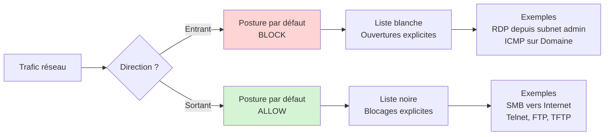

Le firewall Windows est intégré à Windows depuis quinze ans. Il est mature, performant, et géré centralement via Intune dans le cadre de MDE. Pourtant, en audit, c'est la brique de configuration la moins maîtrisée après les exclusions antivirus. Soit il est désactivé sur le profil Domaine "parce que c'est un environnement de confiance", soit il est laissé sur ses valeurs par défaut sans cohérence d'ensemble, soit il est rempli de règles obsolètes qui datent de logiciels désinstallés depuis longtemps.

Cet épisode pose une configuration firewall structurée, postes de travail et serveurs.

## Les trois profils réseau

Windows Firewall applique des règles différentes selon le profil réseau actif sur la machine. C'est un point souvent mal compris : ce n'est pas un seul firewall avec une configuration, c'est trois configurations distinctes selon le contexte.

**Profil Domaine**

Actif quand la machine détecte qu'elle est connectée au domaine Active Directory auquel elle est jointe. Concrètement, la machine arrive à contacter un contrôleur de domaine sur le réseau.

**Profil Privé**

Actif quand l'utilisateur a déclaré le réseau comme "privé" (réseau domestique, télétravail). Aucune validation technique : c'est une déclaration utilisateur.

**Profil Public**

Actif quand l'utilisateur a déclaré le réseau comme "public" (café, aéroport, hôtel). C'est aussi le profil par défaut quand aucun choix n'a été fait.

Sur un poste de travail nomade, ces trois profils peuvent changer plusieurs fois par jour selon les déplacements. Sur un serveur, le profil reste généralement stable sur Domaine.


## Le piège du profil Domaine désactivé

C'est la configuration la plus fréquente en audit, et la plus problématique : le firewall est activé sur Privé et Public, mais désactivé sur Domaine. La justification est toujours la même : "c'est un environnement de confiance, on n'a pas besoin du firewall en interne".

Cette logique est dépassée pour deux raisons.

La première, c'est la notion de Zero Trust. Le réseau interne n'est pas plus sûr que le réseau externe. Une compromission qui démarre sur un poste utilisateur se propage latéralement, et le firewall local est l'un des rares contrôles qui peut ralentir cette propagation.

La deuxième, c'est que les ransomwares modernes scannent activement les ports SMB, RDP, et WinRM des machines voisines après l'infection initiale. Un firewall actif sur Domaine, même avec une politique permissive, bloque par défaut les connexions entrantes non autorisées et complique le mouvement latéral.

Pour cette série, le firewall est activé sur les trois profils, sans exception.

## L'architecture des règles

Le firewall Windows fonctionne selon une logique simple :

- **Entrant** : par défaut, tout est bloqué. Tu ouvres explicitement ce que tu veux autoriser.
- **Sortant** : par défaut, tout est autorisé. Tu bloques explicitement ce que tu veux interdire.

Cette dissymétrie est volontaire. Bloquer tout en sortant casserait la majorité des applications sans bénéfice de sécurité significatif sur un poste de travail. Bloquer tout en entrant est en revanche la posture standard.


Les règles s'évaluent dans l'ordre suivant :

1. Règles de sécurité de connexion (IPsec)
2. Règles de blocage explicite
3. Règles d'autorisation explicite
4. Comportement par défaut du profil

Une règle de blocage explicite gagne toujours contre une règle d'autorisation. C'est utile pour poser des interdictions strictes qui ne peuvent pas être contournées par d'autres règles.

## Configurer le firewall via Intune

Dans Intune, la configuration firewall se fait depuis **Sécurité des points de terminaison > Pare-feu**.

Tu vas créer deux types de policies distinctes :

- Une policy de **configuration globale** qui définit l'état du firewall par profil (activé, comportement par défaut)
- Une ou plusieurs policies de **règles** qui définissent les autorisations et blocages spécifiques

Cette séparation est importante. La policy de configuration globale est stable, elle change rarement. Les policies de règles évoluent plus souvent au gré des besoins applicatifs. Les gérer séparément évite d'avoir à modifier la configuration globale à chaque ajustement de règle.

Avec le modèle d’exclusivité appliqué à cette série d'aticles, cette séparation permet aussi de réutiliser la même configuration globale (firewall activé sur les trois profils) à la fois sur le catch-all et sur les policies spécifiques. Les règles, elles, sont déclinées par périmètre et par étape de déploiement.

### Policy de configuration globale

Plateforme : **Windows 10, Windows 11 et Windows Server**. Profil : **Pare-feu Microsoft Defender**.

Paramètres à configurer pour chacun des trois profils (Domaine, Privé, Public) :

| Paramètre | Valeur |
|---|---|
| Enable Firewall | Enabled (sur les trois profils) |
| Default Inbound Action | Block |
| Default Outbound Action | Allow |
| Disable Unicast Responses To Multicast Broadcast Traffic | Disabled |
| Disable Inbound Notifications | Disabled (pour postes) / Enabled (pour serveurs) |
| Disable Stealth Mode | Disabled |
| Disable Stealth Mode IPsec Secured Packet Exemption | Disabled |
| Allow Local Policy Merge | Disabled |
| Allow Local IPsec Policy Merge | Disabled |

Deux paramètres méritent une explication.

**Allow Local Policy Merge** à `Disabled` signifie que les règles définies localement (par un utilisateur admin ou par un installeur de logiciel) sont ignorées. Seules les règles poussées par Intune s'appliquent. C'est une configuration stricte, à valider avec les équipes applicatives avant déploiement.

**Disable Inbound Notifications** à `Enabled` sur serveurs supprime la popup qui apparaît quand une application tente d'écouter un port pour la première fois. Sur un serveur sans utilisateur interactif, cette popup ne sert à rien. Sur un poste de travail, elle peut être utile pour identifier des comportements anormaux d'application.

### Policy de règles

Plateforme : **Windows 10, Windows 11 et Windows Server**. Profil : **Règles de pare-feu Microsoft Defender**.

Chaque règle se compose de plusieurs paramètres :

- **Nom** : descriptif (par exemple `Allow-RDP-Inbound-From-AdminSubnet`)
- **Direction** : Inbound ou Outbound
- **Action** : Allow ou Block
- **Profils ciblés** : Domaine, Privé, Public (un ou plusieurs)
- **Application** : chemin d'un exécutable ou nom de service
- **Protocole** : TCP, UDP, ICMP
- **Ports locaux et distants** : valeurs ou plages
- **Adresses IP locales et distantes** : valeurs, plages, ou groupes prédéfinis (LocalSubnet, Internet, DNS)

Une règle bien construite est aussi étroite que possible. Plutôt qu'un `Allow TCP 3389 From Any`, on écrit `Allow TCP 3389 From 10.20.30.0/24 Sur profil Domaine uniquement`.

## Un socle de règles de base pour postes de travail

Pour démarrer, voici un ensemble de règles minimales pour les postes de travail. Ces règles s'ajoutent au comportement par défaut, elles ne le remplacent pas.

**Bloquer SMB sortant vers Internet**

Les ransomwares utilisent SMB pour les mouvements latéraux. Aucune raison légitime pour un poste utilisateur de faire du SMB sortant vers Internet.

```
Direction : Outbound
Action : Block
Protocole : TCP
Ports distants : 445
Adresses distantes : Internet (groupe prédéfini)
Profils : Domaine, Privé, Public
```

**Bloquer Telnet, FTP, et autres protocoles obsolètes en sortant**

```
Direction : Outbound
Action : Block
Protocole : TCP
Ports distants : 21, 23, 69
Profils : Domaine, Privé, Public
```

**Bloquer RDP entrant sur profil Public**

Aucune raison qu'un poste utilisateur accepte du RDP entrant depuis un café ou un aéroport.

```
Direction : Inbound
Action : Block
Protocole : TCP
Ports locaux : 3389
Profils : Public
```

**Autoriser ICMPv4 Echo Request entrant sur Domaine**

Utile pour les outils de supervision et de troubleshooting.

```
Direction : Inbound
Action : Allow
Protocole : ICMPv4
Type ICMP : 8 (Echo Request)
Profils : Domaine
```

## Un socle de règles de base pour serveurs

Les serveurs ont une posture firewall différente. Ils acceptent généralement plus de connexions entrantes selon leur rôle, mais on garde la même logique : ouvrir explicitement ce qui est nécessaire.

**Bloquer SMB entrant depuis Internet**

Même logique que pour les postes, mais cette fois en entrant. Un serveur ne doit jamais accepter de connexion SMB depuis Internet.

```
Direction : Inbound
Action : Block
Protocole : TCP
Ports locaux : 445
Adresses distantes : Internet
Profils : Domaine, Privé, Public
```

**Bloquer RDP entrant sur Public**

Si le serveur se retrouve sur un profil Public (cas d'une mauvaise détection de profil), on s'assure que RDP n'est pas accessible.

```
Direction : Inbound
Action : Block
Protocole : TCP
Ports locaux : 3389
Profils : Public
```

**Autoriser RDP entrant sur Domaine depuis le subnet admin**

```
Direction : Inbound
Action : Allow
Protocole : TCP
Ports locaux : 3389
Adresses distantes : <subnet admin spécifique>
Profils : Domaine
```

**Autoriser WinRM entrant sur Domaine depuis le subnet admin**

Indispensable pour la gestion à distance via PowerShell.

```
Direction : Inbound
Action : Allow
Protocole : TCP
Ports locaux : 5985, 5986
Adresses distantes : <subnet admin spécifique>
Profils : Domaine
```

Les règles spécifiques aux rôles applicatifs (IIS sur 443, SQL sur 1433, Exchange sur ses ports SMTP/IMAP/HTTPS) viennent en plus de ce socle, et sont gérées dans des policies de règles dédiées par rôle plutôt que dans le socle commun.

## La structure des policies pour cette série

Le modèle d'exclusivité se traduit pour le firewall par cinq policies. La configuration globale (firewall activé sur les trois profils) est intégrée dans chaque policy spécifique, pas dans une policy à part.

| Policy | Cible Intune | Contenu |
|---|---|---|
| MDE-FW-CatchAll | All Devices + Filter Windows-Only + Exclude des 6 groupes | Configuration globale firewall autosuffisante (firewall activé sur les trois profils), sans règles spécifiques, pour les orphelins |
| MDE-FW-Rules-Workstations | Include MDE-Production-Workstations + Exclude Pilot-WS-Wave1 et Wave2 | Configuration globale + règles postes (blocage SMB sortant Internet, Telnet/FTP, RDP sur Public, ICMP entrant) |
| MDE-FW-Rules-Workstations-Pilot | Include Pilot-WS-Wave1 et Pilot-WS-Wave2 | Identique à la production postes (validation des règles avant rollout production) |
| MDE-FW-Rules-Servers | Include MDE-Production-Servers + Exclude Pilot-Srv-Wave1 et Wave2 | Configuration globale + règles serveurs (blocage SMB entrant Internet, RDP/WinRM autorisés depuis subnet admin) |
| MDE-FW-Rules-Servers-Pilot | Include Pilot-Srv-Wave1 et Pilot-Srv-Wave2 | Identique à la production serveurs |

Chaque policy embarque sa configuration globale (firewall ON sur les trois profils, comportements par défaut, `Allow Local Policy Merge = Disabled`). Pas de socle commun, pas de superposition. Une machine reçoit une seule policy firewall.

Les policies pilote contiennent exactement les mêmes règles que les policies production correspondantes. Le déploiement progressif Wave1 -> Wave2 -> Production permet de valider toute modification de règle avant de toucher l'ensemble du parc.

## Le piège des règles préexistantes

Quand tu déploies les policies Intune sur des machines qui ont déjà des règles firewall locales (héritées de GPO, d'installeurs, ou de modifications manuelles), tu te retrouves avec un mélange.

Le paramètre **Allow Local Policy Merge** à `Disabled` que tu as posé sur le catch-all désactive les règles locales **uniquement pour les profils sur lesquels une policy Intune est appliquée**. C'est le comportement par défaut documenté par Microsoft.

Concrètement : si tu déploies une policy Intune sur le profil Domaine avec `Allow Local Policy Merge = Disabled`, les règles locales sur Domaine sont ignorées. Sur Privé et Public, les règles locales continuent à s'appliquer tant qu'aucune policy Intune ne couvre ces profils.

Pour avoir un comportement homogène, chaque policy de la série couvre les trois profils dans sa configuration globale (firewall activé sur Domain, Private, Public avec les comportements par défaut). Les règles spécifiques ciblent ensuite les profils pertinents (par exemple, blocage RDP entrant sur Public uniquement).

## Vérification après déploiement

Sur un poste cible, depuis PowerShell en administrateur :

```powershell
Get-NetFirewallProfile -PolicyStore ActiveStore | Select-Object `
  Name, Enabled, DefaultInboundAction, DefaultOutboundAction, `
  AllowLocalPolicyMerge, AllowLocalIPsecPolicyMerge
```

Tu dois voir pour chacun des trois profils :

- `Enabled : True`
- `DefaultInboundAction : Block`
- `DefaultOutboundAction : Allow`
- `AllowLocalPolicyMerge : False`

Pour lister les règles actives héritées d'Intune :

```powershell
Get-NetFirewallRule -PolicyStore ActiveStore | Where-Object { $_.PolicyStoreSource -like "*Intune*" }
```

Si tu vois apparaître des règles dont l'origine est `LocalStore` alors que tu as posé `AllowLocalPolicyMerge = Disabled`, vérifie que la policy Intune couvre bien le profil concerné.

## Anti-patterns à éviter

**Désactiver le firewall sur Domaine**

Déjà couvert plus haut. Cette pratique date d'une époque où le réseau interne était considéré comme intrinsèquement sûr. Cette époque est révolue.

**Ouvrir des ports avec "Any" en source**

Une règle qui autorise un port sans restreindre la source IP n'est pas une règle de sécurité, c'est une ouverture sans contrôle. Toujours restreindre les sources à un subnet, une plage, ou un groupe spécifique.

**Empiler des règles sans les nettoyer**

Sur des machines qui ont eu plusieurs vies (changement de domaine, migration de poste à serveur, installation/désinstallation de logiciels), les règles firewall locales s'accumulent. Le `AllowLocalPolicyMerge = Disabled` règle ce problème pour les nouvelles configurations, mais sur l'existant, un audit ponctuel s'impose.

**Confondre profil réseau et VPN**

Quand un utilisateur se connecte au VPN d'entreprise depuis un café, son profil réseau ne bascule pas automatiquement sur Domaine. Il reste sur Public ou Privé selon ce qu'il a déclaré pour le Wi-Fi sous-jacent. Les règles applicables sont donc celles de Public ou Privé, pas celles de Domaine. C'est un point à anticiper dans la conception des règles pour le télétravail.

## Récapitulatif

Tu as maintenant :

- Une configuration firewall homogène sur les trois profils, activée partout y compris sur Domaine
- Une séparation entre policy de configuration globale et policies de règles
- Un socle de règles de base différencié postes / serveurs
- Une compréhension du comportement `Allow Local Policy Merge` et de son impact selon les profils déployés

L'épisode suivant attaque Attack Surface Reduction : comprendre les règles avant de les activer.