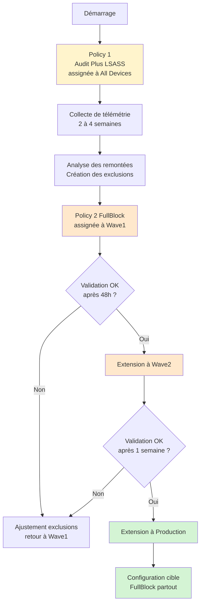

L'épisode précédent a posé les bases conceptuelles d'ASR. Tu sais maintenant ce que sont les règles, leurs modes, et le prérequis Cloud Block Level High. Cet épisode passe à la mise en pratique avec une approche volontairement simple : deux policies, pas plus, et un déploiement progressif piloté par les groupes Wave.

## Le principe : deux policies, point

Plutôt que de découper les règles ASR par catégorie de risque et de multiplier les policies, cette série utilise une approche en deux temps :

**Policy 1 : MDE-ASR-Audit-Plus-LSASS**

Toutes les règles ASR en mode Audit, sauf la règle LSASS en mode Block. Assignée à tous les appareils Windows dès le départ.

**Policy 2 : MDE-ASR-FullBlock**

Toutes les règles ASR en mode Block. Non assignée au départ. Sera assignée progressivement après analyse de la télémétrie et création des exclusions nécessaires.



Cette approche évite la multiplication des policies, simplifie la maintenance, et reflète la réalité du déploiement : on observe d'abord partout, on bascule en Block progressivement.

## Pourquoi LSASS en Block dès le départ

La règle LSASS fait exception. Trois raisons.

Elle est activée en Block par défaut depuis 2022 sur tout tenant MDE moderne. La désactiver pour la repasser en Audit serait un recul.

Microsoft a intégré un filtrage interne au moteur de la règle pour réduire les faux positifs sur les processus Windows légitimes (LSASS lui-même, certains outils signés Microsoft). Le risque de casser un workflow métier est quasi nul.

Les cas légitimes où un processus utilisateur lit la mémoire LSASS sont extrêmement rares. Quand ça arrive, c'est généralement un outil d'audit de sécurité ou un EDR tiers, et ces cas se traitent par exclusion ciblée sans repasser la règle en Audit.

## Construire la policy MDE-ASR-Audit-Plus-LSASS

C'est la première policy à déployer. Universelle, assignée à tous les appareils Windows.

`Sécurité des points de terminaison > Réduction de la surface d'attaque > Créer une policy`

Plateforme : `Windows 10, Windows 11 et Windows Server`
Profil : `Règles de réduction de la surface d'attaque`
Nom : `MDE-ASR-Audit-Plus-LSASS`

| Règle | GUID | État |
|---|---|---|
| Block credential stealing from LSASS | 9e6c4e1f-7d60-472f-ba1a-a39ef669e4b2 | Block |
| Block abuse of exploited vulnerable signed drivers | 56a863a9-875e-4185-98a7-b882c64b5ce5 | Audit |
| Block persistence through WMI event subscription | e6db77e5-3df2-4cf1-b95a-636979351e5b | Audit |
| Block execution of potentially obfuscated scripts | 5beb7efe-fd9a-4556-801d-275e5ffc04cc | Audit |
| Block JavaScript or VBScript from launching downloaded executable content | d3e037e1-3eb8-44c8-a917-57927947596d | Audit |
| Block executable content from email client and webmail | be9ba2d9-53ea-4cdc-84e5-9b1eeee46550 | Audit |
| Block untrusted and unsigned processes that run from USB | b2b3f03d-6a65-4f7b-a9c7-1c7ef74a9ba4 | Audit |
| Block executable files from running unless they meet a prevalence, age, or trusted list criterion | 01443614-cd74-433a-b99e-2ecdc07bfc25 | Audit |
| Use advanced protection against ransomware | c1db55ab-c21a-4637-bb3f-a12568109d35 | Audit |
| Block all Office applications from creating child processes | d4f940ab-401b-4efc-aadc-ad5f3c50688a | Audit |
| Block Office applications from creating executable content | 3b576869-a4ec-4529-8536-b80a7769e899 | Audit |
| Block Office applications from injecting code into other processes | 75668c1f-73b5-4cf0-bb93-3ecf5cb7cc84 | Audit |
| Block Win32 API calls from Office macros | 92e97fa1-2edf-4476-bdd6-9dd0b4dddc7b | Audit |
| Block Adobe Reader from creating child processes | 7674ba52-37eb-4a4f-a9a1-f0f9a1619a2c | Audit |

Affectation :

```
Include : All Devices
Filter : Windows-Only (Include)
```

Pas d'exclusion. Cette policy est universelle, elle s'applique à tout poste ou serveur Windows.

## Construire la policy MDE-ASR-FullBlock

C'est la cible finale : toutes les règles en Block. À créer dès maintenant, mais à **ne pas assigner** immédiatement.

`Sécurité des points de terminaison > Réduction de la surface d'attaque > Créer une policy`

Plateforme : `Windows 10, Windows 11 et Windows Server`
Profil : `Règles de réduction de la surface d'attaque`
Nom : `MDE-ASR-FullBlock`

Les mêmes règles que la policy précédente, mais toutes en Block.

| Règle | GUID | État |
|---|---|---|
| Toutes les règles précédentes | (mêmes GUID) | Block |

Affectation : **aucune au démarrage**.

Cette policy reste créée mais non assignée tant que la phase d'analyse de la télémétrie n'est pas terminée.

## Phase d'analyse de la télémétrie

Une fois la policy `MDE-ASR-Audit-Plus-LSASS` déployée, la phase d'analyse démarre. Durée recommandée : 2 à 4 semaines selon la taille et l'hétérogénéité du parc.

Pendant cette phase, surveillance régulière des remontées dans le portail Defender.

**Dashboard ASR**

`security.microsoft.com > Reports > Attack surface reduction rules`

Filtrer par règle pour identifier celles qui génèrent le plus de remontées en Audit. Une règle qui ne remonte rien sur plusieurs semaines peut être basculée en Block sans risque.

**Advanced Hunting**

Quelques requêtes utiles pour creuser.

Lister les processus déclencheurs par règle sur les 30 derniers jours :

```kql
DeviceEvents
| where Timestamp > ago(30d)
| where ActionType startswith "Asr"
| summarize Count = count() by ActionType, InitiatingProcessFileName, InitiatingProcessFolderPath
| order by Count desc
```

Identifier les appareils qui déclenchent le plus la règle "macros Office créent des processus enfants" :

```kql
DeviceEvents
| where Timestamp > ago(30d)
| where ActionType == "AsrOfficeChildProcessAudited"
| summarize Count = count() by DeviceName
| order by Count desc
```

Lister les processus enfants déclenchés par les macros Office :

```kql
DeviceEvents
| where Timestamp > ago(30d)
| where ActionType startswith "AsrOfficeChildProcess"
| summarize Count = count() by FolderPath, FileName
| order by Count desc
```

**Logs locaux pour analyse fine**

En cas d'incident utilisateur signalé, l'observateur d'événements du poste contient le détail :

```powershell
Get-WinEvent -LogName "Microsoft-Windows-Windows Defender/Operational" | `
  Where-Object { $_.Id -in 1121, 1122, 1125, 1126, 1129 } | `
  Select-Object TimeCreated, Id, Message
```

Identifiants utiles :

- `1121` : règle ASR a bloqué (Block)
- `1122` : règle ASR aurait bloqué (Audit)
- `1125` : règle ASR a affiché Warn (utilisateur n'a pas encore choisi)
- `1126` : utilisateur a cliqué Débloquer dans une popup Warn
- `1129` : règle ASR n'a pas pu bloquer pour raison technique

## Créer les exclusions justifiées

Pour chaque processus métier identifié comme déclencheur légitime, créer une exclusion par règle.

Le paramètre `ASR Only Per Rule Exclusions` permet d'exclure un processus pour une règle spécifique uniquement. Une exclusion par règle limite la brèche à la règle concernée. Une exclusion globale (`ASR Exclusions`) ouvre une porte sur l'ensemble des règles ASR et doit être évitée.

Structure d'une exclusion par règle :

```
{GUID de la règle}|{chemin du processus}
```

Exemple pour exclure un processus métier de la règle "Block all Office applications from creating child processes" :

```
d4f940ab-401b-4efc-aadc-ad5f3c50688a|C:\Program Files\AppliMetier\AppliMetier.exe
```

Pour héberger les exclusions, deux options.

**Option A** : intégrer les exclusions directement dans la policy `MDE-ASR-FullBlock`. Avantage : tout est centralisé. Inconvénient : si tu reviens en Audit temporairement pour creuser, tu perds les exclusions.

**Option B** : créer une policy dédiée `MDE-ASR-Exclusions` avec uniquement le paramètre `ASR Only Per Rule Exclusions` rempli, et l'assigner à `All Devices + Filter Windows-Only`. Avantage : les exclusions persistent indépendamment des changements de mode. Inconvénient : une policy supplémentaire à maintenir.

La série recommande l'**option B** pour la persistance des exclusions à travers les changements de policies.

## Le déploiement progressif de MDE-ASR-FullBlock

Une fois les exclusions identifiées et la policy `MDE-ASR-Exclusions` en place, on attaque la bascule progressive vers le Block global.

**Étape 1 : Wave1**

Assignation de `MDE-ASR-FullBlock` au groupe `MDE-Pilot-Workstations-Wave1`. Cette assignation **prend le pas** sur la policy `MDE-ASR-Audit-Plus-LSASS` qui était universelle, parce que les exclusions Intune assurent que la Wave1 reçoit la FullBlock et plus l'Audit.

Pour que ça fonctionne proprement, ajouter à la policy `MDE-ASR-Audit-Plus-LSASS` une exclusion sur le groupe Wave1 dans l'assignation :

```
Audit-Plus-LSASS:
Include : All Devices
Filter : Windows-Only
Exclude : MDE-Pilot-Workstations-Wave1 (ajouté à cette étape)
```

```
FullBlock:
Include : MDE-Pilot-Workstations-Wave1
```

Période d'observation : 48 heures minimum. Surveiller les remontées en Block et les incidents utilisateur. Si un processus métier est bloqué de manière non anticipée, deux options : ajouter une exclusion à `MDE-ASR-Exclusions` et observer, ou retirer le poste impacté du groupe Wave1 le temps de creuser.

**Étape 2 : Wave2**

Si Wave1 est stable, étendre à Wave2. Mêmes ajustements d'exclusion sur `MDE-ASR-Audit-Plus-LSASS`.

```
Audit-Plus-LSASS:
Exclude : Wave1 et Wave2 (les deux)
```

```
FullBlock:
Include : Wave1 et Wave2
```

Période d'observation : 1 semaine. Le périmètre élargi (40% du parc cumulés) fait remonter des cas qui n'apparaissaient pas sur Wave1.

**Étape 3 : Production**

Une fois Wave1 et Wave2 stables, bascule production. La policy `MDE-ASR-Audit-Plus-LSASS` peut être complètement désaffectée à ce stade, ou conservée avec exclusion de tous les groupes spécifiques (au cas où des orphelins apparaîtraient).

Recommandation : conserver la policy Audit-Plus-LSASS avec exclusion des groupes Wave et Production, comme filet pour les orphelins.

```
Audit-Plus-LSASS:
Include : All Devices
Filter : Windows-Only
Exclude : Wave1 WS, Wave2 WS, Production WS, Wave1 Srv, Wave2 Srv, Production Srv
```

```
FullBlock:
Include : Production-Workstations + Production-Servers + Wave1 + Wave2 (tous les groupes spécifiques)
```

**Étape 4 : Vidage des Wave**

Une fois la production stabilisée, retirer les postes des groupes Wave1 et Wave2. Ils basculent alors automatiquement sur la policy production. Les groupes Wave restent en place pour le prochain cycle de déploiement.

## La gestion des exclusions dans la durée

Les exclusions sont l'aspect qui se dégrade le plus vite. Voici une discipline qui tient sur le long terme.

**Toujours par règle, jamais globales**

Le paramètre `ASR Only Per Rule Exclusions` limite la brèche à la règle concernée. Le paramètre `ASR Exclusions` (sans "Per Rule") ouvre une porte sur toutes les règles ASR. À éviter sauf cas exceptionnel.

**Toujours par processus si possible**

Plutôt qu'exclure un chemin (`C:\AppliMetier\bin\*`), exclure le processus précis (`C:\AppliMetier\bin\AppliMetier.exe`). Un attaquant qui dépose un fichier dans le dossier exclu n'est pas couvert par l'exclusion s'il ne s'agit pas du processus précis.

**Documenter chaque exclusion**

Une exclusion sans contexte sera reconduite indéfiniment "par sécurité". Tracer :

- Date de création
- Règle concernée et processus exclu
- Demandeur (équipe métier, application)
- Justification (workflow légitime confirmé)
- Date de revue prévue (six mois plus tard)

Cette documentation peut vivre dans un fichier maintenu à côté du tenant, ou dans un ticket de référence accessible.

**Réviser tous les six mois**

Une exclusion qui dure plus de six mois sans revue est suspecte. À chaque revue, vérifier : l'application est-elle toujours utilisée ? Le workflow est-il toujours nécessaire ? Une version plus récente de l'application a-t-elle corrigé le comportement ?

## Le cas particulier des serveurs

Les serveurs reçoivent les mêmes policies que les postes dans cette série. La policy `MDE-ASR-Audit-Plus-LSASS` est universelle, elle s'applique aussi aux serveurs.

Les règles Office, Adobe Reader et navigateur n'ont pas de sens sur un serveur sans utilisateur interactif. Elles ne remonteront simplement aucune télémétrie en Audit sur ces machines, ce qui est le comportement attendu.

Pour le déploiement de `MDE-ASR-FullBlock`, les serveurs suivent le même cycle Wave1 -> Wave2 -> Production, mais avec un périmètre plus réduit (2 à 5 serveurs en Wave1, quelques de plus en Wave2). La progression est plus prudente vu la criticité.

## Anti-patterns à éviter

**Multiplier les policies ASR par catégorie**

L'approche par catégorie de risque (faible, modéré, élevé) avec une policy par catégorie semble propre sur le papier, mais elle complique la maintenance et fait perdre la vision d'ensemble. Deux policies (Audit-Plus-LSASS et FullBlock) suffisent.

**Rester en Audit indéfiniment**

Audit n'est pas une configuration cible. C'est une étape de validation. Si la phase Audit dépasse trois mois sans bascule en Block sur au moins Wave1, soit la télémétrie n'est pas analysée, soit les exclusions ne sont pas créées. Dans les deux cas, il y a un problème de pilotage à adresser.

**Activer Block sur des règles sans avoir observé en Audit**

Pour la règle LSASS, c'est OK (Microsoft a fait le travail). Pour toutes les autres, sauter la phase Audit revient à découvrir les impacts métier en production. Respecter le cycle.

**Empiler des exclusions sans les justifier**

Une liste d'exclusions ASR qui dépasse 20 entrées sur un environnement courant est généralement un signal de dérive. Soit les règles activées sont trop agressives pour le contexte, soit les exclusions auraient pu être plus étroites, soit certaines sont obsolètes.

**Désactiver une règle pour résoudre un faux positif**

Devant un faux positif persistant, la tentation est de désactiver la règle. C'est rarement la bonne réponse : une exclusion ciblée résout le cas sans perdre la protection sur tous les autres processus. Désactiver une règle doit être une décision documentée, pas un réflexe de troubleshooting.

## Récapitulatif

Tu as maintenant :

- Une approche ASR volontairement simple à deux policies : Audit-Plus-LSASS partout, FullBlock à déployer progressivement
- Une phase d'analyse de la télémétrie sur 2 à 4 semaines avant tout blocage généralisé
- Un cycle de déploiement Wave1 -> Wave2 -> Production avec exclusions Intune pour assurer l'exclusivité
- Une policy dédiée `MDE-ASR-Exclusions` pour héberger les exclusions justifiées (option B recommandée)
- Une discipline d'exclusions par règle, par processus, documentées et révisées tous les six mois

L'épisode suivant traite de Tamper Protection et du verrouillage de la configuration pour empêcher qu'une compromission ou une mauvaise manipulation ne désactive les protections que tu viens de poser.
