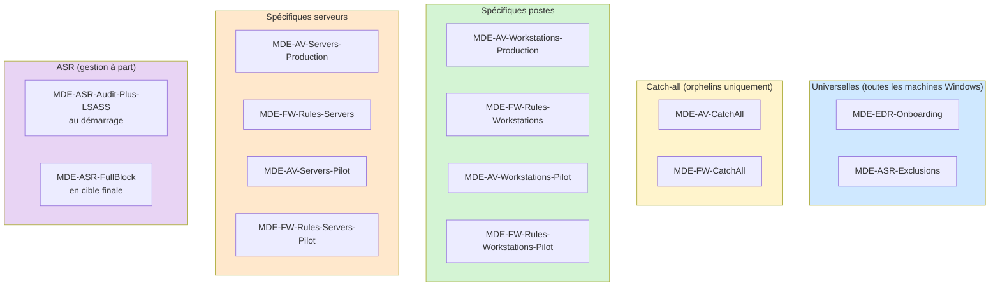

Dix épisodes pour construire une configuration MDE complète, structurée par couches, avec une logique de groupes Entra ID, des policies différenciées postes et serveurs, et une stratégie de déploiement progressif. Cet épisode final consolide l'ensemble en un template importable, et clôt la série MDE Foundations.

## Vue d'ensemble du template

Le template MDE Foundations couvre l'ensemble des briques vues dans la série. Voici la liste des éléments à mettre en place dans un tenant cible.

**Groupes Entra ID**

- `MDE-Pilot-Workstations-Wave1` : groupe statique, 10% du parc, postes représentatifs
- `MDE-Pilot-Workstations-Wave2` : groupe statique, 30% du parc, élargissement de la validation
- `MDE-Production-Workstations` : groupe dynamique, tous les postes (préfixe WRK- ou équivalent)
- `MDE-Pilot-Servers-Wave1` : groupe statique, quelques serveurs non critiques
- `MDE-Pilot-Servers-Wave2` : groupe statique, élargissement du périmètre serveurs
- `MDE-Production-Servers` : groupe dynamique, tous les serveurs (préfixe SRV- ou équivalent)

**Policies Endpoint Security**

- Onboarding EDR : une policy unique pour les postes et serveurs
- Antivirus : cinq policies en couches (catch-all + production postes + production serveurs + pilote postes + pilote serveurs)
- Firewall : trois policies (configuration globale + règles postes + règles serveurs)
- ASR : quatre policies (faible risque + Office audit + Office warn + Office block)

**Configuration au niveau tenant**

- Activation de Security Management for MDE pour les postes hors Intune
- Activation globale de Tamper Protection
- Configuration de l'investigation automatisée


## Prérequis avant déploiement

Avant d'importer ou de créer quoi que ce soit, vérifie les points suivants dans ton tenant.

**Licences**

Au minimum une licence MDE P1 ou P2 par utilisateur pour les postes de travail (incluse dans M365 E3/E5 ou Business Premium). Pour les serveurs, une licence MDE for Servers, Defender for Business servers, ou Defender for Servers via Defender for Cloud (voir épisode 3).

**Activation MDE**

Le tenant MDE doit être initialisé : `security.microsoft.com > Paramètres > Points de terminaison`. Si tu n'as jamais activé MDE, la première connexion au portail propose un assistant d'initialisation.

**Intégration MDE et Intune**

Activée depuis le portail Microsoft Defender : `Paramètres > Points de terminaison > Caractéristiques avancées > Microsoft Intune connection`. Sans cette activation, les policies Intune ne peuvent pas pousser les paramètres MDE.

**Security Management for MDE**

Pour bénéficier de la gestion Intune sur les machines sans licence Intune (managed by MDE). Activée depuis : `Paramètres > Points de terminaison > Configuration management > Pilot Mode` puis `Enforcement Scope`.

**Convention de nommage des machines**

Les règles dynamiques des groupes reposent sur le préfixe du nom de machine. Adapte la convention à ton parc :

- Postes : généralement `WRK-`, `LAP-`, `PC-` ou similaire
- Serveurs : généralement `SRV-`, `SQL-`, `WEB-` ou similaire

Si tu n'as pas de convention, utilise un `extensionAttribute` renseigné dans Active Directory pour les environnements hybrid join, ou un ajustement statique en attendant.

## Étape 1 - Installer IntuneManagement

IntuneManagement est un outil open source qui permet d'exporter, importer et comparer des objets Intune via Microsoft Graph, depuis une interface graphique. Il s'installe en quelques minutes.

Prérequis :
- PowerShell 5.1 ou supérieur (Windows PowerShell, pas PowerShell 7 pour la version stable)
- Modules Graph PowerShell installés au préalable

Installation :

```powershell
# Récupération du dépôt
git clone https://github.com/Micke-K/IntuneManagement.git
cd IntuneManagement

# Premier lancement
.\Start-WithConsole.ps1
```

L'outil ouvre une fenêtre WPF avec une zone de navigation à gauche et une zone de travail à droite. La première utilisation demande de s'authentifier sur ton tenant via une App Registration Entra ID. L'App requise peut être créée automatiquement par l'outil avec les permissions Graph nécessaires, ou tu peux pointer vers une App existante si ton tenant restreint la création d'App.

Permissions Graph requises :
- `DeviceManagementApps.ReadWrite.All`
- `DeviceManagementConfiguration.ReadWrite.All`
- `DeviceManagementServiceConfig.ReadWrite.All`
- `Group.ReadWrite.All`
- `Policy.ReadWrite.ConditionalAccess`
- `User.Read.All`

Une fois connecté, tu accèdes aux différents types d'objets : Configuration Profiles, Endpoint Security Policies, Groupes, etc.

## Étape 2 - Créer les six groupes Entra ID

Création depuis `entra.microsoft.com > Groupes > Tous les groupes > Nouveau groupe`

**MDE-Pilot-Workstations-Wave1**

```
Type : Sécurité
Membres : Statiques (sélection manuelle)
Description : Wave1 pilote postes - 10% du parc - premiers à recevoir les nouvelles policies
```

Sélectionner manuellement environ 10% du parc avec un mélange de profils (techniques, métier, mobiles, sédentaires).

**MDE-Pilot-Workstations-Wave2**

```
Type : Sécurité
Membres : Statiques (sélection manuelle)
Description : Wave2 pilote postes - 30% du parc - élargissement de la validation
```

Sélectionner manuellement environ 30% supplémentaires du parc, après validation Wave1.

**MDE-Production-Workstations**

```
Type : Sécurité
Membres : Dynamiques
Description : Production postes - tous les postes hors pilote
Règle dynamique :
  (device.deviceOSType -eq "Windows") and (device.displayName -startsWith "WRK-")
```

À adapter selon la convention de nommage en place ou un `extensionAttribute`.

**MDE-Pilot-Servers-Wave1**

```
Type : Sécurité
Membres : Statiques (sélection manuelle)
Description : Wave1 pilote serveurs - serveurs non critiques pour validation initiale
```

Sélectionner 2 à 5 serveurs non critiques (serveurs de lab, applicatifs simples).

**MDE-Pilot-Servers-Wave2**

```
Type : Sécurité
Membres : Statiques (sélection manuelle)
Description : Wave2 pilote serveurs - élargissement du périmètre serveurs
```

Sélectionner quelques serveurs supplémentaires, en élargissant la diversité des rôles.

**MDE-Production-Servers**

```
Type : Sécurité
Membres : Dynamiques
Description : Production serveurs - tous les serveurs hors pilote
Règle dynamique :
  (device.deviceOSType -eq "Windows") and (device.displayName -startsWith "SRV-")
```

À adapter selon la convention de nommage ou un `extensionAttribute`.

## Étape 2bis - Créer le filtre d'assignation Windows-Only

Le filtre permet de cibler `All Devices` sans toucher iOS, Android ou macOS.

Création depuis `intune.microsoft.com > Appareils > Filtres > Créer un filtre`

```
Nom : Windows-Only
Plateforme : Windows 10 et plus tard
Description : Filtre pour cibler uniquement les appareils Windows
Règle : (device.deviceTrustType -ne "Workplace") and (device.operatingSystem -eq "Windows")
```

Ce filtre se réutilise sur toutes les policies universelles et catch-all de la série.

## Étape 3 - Créer la policy d'onboarding EDR

Une seule policy d'onboarding couvre postes et serveurs.

`Sécurité des points de terminaison > Détection de point de terminaison et réponse > Créer une policy`

```
Nom : MDE-EDR-Onboarding
Plateforme : Windows 10, Windows 11 et Windows Server
Profile : Endpoint detection and response
```

Paramètres :

| Paramètre | Valeur |
|---|---|
| Microsoft Defender for Endpoint client configuration package type | Auto from connector |
| Sample sharing | All |
| Telemetry Reporting Frequency | Expedite |

Assignations :

- Include : `All Devices`
- Filter : `Windows-Only` (Include)

## Étape 4 - Créer les policies Antivirus

Cinq policies en couches. Toutes sont créées depuis `Sécurité des points de terminaison > Antivirus > Créer une policy`, plateforme `Windows 10, Windows 11 et Windows Server`, profil `Microsoft Defender Antivirus`.

### MDE-AV-CatchAll

Le socle minimal appliqué à tout appareil Windows.

| Paramètre | Valeur |
|---|---|
| Allow Realtime Monitoring | Allowed |
| Allow Behavior Monitoring | Allowed |
| Allow IOAV Protection | Allowed |
| Allow Script Scanning | Allowed |
| Allow On Access Protection | Allowed |
| Allow Cloud Protection | Allowed |
| Cloud Block Level | High |
| Cloud Extended Timeout | 50 |
| Submit Samples Consent | Send safe samples automatically |
| Disable Catchup Quick Scan | Disabled |
| Disable Catchup Full Scan | Disabled |
| Disable Local Admin Merge | Disabled |
| Allow Archive Scanning | Allowed |
| Allow Email Scanning | Allowed |
| Allow Full Scan On Mapped Network Drives | Not Allowed |
| Allow Scanning Network Files | Not Allowed |
| Real Time Scan Direction | Monitor all files (bi-directional) |
| Days To Retain Cleaned Malware | 30 |
| Tamper Protection | Enabled |
| Disable Auto Exclusions | Not Configured |

Assignations :
- Include : `All Devices`
- Filter : `Windows-Only` (Include)
- Exclude :
  - `MDE-Pilot-Workstations-Wave1`
  - `MDE-Pilot-Workstations-Wave2`
  - `MDE-Production-Workstations`
  - `MDE-Pilot-Servers-Wave1`
  - `MDE-Pilot-Servers-Wave2`
  - `MDE-Production-Servers`


### MDE-AV-Workstations-Production

Couche spécifique aux postes de travail. Hérite du catch-all et ajoute des paramètres orientés usage utilisateur.

| Paramètre | Valeur |
|---|---|
| Scan Parameter | Full scan |
| Schedule Scan Day | Saturday |
| Schedule Quick Scan Time | 720 (12:00) |
| Schedule Scan Time | 120 (02:00) |
| Avg CPU Load Factor | 25 |
| Disable CPU Throttle On Idle Scans | Disabled |
| Check For Signatures Before Running Scan | Enabled |
| Signature Update Interval | 4 |

Pas d'exclusions à ce niveau. Les exclusions spécifiques métier doivent vivre dans une policy dédiée par application, pas dans cette policy générique.

Assignations : `MDE-Production-Workstations`

### MDE-AV-Servers-Production

Couche spécifique aux serveurs. Hérite du catch-all et ajuste pour le contexte serveur.

| Paramètre | Valeur |
|---|---|
| Scan Parameter | Quick scan |
| Schedule Scan Day | Sunday |
| Schedule Quick Scan Time | 180 (03:00) |
| Avg CPU Load Factor | 10 |
| Disable CPU Throttle On Idle Scans | Disabled |
| Disable Auto Exclusions | Not Configured |
| Allow On Access Protection | Allowed |

Les exclusions automatiques liées aux rôles serveur (Exchange, SQL Server, AD DS, IIS, Hyper-V) sont appliquées automatiquement par Windows Server 2016+ tant que `Disable Auto Exclusions` n'est pas explicitement à `Enabled`.

Assignations :
- Include : `MDE-Production-Servers`
- Exclude :
  - `MDE-Pilot-Servers-Wave1`
  - `MDE-Pilot-Servers-Wave2`


### MDE-AV-Workstations-Pilot

Couche encore plus stricte appliquée aux postes pilotes pour identifier les éventuels faux positifs avant rollout production.

| Paramètre | Valeur |
|---|---|
| Cloud Block Level | High Plus |

Assignations : 
- Include :
  - `MDE-Pilot-Workstations-Wave1`
  - `MDE-Pilot-Workstations-Wave2`


### MDE-AV-Servers-Pilot

Identique au pilote postes pour le paramètre Cloud Block Level.

| Paramètre | Valeur |
|---|---|
| Cloud Block Level | High Plus |

Assignations : 
- Include :
  - `MDE-Pilot-Servers-Wave1`
  - `MDE-Pilot-Servers-Wave2`

## Étape 5 - Créer les policies Firewall

Trois policies. La première porte la configuration globale, les deux autres portent les règles différenciées par type d'appareil.

### MDE-FW-CatchAll

Configuration globale du firewall, appliquée à tout appareil Windows.

`Sécurité des points de terminaison > Pare-feu > Créer une policy`, plateforme `Windows 10, Windows 11 et Windows Server`, profil `Pare-feu Microsoft Defender`.

Pour chacun des trois profils (Domaine, Privé, Public), appliquer les mêmes valeurs :

| Paramètre | Valeur |
|---|---|
| Enable Firewall | True |
| Default Inbound Action | Block |
| Default Outbound Action | Allow |
| Disable Unicast Responses To Multicast Broadcast Traffic | False |
| Disable Stealth Mode | False |
| Disable Stealth Mode IPsec Secured Packet Exemption | False |
| Allow Local Policy Merge | False |
| Allow Local IPsec Policy Merge | False |
| Disable Inbound Notifications | False |

Pour les serveurs, créer une copie de cette policy avec `Disable Inbound Notifications` à `True` (pas de popup utilisateur pertinent sur serveur sans session interactive).

Assignations :
- Include : `All Devices`
- Filter : `Windows-Only` (Include)
- Exclude : `Tous les groupes spécifiques`}

### MDE-FW-Rules-Workstations

Règles spécifiques aux postes de travail.

`Sécurité des points de terminaison > Pare-feu > Créer une policy`, plateforme `Windows 10, Windows 11 et Windows Server`, profil `Règles de pare-feu Microsoft Defender`.

Règles à créer :

```
Nom : Block-Outbound-SMB-Internet
Direction : Outbound
Action : Block
Protocole : TCP
Ports distants : 445
Adresses distantes : Internet
Profils : Domaine, Privé, Public
Description : Empêche les mouvements latéraux SMB sortants vers Internet
```

```
Nom : Block-Outbound-Legacy-Protocols
Direction : Outbound
Action : Block
Protocole : TCP
Ports distants : 21, 23, 69
Profils : Domaine, Privé, Public
Description : Bloque Telnet, FTP, TFTP sortants
```

```
Nom : Block-Inbound-RDP-Public
Direction : Inbound
Action : Block
Protocole : TCP
Ports locaux : 3389
Profils : Public
Description : Empêche RDP entrant sur profil Public (café, aéroport)
```

```
Nom : Allow-Inbound-ICMPv4-Echo-Domain
Direction : Inbound
Action : Allow
Protocole : ICMPv4
Type ICMP : 8
Profils : Domaine
Description : Autorise ping entrant sur profil Domaine pour supervision
```

Assignations : 
- Include : `MDE-Production-Workstations`
- Exclude : 
  - `MDE-Pilot-Workstations-Wave1`
  - `MDE-Pilot-Workstations-Wave2`

### MDE-FW-Rules-Servers

Configuration globale du firewall pour les serveurs, sans règles applicatives. Comme expliqué à l'épisode 6, les règles serveur dépendent du rôle, du contexte d'administration et de la topologie réseau. Les pousser de manière générique expose à des coupures de flux métier. L'objectif ici est uniquement de garantir que le firewall est actif sur les trois profils avec les comportements par défaut corrects.

`Sécurité des points de terminaison > Pare-feu > Créer une policy`, plateforme `Windows 10, Windows 11 et Windows Server`, profil `Pare-feu Microsoft Defender`.

Mêmes paramètres que `MDE-FW-CatchAll`, avec `Disable Inbound Notifications` à `True` (pas de popup sur serveur sans utilisateur interactif).

Les règles d'accès administration (RDP, WinRM depuis subnet admin) sont à ajouter séparément dans des policies dédiées par rôle ou par groupe de serveurs, avec les adresses sources adaptées à ton environnement.

Assignations : 
- Include : `MDE-Production-Servers`
- Exclude : 
  - `MDE-Pilot-Servers-Wave1`
  - `MDE-Pilot-Servers-Wave2`

## Étape 6 - Créer les policies ASR

Conformément à l'approche simplifiée de l'épisode 8, deux policies suffisent.

**MDE-ASR-Audit-Plus-LSASS**

Contenu : toutes les règles ASR en mode Audit, sauf la règle LSASS en mode Block.

```
Affectation :
  Include : All Devices
  Filter : Windows-Only (Include)
```

Cette policy est universelle au démarrage. Elle collecte la télémétrie sur toutes les règles.

**MDE-ASR-FullBlock**

Contenu : toutes les règles ASR en mode Block.

```
Affectation au démarrage : aucune
```

Cette policy est créée mais **non assignée** au démarrage. Elle sera déployée progressivement après analyse de la télémétrie (voir épisode 8).

**MDE-ASR-Exclusions** (optionnel mais recommandé)

Policy dédiée pour héberger les exclusions ASR par règle, indépendamment des changements de mode.

```
Contenu : ASR Only Per Rule Exclusions = (liste des exclusions justifiées)
Affectation :
  Include : All Devices
  Filter : Windows-Only (Include)
```

## Étape 7 - Matrice d'assignation

Vue d'ensemble de toutes les policies et de leurs cibles dans l'état stable (après déploiement complet).

| Policy | Include | Exclude |
|---|---|---|
| MDE-EDR-Onboarding | All Devices + Filter Windows-Only | aucune |
| MDE-ASR-Audit-Plus-LSASS | All Devices + Filter Windows-Only | (à terme : les 6 groupes spécifiques) |
| MDE-ASR-FullBlock | (à terme : tous les groupes spécifiques) | aucune |
| MDE-ASR-Exclusions | All Devices + Filter Windows-Only | aucune |
| MDE-AV-CatchAll | All Devices + Filter Windows-Only | Les 6 groupes spécifiques |
| MDE-FW-CatchAll | All Devices + Filter Windows-Only | Les 6 groupes spécifiques |
| MDE-AV-Workstations-Production | MDE-Production-Workstations | Wave1 WS, Wave2 WS |
| MDE-FW-Rules-Workstations | MDE-Production-Workstations | Wave1 WS, Wave2 WS |
| MDE-AV-Workstations-Pilot | Wave1 WS + Wave2 WS | aucune |
| MDE-FW-Rules-Workstations-Pilot | Wave1 WS + Wave2 WS | aucune |
| MDE-AV-Servers-Production | MDE-Production-Servers | Wave1 Srv, Wave2 Srv |
| MDE-FW-Rules-Servers | MDE-Production-Servers | Wave1 Srv, Wave2 Srv |
| MDE-AV-Servers-Pilot | Wave1 Srv + Wave2 Srv | aucune |
| MDE-FW-Rules-Servers-Pilot | Wave1 Srv + Wave2 Srv | aucune |

Trois types de policies se distinguent visuellement :

- **Universelles** : EDR Onboarding et ASR Exclusions ciblent toutes les machines Windows sans exception
- **Catch-all** : AV et FW CatchAll ciblent toutes les machines Windows à l'exception des six groupes spécifiques, pour rattraper les orphelins
- **Spécifiques** : toutes les policies AV/FW pilote et production ciblent un ou plusieurs groupes explicitement, avec exclusion des groupes pilote pour les policies production



## Étape 8 - Activation au niveau tenant

Quelques paramètres à activer côté portail Microsoft Defender, indépendants des policies Intune.

**Tamper Protection au niveau tenant**

`security.microsoft.com > Paramètres > Points de terminaison > Caractéristiques avancées > Protection contre les altérations`

État : Activé

**Investigation automatisée**

`Paramètres > Points de terminaison > Caractéristiques avancées > Automated Investigation`

État : Activé. Mode initial recommandé : Semi (validation manuelle des remédiations).

**Live Response pour les serveurs**

`Paramètres > Points de terminaison > Caractéristiques avancées > Live Response for Servers`

État : Activé (nécessite MDE P2).

**Allow or block file**

`Paramètres > Points de terminaison > Caractéristiques avancées > Allow or block file`

État : Activé. Permet de bloquer manuellement des fichiers par hash depuis le portail.

## Étape 9 - Plan de déploiement

Le déploiement complet se déroule sur 11 semaines pour un parc de plusieurs centaines de postes. À adapter selon la taille du parc.

**Semaine 1 - Socle infrastructure**

1. Créer les six groupes Entra ID
2. Créer le filtre d'assignation `Windows-Only`
3. Importer ou créer la policy `MDE-EDR-Onboarding` (universelle)
4. Importer ou créer la policy `MDE-AV-CatchAll` (avec exclusion des 6 groupes)
5. Importer ou créer la policy `MDE-FW-CatchAll` (avec exclusion des 6 groupes)
6. Importer ou créer la policy `MDE-ASR-Audit-Plus-LSASS` (universelle)
7. Activer Tamper Protection au niveau tenant

**Semaine 2 - Déploiement antivirus et firewall**

1. Importer ou créer `MDE-AV-Workstations-Production` et l'assigner
2. Importer ou créer `MDE-AV-Workstations-Pilot` et l'assigner
3. Importer ou créer `MDE-AV-Servers-Production` et l'assigner
4. Importer ou créer `MDE-AV-Servers-Pilot` et l'assigner
5. Importer ou créer les policies firewall production et pilote (4 policies)
6. Vérifier les statuts d'application dans Intune

**Semaines 3 à 6 - Phase d'analyse ASR**

Collecte de la télémétrie via `MDE-ASR-Audit-Plus-LSASS`. Analyse des remontées dans le portail Defender, identification des workflows métier impactés, création de la policy `MDE-ASR-Exclusions` avec les exclusions justifiées.

**Semaine 7 - Bascule ASR sur Wave1**

1. Assigner `MDE-ASR-FullBlock` au groupe `MDE-Pilot-Workstations-Wave1`
2. Ajouter exclusion de Wave1 dans `MDE-ASR-Audit-Plus-LSASS`
3. Observer 48h, ajuster les exclusions si nécessaire

**Semaines 8 à 9 - Extension à Wave2**

1. Assigner `MDE-ASR-FullBlock` au groupe `MDE-Pilot-Workstations-Wave2`
2. Ajouter exclusion de Wave2 dans `MDE-ASR-Audit-Plus-LSASS`
3. Observer 1 semaine

**Semaines 10 à 11 - Bascule production**

1. Assigner `MDE-ASR-FullBlock` aux groupes `MDE-Production-Workstations`, `MDE-Production-Servers`, et aux pilotes serveurs
2. Ajouter exclusion de tous les groupes dans `MDE-ASR-Audit-Plus-LSASS`
3. Communication finale aux utilisateurs avec canal incident dédié
4. Surveillance renforcée pendant deux semaines

**Après la semaine 11 - Vidage des Wave**

Retirer progressivement les postes des groupes Wave1 et Wave2. Ils basculent automatiquement sur les policies production. Les groupes Wave restent disponibles pour le prochain cycle de déploiement.

## Étape 10 - Vérification globale

Sur un poste cible, vérifier l'état complet :

```powershell
# Antivirus et Tamper Protection
Get-MpComputerStatus | Select-Object `
  AMRunningMode, `
  AntivirusEnabled, `
  RealTimeProtectionEnabled, `
  IsTamperProtected, `
  OnboardingState

# Configuration cloud
Get-MpPreference | Select-Object `
  MAPSReporting, `
  CloudBlockLevel, `
  CloudExtendedTimeout, `
  SubmitSamplesConsent

# Règles ASR
Get-MpPreference | Select-Object `
  AttackSurfaceReductionRules_Ids, `
  AttackSurfaceReductionRules_Actions

# Firewall
Get-NetFirewallProfile -PolicyStore ActiveStore | Select-Object `
  Name, Enabled, DefaultInboundAction, AllowLocalPolicyMerge
```

Sur un serveur cible, mêmes commandes plus :

```powershell
# Service MDE
Get-Service -Name Sense | Select-Object Status, StartType
```

Côté portail Intune, vérifier l'état d'application de chaque policy : `Sécurité des points de terminaison > [type de policy] > [nom de policy] > État de l'appareil`. Cibler les statuts `Erreur` et `Conflit` pour diagnostic.

Côté portail Defender, vérifier les remontées des règles ASR : `Reports > Attack surface reduction rules`. Si rien n'apparaît après 48 heures, vérifier le Cloud Block Level (doit être à High ou High Plus pour que les alertes EDR soient générées).

## Récapitulatif de la série MDE Foundations

Onze épisodes pour construire une configuration MDE complète à partir d'un tenant non configuré ou mal configuré.

- **Episode 1** : état des lieux des configurations courantes et feuille de route
- **Episode 2** : licences et onboarding des postes de travail
- **Episode 3** : licences et onboarding des serveurs Windows
- **Episode 4** : stratégie catch-all et logique de superposition des policies
- **Episode 5** : configuration antivirus, protection cloud et exclusions
- **Episode 6** : firewall sur les trois profils réseau
- **Episode 7** : comprendre les règles ASR avant déploiement
- **Episode 8** : déploiement progressif des règles ASR
- **Episode 9** : Tamper Protection et verrouillage de la configuration
- **Episode 10** : exploitation opérationnelle, alertes, incidents, Live Response
- **Episode 11** : template clés en main et plan de déploiement

La configuration posée n'est pas figée. Elle constitue un socle solide qui couvre la majorité des cas et qui doit ensuite être adapté au contexte spécifique de chaque tenant : applications métier, contraintes de conformité, taille du parc, niveau de maturité SOC.

## Note sur l'export du template

Cet article décrit la composition du template MDE Foundations en termes de groupes, policies et paramètres. La publication d'un export IntuneManagement directement importable est prévue ultérieurement, après validation complète en environnement de test.

En attendant, les paramètres documentés dans cet article peuvent être recréés manuellement dans n'importe quel tenant Intune en suivant la séquence proposée. La majeure partie du travail consiste à créer les groupes Entra ID et à reproduire les valeurs des tableaux par policy.

## Conclusion de la série

Cette série a été construite autour d'un constat simple : les configurations MDE sont rarement propres en audit, et il n'existe pas de référence officielle prête à l'emploi qui couvre à la fois postes de travail et serveurs avec une logique cohérente de groupes et de déploiement progressif.

Le template MDE Foundations ne prétend pas être la seule manière de faire. Il représente une approche qui a fait ses preuves en environnement réel, qui s'appuie sur les recommandations Microsoft, et qui reste auditable parce que chaque paramètre est justifié quelque part dans la série.

Si tu déploies tout ou partie de ce template dans ton tenant et que tu identifies des ajustements pertinents, des manques, ou des erreurs, les retours sont les bienvenus. C'est le genre de socle qui s'améliore avec les retours terrain.